# 数据库系统概论-第五版


# 1. 绪论

## 1.1. 数据库4个基本概念

### 1.1.1. 数据

> 描述事物的符号记录，数据与其语义是不可分的。

### 1.1.2. 数据库

> 数据库是长期存储在计算机内、有组织的、可共享的大量数据的集合。
> **数据库中数据基本特点**：永久存储、有组织和可共享三个基本特点。**数据库中数据**都是按照某一种数据模型来组织、描述和存储的。

### 1.1.3. 数据库管理系统(DBMS)

> 科学地组织和存储数据，高效的获取和维护数据。

主要功能：

1. 数据定义功能
2. 数据组织、存储和管理功能
3. 数据操纵功能
4. 数据库的事务管理和运行管理
5. 数据库的建立和维护功能
6. 其他功能（例如通信功能等）


### 1.1.4 数据库系统(DBS)

> 数据库系统是由数据库、数据库管理系统（及其应用开发工具）、应用程序和数据库管理员组成的存储、管理、处理和维护数据的系统


## 1.2. 数据管理

> 对数据进行**分类、组织、编码、存储、检索和维护**，它是数据处理的中心问题。数据处理是指对各种数据进行收集、存储、加工和传播的一系列活动的总和。

### 1.2.1 发展过程

人工管理阶段、文件系统阶段、数据库系统阶段

### 1.2.2 三个阶段对比

| 特点           | 人工管理阶段       | 文件系统阶段             | 数据库系统阶段                                 |
| -------------- | ------------------ | ------------------------ | ---------------------------------------------- |
| 管理者         | 程序员             | 文件系统                 | 数据库管理系统                                 |
| 数据面向对象   | 某一应用程序       | 某一应用                 | 部门企业                                       |
| 数据的共享程度 | 无共享，冗余度极大 | 共享性差，冗余度答       | 共享性高，冗余度低                             |
| 数据独立性     | 不独立             | 独立性差                 | 具有高度的物理独立性和一定的逻辑独立性         |
| 数据结构化     | 无结构             | 记录内有结构、整体无结构 | 整体结构化，用数据模型描述                     |
| 数据控制能力   | 应用程序自己控制   | 应用程序自己控制         | DBMS提供数据安全性、完整性、并发控制和恢复能力 |

### 1.2.3 数据库系统特点

1. 数据结构化（与文件系统的本质区别）
2. 共享性高，冗余度低且易扩展
3. 数据独立性高（独立性指应用程序与逻辑结构、物理存储相互独立）
4. 数据统一管理和控制


### 1.2.4 使用数据库系统好处

1. 使用数据库系统可以大大提高应用开发的效率
2. 当数据逻辑结构需要改变是，开发人员不必修改应用程序，或者只需要修改很少一部分
3. 使用数据库系统可以减轻DBA维护系统的负担

## 1.3. 数据模型

> 数据模型是数据库用来对现实世界进行抽象的的工具，是数据库中用于提供信息表示和操作手段的形式框架
>
> **数据模型的数据库系统的核心和基础**

### 1.3.1. 数据模型分类

* 概念模型

  > 表示方法，实体-联系方法，该方法用E-R 图来描述现实世界的概念模型，E-R方法也称为E-R 模型

  + 实体

    客观存在并可相互区别的事务称为实体

  + 属性

    实体所具有的某一特性称为属性

  + 码

    唯一标识实体的属性集称为码

  + 实体型

    用实体名及其属性集合来抽象和刻画同类实体，称为实体性

  + 实体集

    同一类型实体的集合称为实体集

  + 联系

    实体之间的联系通常是指不同实体集之间的联系

* 逻辑模型和物理模型

  * 第二类中的逻辑模型：**层次模型、网状模型、关系模型**、面向对象数据模型、对象关系数据模型、半结构化数据模型等
  * 第二类中的物理模型：是对数据最底层的抽象。描述了数据在系统内部的表示方式和存取方法


### 1.3.2. 数据模型的组成要素

* 数据结构

  描述数据库的组成对象以及对象之间的联系

* 数据操作

  数据操作是指对数据库中各种对象型的实例值允许执行的操作的几个，包括操作及有关的操作规则

* 数据的完整性约束条件

  数据的完整性约束是一族完整性的规则

### 1.3.3. 模型优缺点

#### 层次模型

> 像一颗倒立的树，结点的双亲是唯一的

优点：

1. 数据结构简单清晰
2. 查询效率高
3. 提供了良好的完整性支持

缺点：

1. 现实世界中很多联系时非层次化的
2. 程序编写复杂，如果一个节点具有多个双亲节点，只能引入冗余数据。插入删除限制多
3. 查询子女节点必须通过双亲节点
4. 由于结构严密，层次命令趋向于结构化

#### 网状模型

> 典型的代表是DBTG 系统

特点

* 允许多个结点没有双亲结点
* 允许一个结点有多个双亲结点
* 允许两个结点之间有多种联系
* 要为每个联系命名并指出该联系有关的双亲记录和子女记录

优点：

1. 能够更为直接的描述现实世界
2. 具有良好的性能，存取效率较高

缺点：

1. 结构比较复杂
2. 语言复杂，不好掌握使用
3. 用户需要了解系统结构的细节，因为联系是通过存取路径实现的

#### 关系模型

特点

* 关系模型要求关系必须是规范化
* 关系的每一个分量必须是一个不可分的数据项
* 操作对象和操作结果都是关系
* 关系模型把存取路径向用户隐蔽起来，用户只要指出干什么或找什么，不必详细说明怎么干或怎么找

优点：

1. 建立在严格的数据概念基础上
2. 概念单一
3. 存取路径对用户透明，简化工作

缺点：

存取路径隐蔽，导致查询效率不高，为了提升性能，DMBS必须对用户查询请求进行优化

## 1.4. 数据库系统的结构

### 1.4.1. 数据库系统模式的概念

> 模式是数据库中全体数据的**逻辑结构和特征的描述**，它仅仅涉及型(type)的描述，不涉及具体的值。模式的一个具体值称为模式的一个实例。

### 1.4.2. 三级模式结构

> 模式、外模式、内模式

* 模式
  模式也称逻辑模式，是数据库中**全体数据**的*逻辑结构和特征的描述*，是所有用户的公共数据视图

* 外模式
  外模式也称用户模式，它是数据库用户能够看见和使用的**局部数据**的*逻辑结构和特征的描述*。是数据库用户的数据视图，是与某一应用有关的数据的逻辑表示。

* 内模式

  + 也称存储模式，一个数据库只有一个内模式。它是**数据物理结构和存储方式的描述**，是数据在数据库内部的组织方式。

  + 索引的组织方式

    B+树，Bitmap，Hash

  + 记录的存储方式

    顺序存储，堆存储，按hash 方法存储


### 1.4.3. 数据库的二级映像功能与数据独立性

* 外模式/模式映像
  模式改变，对映象做修改，可以保证外模式不变，保证了**逻辑独立性**。

  + 保证数据的逻辑独立性

    当模式改变时，数据库管理员对外模式/模式映像作相应改变，使外模式保持不变

    应用程序是依据数据的外模式编写的，应用程序不必修改与程序的逻辑独立性，简称数据的逻辑独立性

  + 有一个外模式/模式映像定义外模式与模式之间的对应关系，映像定义通常包含在个外模式的描述中

* 模式/内模式映象
  内模式改变（数据库的存储结构改变），对映象做修改，可以保持模式不变，保证了**物理独立性**。


## 1.5. 数据库系统的组成

1. 数据库、数据库管理系统(及其开发工具)、应用程序、数据库管理员
2. 硬件平台及数据库、软件、人员


# 2. 关系数据库

> 按照数据模型三要素，关系模型由数据结构、关系操作集合和关系完整性约束三部分组成

## 2.1. 关系模型数据结构及形式化定义

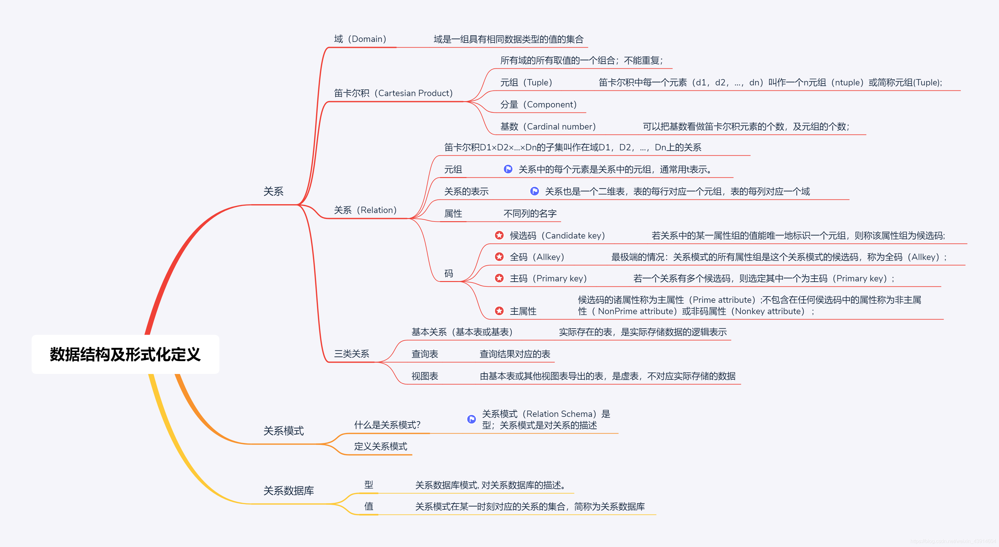

> 关系模型的数据结构非常简单，只包含单一的数据结构——关系

### 2.1.1. 关系

> 关系是关系模式某一时刻的内容或状态
>
> 关系在域上D笛卡尔积的子集
> 关系可以有三种类型：基本关系（基本表）、查询表、试图表。

* 域

  域是一组具有相同数据类型的值的集合

* 笛卡尔积

  $给定一组域D_1,D_2,D_3,D_n的笛卡尔积为D_1*D_2*D_3=\{d_1,d_2,d_n\}$

  每一个元素$(d_1,d_2,d_3)叫做一个元组，每一个元素中的每一个值d_i叫做一个分量$

  一个域允许的不同取值个数称为这个域的基数

### 2.1.2. 关系模式

关系的描述称为关系模式 ，可形式化的表示为**R(U,D,DOM,F)**
其中R为关系名，U为组成该关系的属性名集合，D为U中属性所来自的域，DOM为属性向域的映象集合，F为属性间数据的依赖关系集合。


### 2.1.3 关系数据库

关系模式：对关系的描述称为关系模式，可以形式化表示为R(U,D,DOM,F)
关系：是关系模式某一时刻的状态或者内容，关系模式是静态的，而关系是动态的。
关系数据库：关系数据库也有型和值之分，型是关系模式，是对关系数据库的描述。值是关系模式在某一时刻对应的关系集合。


### 2.1.4. 关系模式与关系的区别

关系模式是型；关系是值，是关系模式的实例。
例如S(num,name,age)是关系模式，组成的表是关系，即某一时刻关系模式的值

- **关系模式**
  对关系的描述
  静态的、稳定的
- **关系**
  关系模式在某一时刻的状态或内容
  动态的、随时间不断变化的
  关系模式和关系往往统称为关系
- `在数据库学科中可以把关系模式理解为表的结构、属性之间的关系、约束条件，把关系理解为二维表`

## 2.2. 关系操作


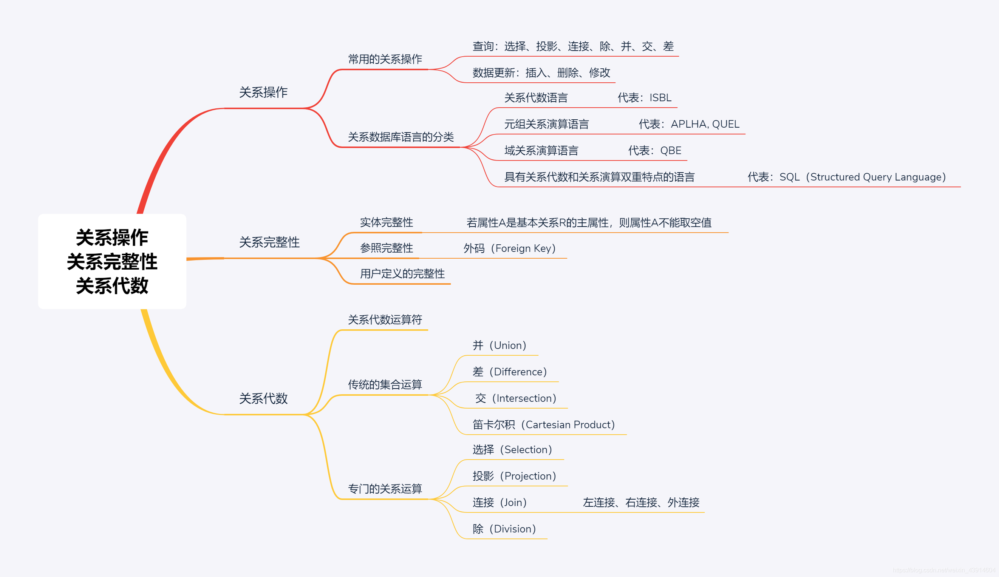


### 2.2.1 基本操作

**查询操作**： 选择、投影、连接、除、并、差、交、笛卡尔积
选择、投影、并、差、笛卡尔积是五种基本操作
**数据更新**：插入、删除、修改

### 2.2.2 关系数据语言的分类

- **关系代数语言**
  用对关系的运算来表达查询要求；
  代表：ISBL；
  关系演算语言：用谓词来表达查询要求；
- **元组关系演算语言**
  谓词变元的基本对象是元组变量；
  代表：APLHA, QUEL；
- **域关系演算语言**
  谓词变元的基本对象是域变量；
  代表：QBE；
- 具有关系代数和关系演算双重特点的语言；
  代表：SQL（Structured Query Language） ；


## 2.3. 关系完整性规则

### 1) 实体完整性：

若属性A是基本关系R的主属性，则属性A不能取空值

### 2) 参照完整性

##### 外码（Foreign Key）

- 设F是基本关系R的一个或一组属性，但不是关系R的码。如果F与基本关系S的主码Ks相对应，则称F是基本关系R的`外码`,即该码是另一个表的主码。
- 基本关系R称为`参照关系`（Referencing Relation），即本表。
- 基本关系S称为`被参照关系`（Referenced Relation） 或`目标关系`（Target Relation），即外码对应的主码所在的表。

若属性F是基本关系R的外码，它与基本关系S的主码K相对应，则对R中的每个元组在F上的值，必须为空值或者S中某个元组的主码值

若属性（或属性组）F是基本关系R的外码它与基本关系S的主码Ks相对应（基本关系R和S不一定是不同的关系），则对于R中每个元组在F上的值必须为：

- 或者取空值（F的每个属性值均为空值）

- 或者等于S中某个元组的主码值

- 外码的值要么为空，要么为S中某个元组的主码值
  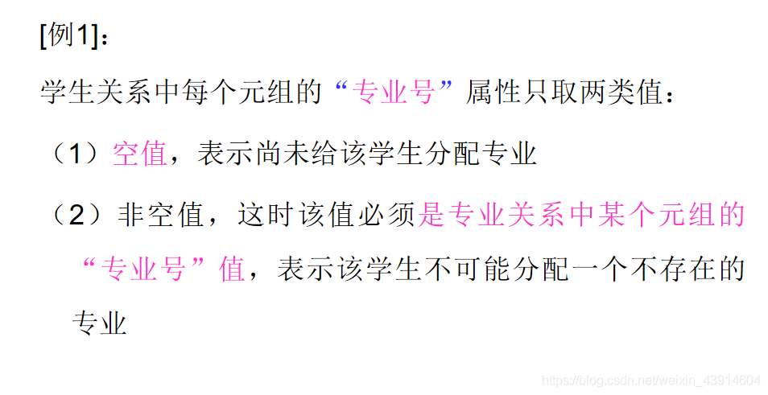

  例2

  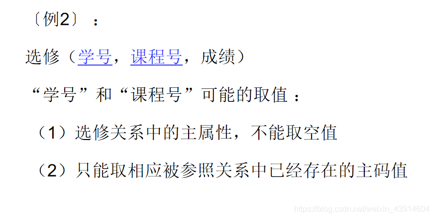

  例3

  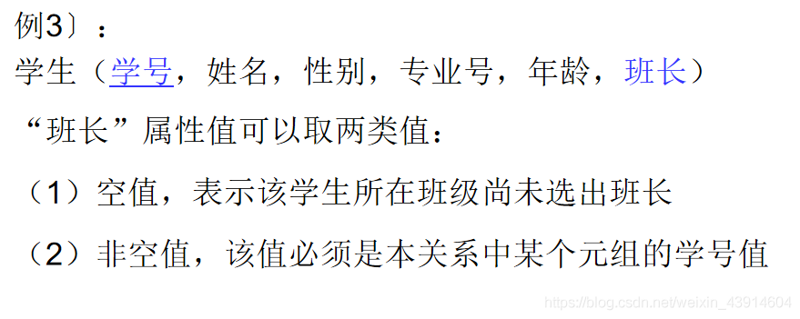

### 3) 用户定义完整

* 性针对某一具体关系数据库的约束条件。它反映了某一具体应用所涉及的数据必须满足的语义要求。

- 针对某一具体关系数据库的约束条件，反映某一具体应用所涉及的数据必须满足的语义要求
- 关系模型应提供定义和检验这类完整性的机制，以便用统一的系统的方法处理它们，而不要由应用程序承担这一功能


## 2.4. 关系代数

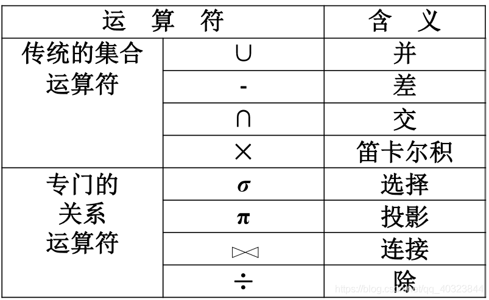

### 2.4.1 传统的集合运算

* 并
* 差
* 交
* 笛卡尔积

### 2.4.2 专门的关系运算

* 选择

* 投影

* 连接

  > $连接也被\theta 连接，它是从两个关系的笛卡尔积中选取属性满足一定条件的元组$
  >
  > 连接运算中有两种最重要也是最为常用的连接，一种是等值连接，一种是自然连接

  * $\theta 为"=" 的连接运算称为等值连接$
  * 自然连接是一种特殊的等值连接

  

* 除


## 2.5 关系演算

### 2.5.1 元组关系演算语言


### 2.5.2 元组关系演算


# 3. 数据库标准语言SQL


## 3.1. SQL概述

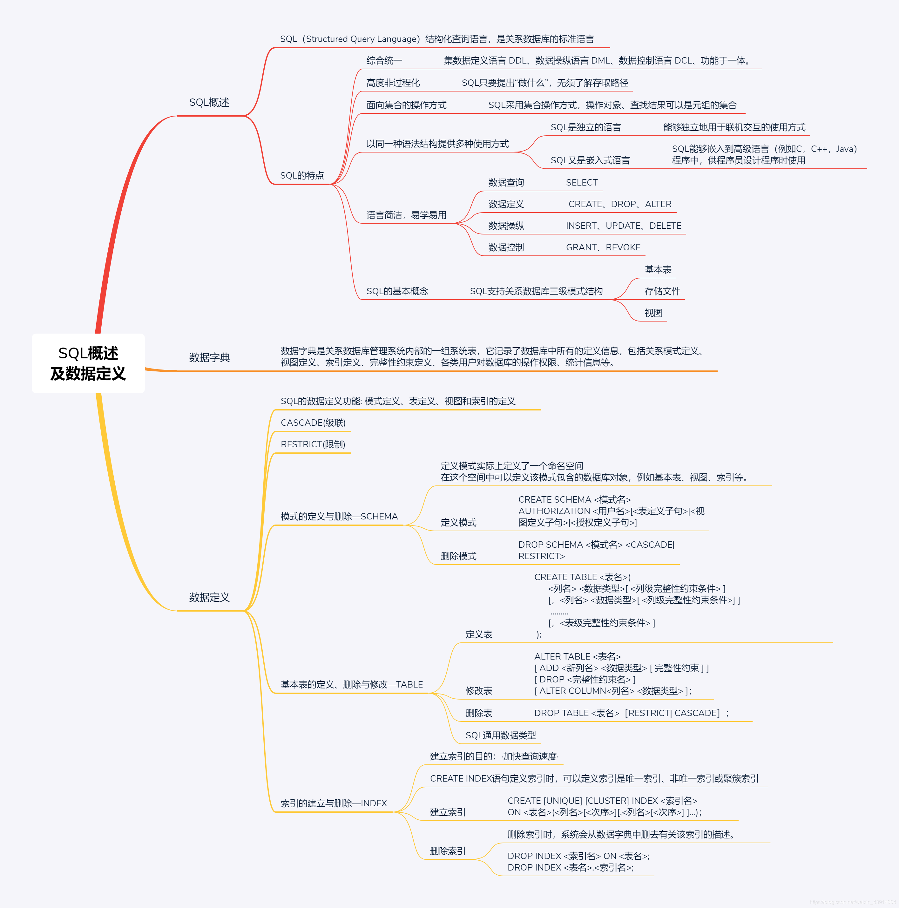

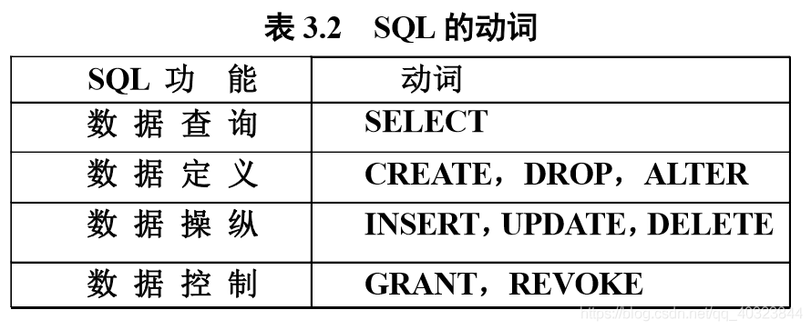

### 3.1.1. SQL特点

**① 综合统一**

- 集数据定义语言 DDL(Data Definition Language)，数据操纵语言 DML（Data Manipulation Language），数据控制语言 DCL(Data Control Language) 功能于一体。
- 可以独立完成数据库生命周期中的全部活动：
  - 定义关系模式，插入数据，建立数据库；
  - 对数据库中的数据进行查询和更新；
  - 数据库重构和维护
  - 数据库安全性、完整性控制等
- 用户数据库投入运行后，可根据需要随时逐步修改模式，不影响数据的运行。
- 数据操作符统一

**② 高度非过程化**

- 非关系数据模型的数据操纵语言“面向过程”，必须制定存取路径
- SQL只要提出“做什么”，无须了解存取路径。
- 存取路径的选择以及SQL的操作过程由系统自动完成。

**③ 面向集合的操作方式**

- 非关系数据模型采用面向记录的操作方式，操作对象是一条记录
- SQL采用集合操作方式：
  - 操作对象、查找结果可以是元组的集合
  - 一次插入、删除、更新操作的对象可以是元组的集合

**④ 以同一种语法结构提供多种使用方式**

- SQL是独立的语言
  - 能够独立地用于联机交互的使用方式
- SQL又是嵌入式语言
  - SQL能够嵌入到高级语言（例如C，C++，Java）程序中，供程序员设计程序时使用

**⑤ 语言简洁，易学易用**

- SQL功能极强，完成核心功能只用了9个动词。

| SQL功能  | 动词                   |
| -------- | ---------------------- |
| 数据查询 | SELECT                 |
| 数据定义 | CREATE、DROP、ALTER    |
| 数据操纵 | INSERT、UPDATE、DELETE |
| 数据控制 | GRANT、REVOKE          |

### 3.1.2. 基本概念

- SQL支持关系数据库三级模式结构

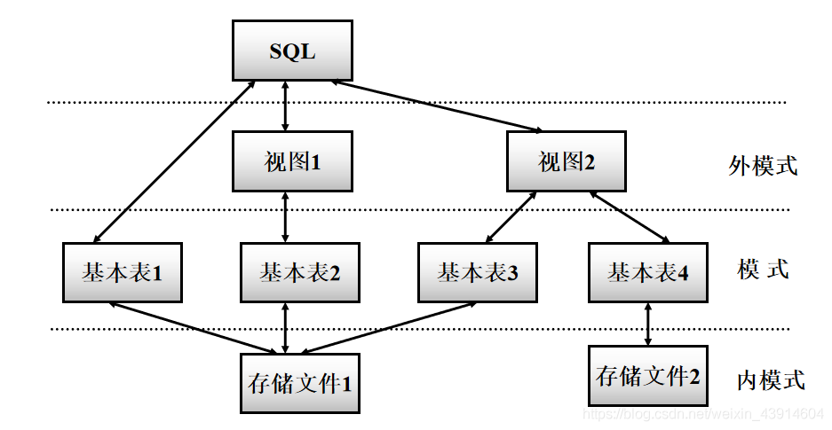
**基本表**

- 本身独立存在的表
- SQL中一个关系就对应一个基本表
- 一个(或多个)基本表对应一个存储文件
- 一个表可以带若干索引

**存储文件**

- 逻辑结构组成了关系数据库的内模式
- 物理结构是任意的，对用户透明

**视图**

- 从一个或几个基本表导出的表
- 数据库中只存放视图的定义而不存放视图对应的数据
- 视图是一个虚表
- 用户可以在视图上再定义视图

### 3.1.3 数据字典

- `数据字典`是`关系数据库管理系统内部`的一组`系统表`，`它记录了数据库中所有的定义信息，包括关系模式定义、视图定义、索引定义、完整性约束定义、各类用户对数据库的操作权限、统计信息等`。
- 关系数据库管理系统在执行SQL的数据定义语句时，实际上就是在更新数据字典表中的相应信息。
- 在进行查询优化和查询处理时，数据字典中的信息是其重要依据。


## 3.2. 数据定义

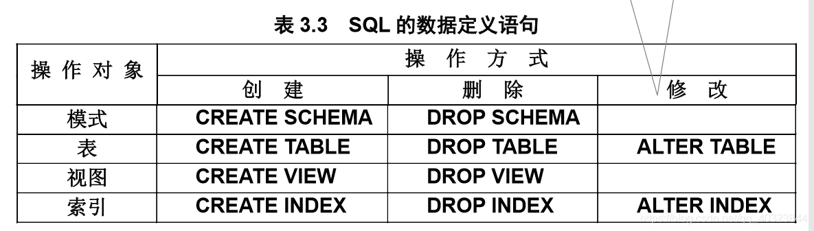
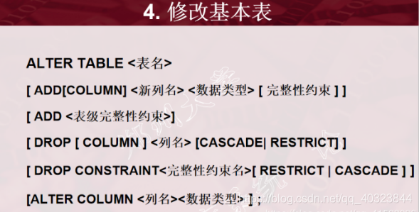


**没有那种数据库支持所有的sql和特性**

### 3.2.1 数据定义概览

SQL的数据定义功能: `模式定义`、`表定义`、`视图`和`索引`的定义

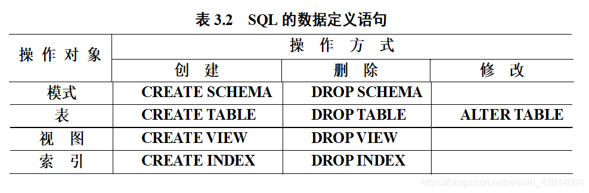

### 3.2.2 SCHEMA

**定义模式实际上定义了一个`命名空间`**

- 在这个`空间`中可以`定义`该`模式`包含的`数据库对象`，例如`基本表`、`视图`、`索引`等。
- 在CREATE SCHEMA中可以接受CREATE TABLE，CREATE VIEW和GRANT子句。
- `CREATE SCHEMA <模式名> AUTHORIZATION <用户名>[<表定义子句>|<视图定义子句>|<授权定义子句>]`
- 如果没有指定<模式名>，那么<模式名>隐含为<用户名>

#### ① 定义模式

> dbo database owner 数据库的创建者,创建该对象的用户. guest 顾客 能够访问数据库中对象的数据, 要求dbo分配权限给guest, 一般给他查看的权限select

- 这里我先创建一个数据库用户：
  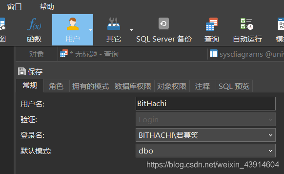

**[例1]定义一个学生-课程模式S-T**

```sql
CREATE SCHEMA "S-T" AUTHORIZATION BitHachi; -- 为用户BitHachi定义了一个模式S-T
```

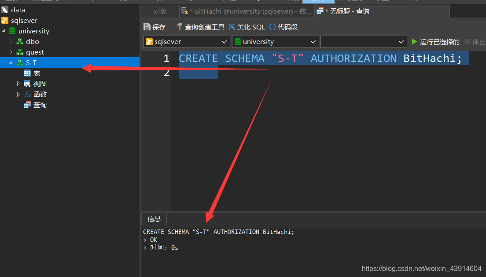

- 如果没有指定<模式名>，那么<模式名>隐含为<用户名>

```sql
CREATE SCHEMA AUTHORIZATION BitHachi；-- <模式名>隐含为用户名BitHachi 这个不知道咋回事，没出结果，默认模式BitHachi没创建出来，没显示
```

**[例2]为用户BitHachi创建了一个模式S-T，并在其中定义了一个表TAB1。**

```sql
CREATE SCHEMA "S-T" AUTHORIZATION BitHachi
CREATE TABLE TAB1(
COL1 SMALLINT, 
COL2 INT,
COL3 CHAR(20),
COL4 NUMERIC(10,3),
COL5 DECIMAL(5,2)
);
```

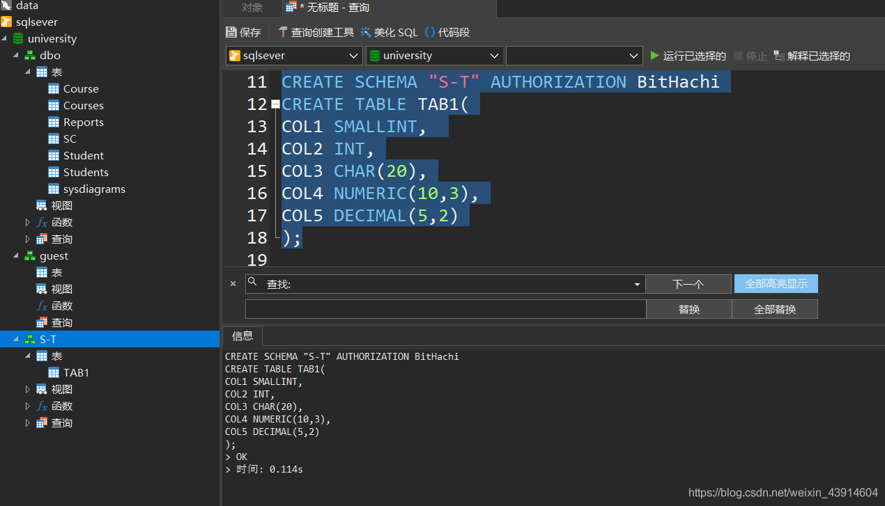

#### ② 删除模式

- `DROP SCHEMA <模式名> <CASCADE|RESTRICT>`
- `CASCADE(级联)`
  删除模式的同时把该模式中所有的数据库对象全部删除
- `RESTRICT(限制)`
  如果该模式中定义了下属的数据库对象（如表、视图等），则拒绝该删除语句的执行。
- 当该模式中没有任何下属的对象时才能执行。
- 以下是运行结果，至于为什么是错误的，暂且放在这里，等熟悉相关知识之后，再来解决。

```sql
DROP SCHEMA "S-T" CASCADE;
```

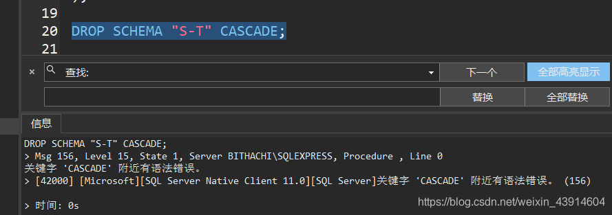

```sql
DROP SCHEMA "S-T" RESTRICT;
```

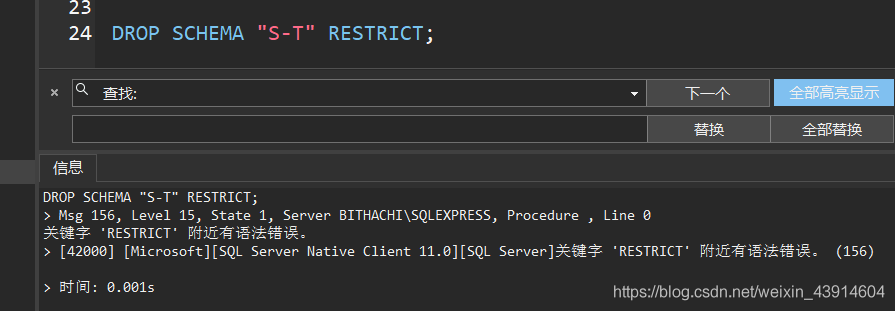

### 3.2.3 TABLE

#### ① 定义基本表的标准格式

```sql
CREATE TABLE <表名>(
      <列名> <数据类型>[ <列级完整性约束条件> ]
      [，<列名> <数据类型>[ <列级完整性约束条件>] ]
       ………
      [，<表级完整性约束条件> ]
 );
```

- `如果完整性约束条件涉及到该表的多个属性列，则必须定义在表级上，否则既可以定义在列级也可以定义在表级。`

#### ② 数据类型

- SQL中`域`的概念用`数据类型`来实现
- 定义表的`属性`时 需要指明其`数据类型及长度`
- 选用哪种数据类型
  - 取值范围
  - 要做哪些运算
- 以下是通用数据类型，不同数据库的数据类型可能有所不同，可查相关文档。

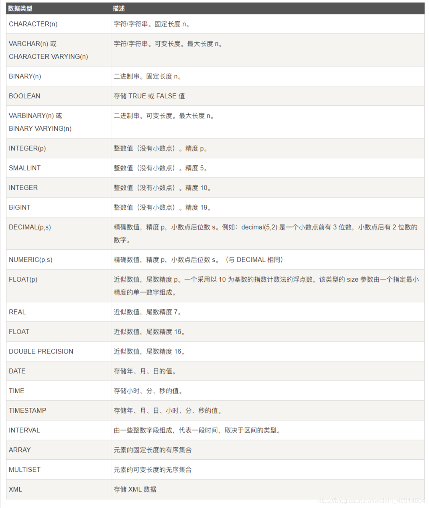

#### ③ 修改基本表

```sql
ALTER TABLE <表名>
[ ADD <新列名> <数据类型> [ 完整性约束 ] ]
[ DROP <完整性约束名> ]
[ ALTER COLUMN<列名> <数据类型> ];
```

**[例8]向Student表增加“入学时间”列，其数据类型为日期型。**

- 不论基本表中原来是否已有数据，新增加的列一律为空值。

```sql
ALTER TABLE Student ADD S_entrance DATE;
```

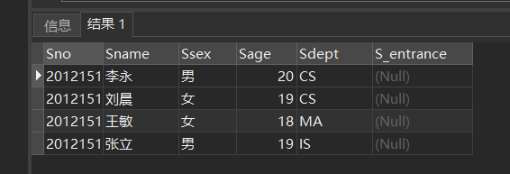

**[例9]将年龄的数据类型由字符型（假设原来的数据类型是字符型）改为整数。**

```sql
ALTER TABLE Student ALTER COLUMN Sage INT;
```

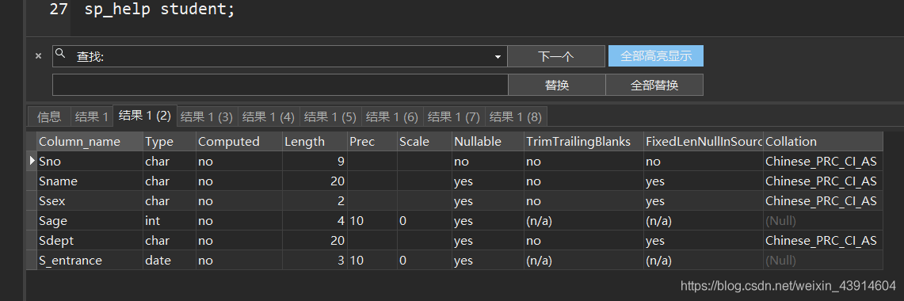
**[例10]增加课程名称必须取唯一值的约束条件。**

```sql
ALTER TABLE Course ADD UNIQUE(Cname);
```

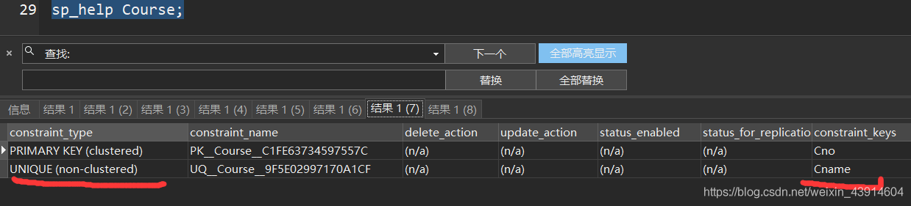

#### ④ 删除基本表

**标准格式：**
`DROP TABLE <表名>［RESTRICT| CASCADE］；`

- ```
  RESTRICT
  ```

  ：删除表是有限制的。

  - 欲删除的基本表不能被其他表的约束所引用
  - 如果存在依赖该表的对象，则此表不能被删除

- ```
  CASCADE
  ```

  ：删除该表没有限制。

  - 在删除基本表的同时，相关的依赖对象一起删除

**[例11] 删除Student表**

- 基本表定义被删除，数据被删除

- 表上建立的索引、视图、触发器等一般也将被删除

- 还是和上述删除模式情况一样，加了CASCADE和RESTRUCT删除不了

  ```sql
    DROP TABLE  Student  CASCADE ;
  ```

**［例12］若表上建有视图，选择RESTRICT时表不能删除**

```sql
    CREATE VIEW IS_Student      
	AS 
	    SELECT Sno,Sname,Sage
	    FROM  Student
    	    WHERE Sdept='IS';
	 DROP TABLE Student RESTRICT;   
456
```


```
--ERROR: cannot drop table Student because other objects depend on it
```

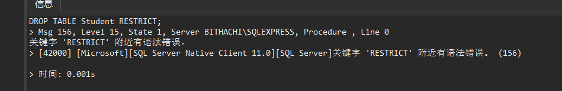

**[例12]如果选择CASCADE时可以删除表，视图也自动被删除**

- 这里还是跟之前的情况一样，删除不了，可能是我用的数据库不同叭

```sql
	DROP TABLE Student CASCADE; 	    
 --NOTICE: drop cascades to view IS_Student
	SELECT * FROM IS_Student;
--ERROR: relation " IS_Student " does not exist 
```

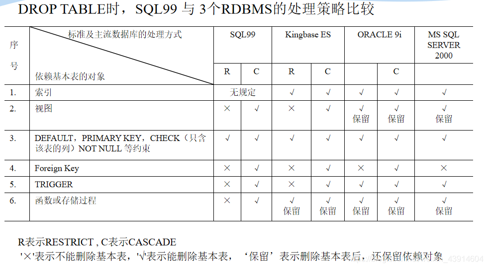

### 3.2.4 INDEX

**建立索引的目的：`·加快查询速度·`**

- 谁可以建立索引？
  - DBA 或 表的属主（即建立表的人）
  - DBMS一般会自动建立以下列上的索引
  - PRIMARY KEY
  - UNIQUE
- 谁维护索引？
  DBMS自动完成
- 使用索引
  DBMS自动选择是否使用索引以及使用哪些索引
- RDBMS中索引一般采用B+树、HASH索引来实现
  - B+树索引具有动态平衡的优点
  - HASH索引具有查找速度快的特点
- 采用B+树，还是HASH索引 则由具体的RDBMS来决定
- 索引是关系数据库的内部实现技术，属于内模式的范畴
- `CREATE INDEX`语句定义索引时，可以定义索引是`唯一索引、非唯一索引或聚簇索引`

#### ① 建立索引的标准格式

**语句格式**

```sql
CREATE [UNIQUE] [CLUSTER] INDEX <索引名> 
ON <表名>(<列名>[<次序>][,<列名>[<次序>] ]…);
```

**[例13]**

```sql
 	  CREATE CLUSTERED	INDEX Stusname
           ON   Student(Sname);
```

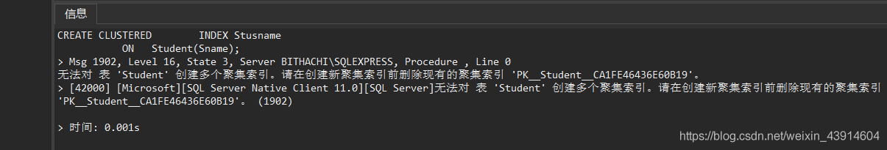

- 在Student表的Sname（姓名）列上建立一个`聚簇索引`
- 在最经常查询的列上建立聚簇索引以提高查询效率
- `一个基本表上最多只能建立一个聚簇索引`
- 经常更新的列不宜建立聚簇索引

**[例14]为学生-课程数据库中的Student，Course，SC三个表建 立索引。**

- Student表按学号升序建唯一索引
- Course表按课程号升序建唯一索引
- SC表按学号升序和课程号降序建唯一索引

```sql
CREATE UNIQUE INDEX  Stusno ON Student(Sno);
CREATE UNIQUE INDEX  Coucno ON Course(Cno);
CREATE UNIQUE INDEX  SCno ON SC(Sno ASC,Cno DESC);
```

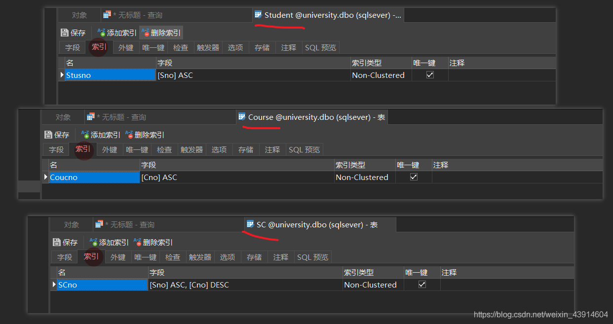

#### ② 删除索引

**`DROP INDEX <索引名> ON <表名>;`
`DROP INDEX <表名>.<索引名>;`**

- 删除索引时，系统会从数据字典中删去有关该索引的
  描述。

**[例15] 删除Student表的Stusname索引**

```sql
   DROP INDEX Stusno ON Student;
   //等价
   DROP INDEX Student.Stusno;
```

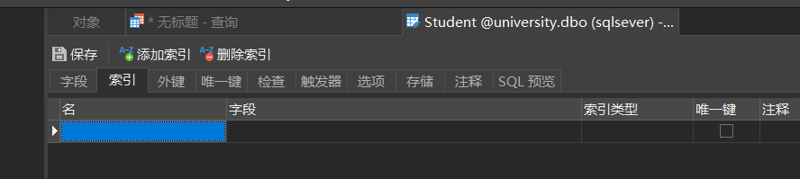

## 3.3. 数据查询

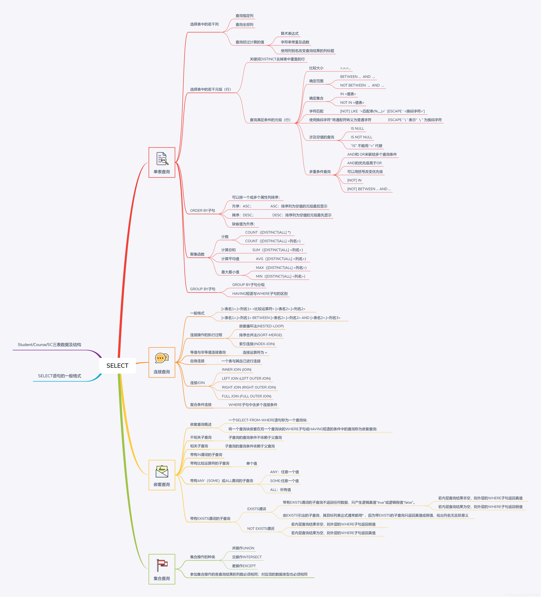


### 3.3.1 表数据及结构

- 本篇文章都是围绕这三个表展开的。
  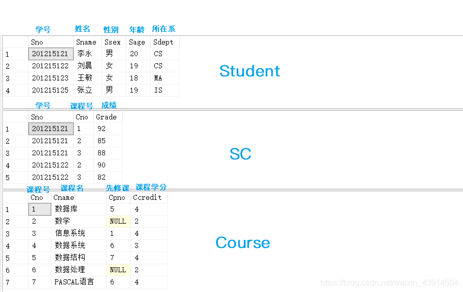

### 3.3.2 SELECT语句的一般格式

先从整体上了解一下SELECT的格式，关键字的位置。

```sql
SELECT [ALL|DISTINCT]   
<目标列表达式> [别名] [ ，<目标列表达式> [别名]] … 
FROM   <表名或视图名> [别名]   [ ，<表名或视图名> [别名]] …
[WHERE <条件表达式>]
[GROUP  BY<列名1>
[HAVING  <条件表达式>]]
[ORDER BY <列名2> [ASC|DESC] 
4567
```

### 3.3.4 单表查询

#### 1) 选择表中的若干列

##### ① 查询指定列

- `查询指定列`

**[例1] 查询全体学生的学号与姓名。**

```sql
SELECT Sno,Sname 
FROM Student;
12
```

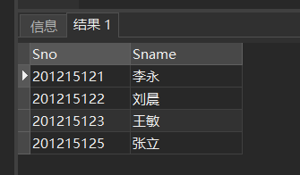

**[例2] 查询全体学生的姓名、学号、所在系。**

```sql
SELECT Sname,Sno,Sdept 
FROM Student;
12
```

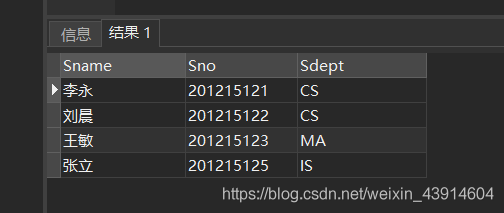

##### ② 查询全部列

- 选出所有属性列：在SELECT关键字后面列出所有列名 ，将<目标列表达式>指定为 *

**[例3] 查询全体学生的详细记录。**

```sql
SELECT  Sno,Sname,Ssex,Sage,Sdept 
FROM Student;
//两种方式
SELECT  *FROM Student;
4
```

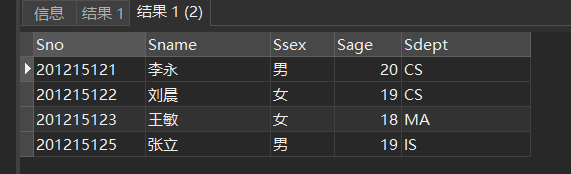

##### ③ 查询经过计算的值

- `SELECT子句的<目标列表达式>可以为：`
  算术表达式
  字符串常量
  函数
  列别名

###### ❶ 算术表达式

**[例4] 查全体学生的姓名及其出生年份。这里假定目前年份是2004年。**

```sql
SELECT Sname,2004-Sage 
FROM Student;
```

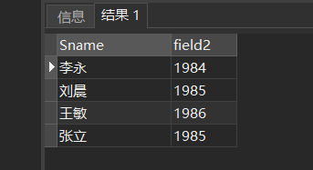

###### ❷ 字符串常量及函数

**[例5] 查询全体学生的姓名、出生年份和所有系，要求用小写字母表示所有系名，这里假定目前年份是2004年。**

```sql
 SELECT Sname,'Year of Birth: ', 2004-Sage, LOWER(Sdept)
 FROM Student;
```

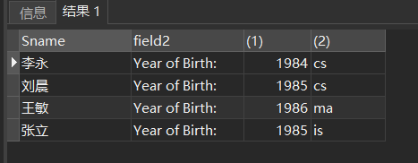

###### ❸ 使用列别名改变查询结果的列标题

```sql
SELECT Sname NAME,'Year of Birth: '  BIRTH,
2000-Sage  BIRTHDAY,
LOWER(Sdept)  DEPARTMENT
FROM Student;
```

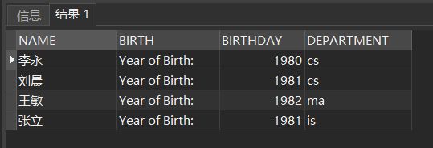

#### 2) 选择表中的若干元组（行）

##### ① 关键词DISTINCT去掉表中重复的行

- 如果没有指定DISTINCT关键词，则缺省为ALL

```sql
SELECT Sno FROM SC;
/*等价于：*/
SELECT ALL  Sno  FROM SC;
```

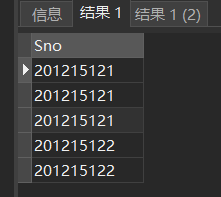
**[例6] 查询选修了课程的学生学号。指定`DISTINCT`关键词，去掉表中重复的行**

```sql
SELECT DISTINCT Sno
FROM SC;
```

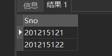

##### ② 查询满足条件的元组（行）

- 常用的查询条件

| 查询条件             | 谓词                                                |
| -------------------- | --------------------------------------------------- |
| 比较                 | =，>，<，>=，<=，!=，<>，!>，!<；NOT+上述比较运算符 |
| 确定范围             | BETWEEN AND，NOT BETWEEN AND                        |
| 确定集合             | IN，NOT IN                                          |
| 字符匹配             | LIKE，NOT LIKE                                      |
| 空值                 | IS NULL，IS NOT NULL                                |
| 多重条件（逻辑运算） | AND，OR，NOT                                        |

###### ❶ 比较大小

**[例7]查询计算机科学系全体学生的名单。**

```sql
SELECT Sname
FROM Student
WHERE Sdept='CS';
```

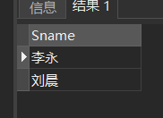
**[例8] 查询所有年龄在20岁以下的学生姓名及其年龄。**

```sql
SELECT Sname,Sage 
FROM Student 
WHERE Sage < 20;
```

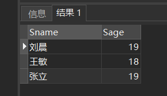
**[例9]查询考试成绩有不及格的学生的学号。**

```sql
SELECT DISTINCT Sno
FROM  SC
WHERE Grade<60;
```

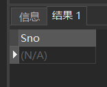

###### ❷ 确定范围

**谓词:**

- `BETWEEN … AND …`
- `NOT BETWEEN … AND …`

**[例10] 查询年龄在20~23岁（包括20岁和23岁）之间的学生的**

```sql
SELECT Sname,Sdept,Sage
FROM  Student
WHERE Sage 
BETWEEN 20 AND 23; 
```

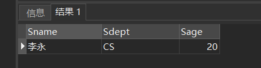
**[例11] 查询年龄不在20~23岁之间的学生姓名、系别和年龄**

```sql
SELECT Sname,Sdept,Sage
FROM  Student
WHERE Sage NOT BETWEEN 20 AND 23;
```

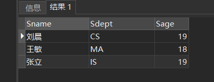

###### ❸ 确定集合

**谓词：**

- `IN <值表>,`
- `NOT IN <值表>`

**[例12]查询信息系（IS）、数学系（MA）和计算机科学系（CS）学生的姓名和性别。**

```sql
SELECT Sname,Ssex
FROM  Student
WHERE Sdept IN ( 'IS','MA','CS' );
```

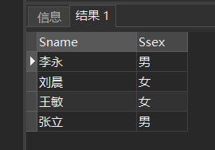
**[例13]查询既不是信息系、数学系，也不是计算机科学系的学生的姓名和性别。**

```sql
SELECT Sname,Ssex
FROM Student
WHERE Sdept NOT IN ( 'IS','MA','CS' );
```

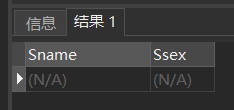

###### ❹ 字符匹配

**谓词：**

- `[NOT] LIKE ‘<匹配串>’ [ESCAPE ‘ <换码字符>’]`

**`匹配串为固定字符串`**
**[例14] 查询学号为201215121的学生的详细情况。**

```sql
SELECT *    
FROM  Student  
WHERE  Sno LIKE '201215121';
/*等价于：*/ 
SELECT  * 
FROM  Student 
WHERE Sno = '201215121';
```

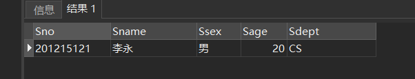

**`匹配串为含通配符的字符串`**
**[例15] 查询所有姓刘学生的姓名、学号和性别。**

```sql
SELECT Sname,Sno,Ssex
FROM Student
WHERE  Sname LIKE '刘%';
```

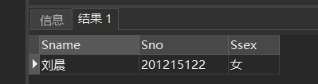
**[例16] 查询姓"欧阳"且全名为三个汉字的学生的姓名。**

```sql
SELECT Sname
FROM   Student
WHERE  Sname LIKE '欧阳_';
```

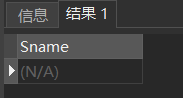

**[例17] 查询名字中第2个字为"阳"字的学生的姓名和学号。**

```sql
SELECT Sname,Sno
FROM Student
WHERE Sname LIKE '_阳%';
```

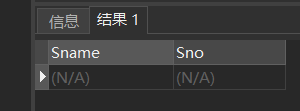

**[例18] 查询所有不姓刘的学生姓名。**

```sql
SELECT Sname,Sno,Ssex
FROM Student
WHERE Sname NOT LIKE '刘%';
```

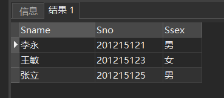

###### ❺ 使用换码字符’'将通配符转义为普通字符

- `ESCAPE '＼' 表示“ ＼” 为换码字符`

**[例19] 查询DB_Design课程的课程号和学分。**

```sql
SELECT Cno,Ccredit
FROM Course
WHERE Cname LIKE 'DB\_Design' ESCAPE '\';
```

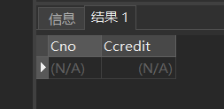

**[例20] 查询以"DB_"开头，且倒数第3个字符为 i的课程的详细情况。**

```sql
SELECT  *
FROM   Course
WHERE  Cname LIKE  'DB\_%i_ _' ESCAPE '\';
```

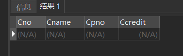

###### ❻ 涉及空值的查询

**谓词：**

- `IS NULL`
- `IS NOT NULL`
- `“IS” 不能用 “=” 代替`

**[例21] 某些学生选修课程后没有参加考试，所以有选课记录，但没有考试成绩。查询缺少成绩的学生的学号和相应的课程号。**

```sql
SELECT Sno,Cno
FROM  SC
WHERE  Grade IS NULL;
```

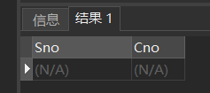

**[例22] 查所有有成绩的学生学号和课程号。**

```sql
SELECT Sno,Cno
FROM  SC
WHERE  Grade IS NOT NULL;
```

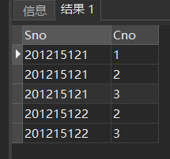

###### ❼ 多重条件查询

**逻辑运算符：**

- AND和 OR来联结多个查询条件
- AND的优先级高于OR
- 可以用括号改变优先级

**可用来实现多种其他谓词**

- `[NOT] IN`
- `[NOT] BETWEEN … AND …`

**[例23] 查询计算机系年龄在20岁以下的学生姓名。**

```sql
SELECT Sname
FROM  Student
WHERE Sdept= 'CS' AND Sage<20;
```

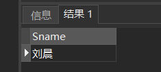

**改写[例12] 查询信息系（IS）、数学系（MA）和计算机科学系（CS）学生的姓名和性别。**

```sql
SELECT Sname,Ssex
FROM Student
WHERE Sdept IN ( 'IS','MA','CS' );
/*可改写为：*/
SELECT Sname,Ssex
FROM   Student
WHERE  Sdept= 'IS' OR Sdept= 'MA' OR Sdept= 'CS';
```


#### 3) ORDER BY子句

**ORDER BY子句**

- `可以按一个或多个属性列排序；`
- `升序：ASC；`
- `降序：DESC；`
- `缺省值为升序；`

**当排序列含空值时**

- `ASC`：排序列为空值的元组`最后显示`
- `DESC`：排序列为空值的元组`最先显示`

**[例24] 查询选修了3号课程的学生的学号及其成绩，查询结果按分数降序排列。**

```sql
SELECT Sno,Grade
FROM  SC
WHERE  Cno= '3'
ORDER BY Grade DESC;
4
```

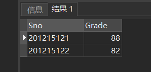
**[例25] 查询全体学生情况，查询结果按所在系的系号升序排列，同一系中的学生按年龄降序排列。**

```sql
SELECT  *
FROM  Student
ORDER BY Sdept,Sage DESC;
```

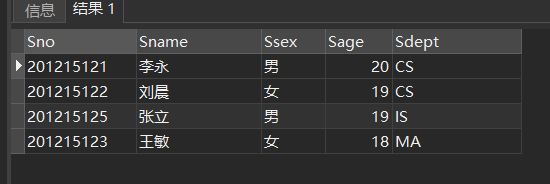

#### 4) 聚集函数

**聚集函数：**

- 计数
  `COUNT（[DISTINCT|ALL] *）`
  `COUNT（[DISTINCT|ALL] <列名>）`
- 计算总和
  `SUM（[DISTINCT|ALL] <列名>）`
- 计算平均值
  `AVG（[DISTINCT|ALL] <列名>）`
- 最大最小值
  `MAX（[DISTINCT|ALL] <列名>）`
  `MIN（[DISTINCT|ALL] <列名>）`

**[例26] 查询学生总人数。**

```sql
SELECT COUNT(*)
FROM  Student;
```

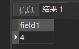
**[例27] 查询选修了课程的学生人数。**

```sql
SELECT COUNT(DISTINCT Sno)
FROM SC;
```

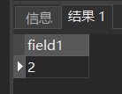
**[例28] 计算2号课程的学生平均成绩。**

```sql
SELECT AVG(Grade)
FROM SC
WHERE Cno= '2';
```

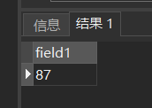

**[例29] 查询选修2号课程的学生最高分数。**

```sql
SELECT MAX(Grade)
FROM SC
WHERE Cno= '2';
```


**[例30]查询学生201215121选修课程的总学分数。**

```sql
SELECT SUM(Ccredit)
FROM  SC, Course
WHERE Sno='201215121' AND SC.Cno=Course.Cno;
```

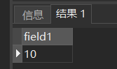

#### 5) GROUP BY子句

**`GROUP BY`子句分组：**
**细化聚集函数的作用对象**

- 未对查询结果分组，聚集函数将作用于整个查询结果
- 对查询结果分组后，聚集函数将分别作用于每个组
- 作用对象是查询的中间结果表
- 按指定的一列或多列值分组，值相等的为一组

**`HAVING`短语与`WHERE`子句的区别：**

- 作用对象不同
- WHERE子句作用于`基表或视图`，从中选择满足条件的`元组`
- HAVING短语作用于`组`，从中选择满足条件的`组`。

**[例31] 求各个课程号及相应的选课人数。**

```sql
SELECT Cno,COUNT(Sno)
FROM    SC
GROUP BY Cno;
```

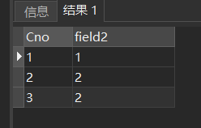

**[例32] 查询选修了2门以上课程的学生学号。**

```sql
SELECT Sno
FROM  SC
GROUP BY Sno
HAVING  COUNT(*) >2;  
```

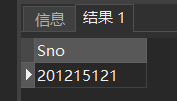

### 3.3.4 连接查询

**连接查询：同时涉及多个表的查询**

**连接条件或连接谓词：用来连接两个表的条件**

**一般格式：**

- `[<表名1>.]<列名1> <比较运算符> [<表名2>.]<列名2>`
- `[<表名1>.]<列名1> BETWEEN [<表名2>.]<列名2> AND [<表名2>.]<列名3>`

**连接字段：连接谓词中的列名称**

- 连接条件中的各连接字段类型必须是可比的，但名字不必是相同的

#### （1）连接操作的执行过程

##### ① 嵌套循环法(NESTED-LOOP)

- 首先在表1中找到第一个元组，然后从头开始扫描表2，逐一查找满足连接件的元组，找到后就将表1中的第一个元组与该元组拼接起来，形成结果表中一个元组。
- 表2全部查找完后，再找表1中第二个元组，然后再从头开始扫描表2，逐一查找满足连接条件的元组，找到后就将表1中的第二个元组与该元组拼接起来，形成结果表中一个元组。
- 重复上述操作，直到表1中的全部元组都处理完毕

##### ② 排序合并法(SORT-MERGE)

**常用于=连接**

- 首先按连接属性对表1和表2排序
- 对表1的第一个元组，从头开始扫描表2，顺序查找满足连接条件的元组，找到后就将表1中的第一个元组与该元组拼接起来，形成结果表中一个元组。当遇到表2中第一条大于表1连接字段值的元组时，对表2的查询不再继续
- 找到表1的第二条元组，然后从刚才的中断点处继续顺序扫描表2，查找满足连接条件的元组，找到后就将表1中的第一个元组与该元组拼接起来，形成结果表中一个元组。直接遇到表2中大于表1连接字段值的元组时，对表2的查询不再继续
- 重复上述操作，直到表1或表2中的全部元组都处理完毕为止

##### ③ 索引连接(INDEX-JOIN)

- 对表2按连接字段建立索引
- 对表1中的每个元组，依次根据其连接字段值查询表2的索引，从中找到满足条件的元组，找到后就将表1中的第一个元组与该元组拼接起来，形成结果表中一个元组

#### （2）等值与非等值连接查询

**等值连接：连接运算符为=**

**[例33] 查询每个学生及其选修课程的情况**

```sql
SELECT  Student.*,SC.*
FROM     Student,SC
WHERE  Student.Sno = SC.Sno;
```

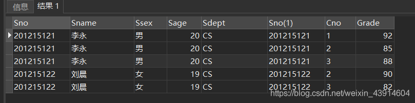

**自然连接**

**[例34] 对[例33]用自然连接完成。**

```sql
SELECT  Student.Sno,Sname,Ssex,Sage,Sdept,Cno,Grade
FROM     Student,SC
WHERE  Student.Sno = SC.Sno;
```

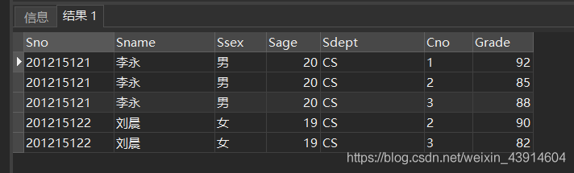

#### （3）自身连接

- **自身连接：一个表与其自己进行连接**
- **需要给表起别名以示区别**
- **由于所有属性名都是同名属性，因此必须使用别名前缀**

**[例35]查询每一门课的间接先修课（即`先修课的先修课`）**

```sql
SELECT  FIRST.Cno,SECOND.Cpno
FROM  Course  FIRST,Course  SECOND
WHERE FIRST.Cpno = SECOND.Cno;
```

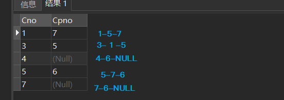

#### （4）连接JOIN

**SQL join 用于把来自两个或多个表的行结合起来。**
**标准格式：**

```sql
 SELECT column_name(s)
FROM table1//左表
<xxx JOIN> table2//右表
ON table1.column_name=table2.column_name;
```

**分类：**

- `INNER JOIN (JOIN)`
- `LEFT JOIN (LEFT OUTER JOIN)`
- `RIGHT JOIN (RIGHT OUTER JOIN)`
- `FULL JOIN (FULL OUTER JOIN)`

这里就以SC和Course两个表来检验这四类连接

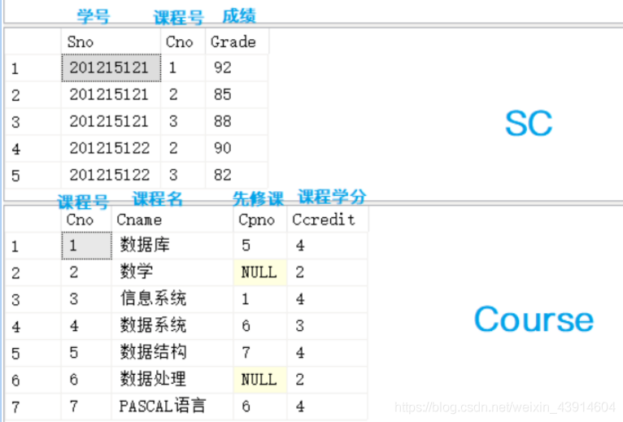

##### ① INNER JOIN (JOIN)

- `INNER JOIN`：关键字在表中存在至少一个匹配时返回行。
  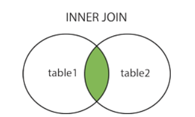

```sql
SELECT Sno,SC.Cno,Grade,Course.Cno,Cname,Cpno,Ccredit
FROM  SC INNER JOIN Course ON (SC.Cno=Course.Cno);
/*INNER JOIN 与 JOIN结果相同*/
SELECT Sno,SC.Cno,Grade,Course.Cno,Cname,Cpno,Ccredit
FROM  SC  JOIN Course ON (SC.Cno=Course.Cno);
```

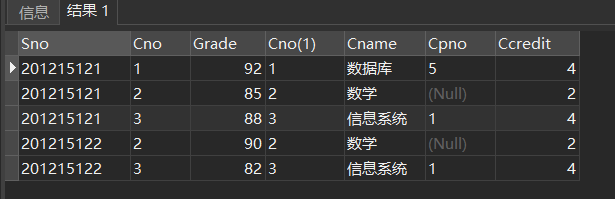

##### ② LEFT JOIN (LEFT OUTER JOIN)

- `LEFT JOIN`：关键字从左表（table1）返回所有的行，即使右表（table2）中没有匹配。如果右表中没有匹配，则结果为 NULL。

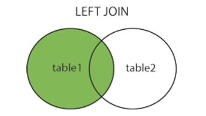

```sql
SELECT Sno,SC.Cno,Grade,Course.Cno,Cname,Cpno,Ccredit
FROM  SC LEFT JOIN Course ON (SC.Cno=Course.Cno);
/*LEFT JOIN 与 LEFT OUTER JOIN结果相同*/
SELECT Sno,SC.Cno,Grade,Course.Cno,Cname,Cpno,Ccredit
FROM  SC LEFT OUTER JOIN Course ON (SC.Cno=Course.Cno);
```

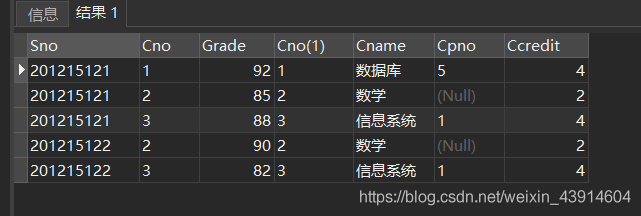

##### ③ RIGHT JOIN (RIGHT OUTER JOIN)

- `RIGHT JOIN`：关键字从右表（table2）返回所有的行，即使左表（table1）中没有匹配。如果左表中没有匹配，则结果为 NULL。
  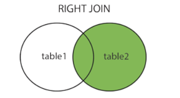

```sql
SELECT Sno,SC.Cno,Grade,Course.Cno,Cname,Cpno,Ccredit
FROM  SC RIGHT JOIN Course ON (SC.Cno=Course.Cno);
/*RIGHT JOIN 与 RIGHT OUTER JOIN结果相同*/
SELECT Sno,SC.Cno,Grade,Course.Cno,Cname,Cpno,Ccredit
FROM  SC RIGHT OUTER JOIN Course ON (SC.Cno=Course.Cno);
```

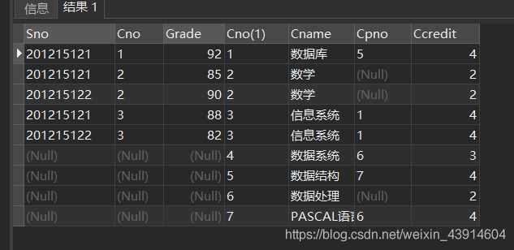

##### ④ FULL JOIN (FULL OUTER JOIN)

- `FULL JOIN`：关键字只要左表（table1）和右表（table2）其中一个表中存在匹配，则返回行。结合了 LEFT JOIN 和 RIGHT JOIN 的结果。
  

```sql
SELECT Sno,SC.Cno,Grade,Course.Cno,Cname,Cpno,Ccredit
FROM  SC FULL JOIN Course ON (SC.Cno=Course.Cno);
/*FULL JOIN 与 FULL OUTER JOIN结果相同*/
SELECT Sno,SC.Cno,Grade,Course.Cno,Cname,Cpno,Ccredit
FROM  SC FULL OUTER JOIN Course ON (SC.Cno=Course.Cno);
```

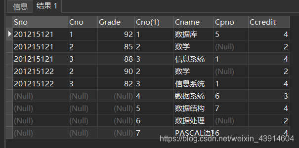

### （5）复合条件连接

**复合条件连接：WHERE子句中含多个连接条件**

**[例37]查询选修2号课程且成绩在88分以上的所有学生**

```sql
SELECT Student.Sno, Sname
FROM    Student,SC
WHERE Student.Sno = SC.Sno AND   
/* 连接谓词*/
SC.Cno= '2' AND SC.Grade > 88;     
/* 其他限定条件 */
```

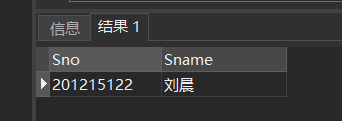
**[例38]查询每个学生的学号、姓名、选修的课程名及成绩**

```sql
SELECT Student.Sno,Sname,Cname,Grade
FROM    Student,SC,Course  /*多表连接*/
WHERE Student.Sno = SC.Sno 
and SC.Cno = Course.Cno;
```

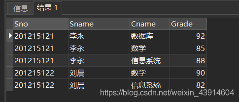

### 3.3.6 嵌套查询

#### （1）嵌套查询概述

- 一个SELECT-FROM-WHERE语句称为一个`查询块`
- 将一个`查询块嵌套`在另一个`查询块`的`WHERE`子句或`HAVING`短语的条件中的查询称为`嵌套查询`

**一个例子：**

```sql
 SELECT Sname/*外层查询/父查询*/
 FROM Student
 WHERE Sno IN
(SELECT Sno    /*内层查询/子查询*/
 FROM SC
 WHERE Cno= '2');
```

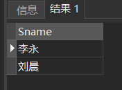

- 子查询的`限制`： `·不能使用ORDER BY子句·`
- 层层嵌套方式反映了 SQL语言的结构化
- 有些嵌套查询可以用连接运算替代

#### （2）不相关子查询

**`子查询的查询条件不依赖于父查询`**

- 由里向外 逐层处理。即每个子查询在上一级查询处理之前求解，子查询的结果用于建立其父查询的查找条件。

#### （3）相关子查询

**`子查询的查询条件依赖于父查询`**

- 首先取外层查询中表的第一个元组，根据它与内层查询相关的属性值处理内层查询，若WHERE子句返回值为真，则取此元组放入结果表
- 然后再取外层表的下一个元组
- 重复这一过程，直至外层表全部检查完为止

#### （4）带有IN谓词的子查询

**[例39] 查询与“刘晨”在同一个系学习的学生。此查询要求可以分步来完成**

- ① 确定“刘晨”所在系名

```sql
SELECT  Sdept  
FROM     Student                            
WHERE  Sname= '刘晨';
```

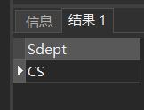

- ② 查找所有在CS系学习的学生。

```sql
SELECT  Sno,Sname,Sdept     
FROM    Student                 
WHERE  Sdept= 'CS';
```

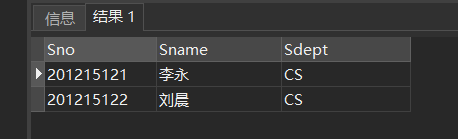
**将第一步查询嵌入到第二步查询的条件中**

```sql
SELECT Sno,Sname,Sdept
FROM Student
WHERE Sdept  IN
(SELECT Sdept
FROM Student
WHERE Sname= '刘晨');
```

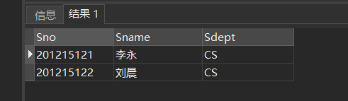

- 此查询为不相关子查询。

**[例40]查询选修了课程名为“信息系统”的学生学号和姓名**

```sql
SELECT Sno,Sname /*③ 最后在Student关系中取出Sno和Sname*/
FROM    Student  
WHERE Sno  IN
(  SELECT Sno  	/*② 然后在SC关系中找出选修了3号课程的学生学号*/
	 FROM    SC      
	 WHERE  Cno IN
( SELECT Cno   /*① 首先在Course关系中找出 “信息系统”的课程号,为3号*/
  FROM Course    
  WHERE Cname= '信息系统'
     )
);
```

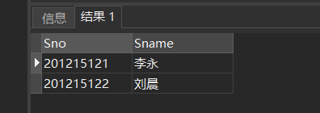

**用连接查询实现[例40]**

```sql
SELECT Student.Sno,Sname
FROM    Student,SC,Course
WHERE Student.Sno = SC.Sno 
AND SC.Cno = Course.Cno 
AND Course.Cname='信息系统';
```

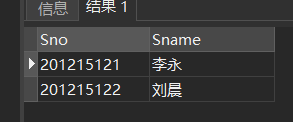

#### （5）带有比较运算符的子查询

- 带有比较运算符的子查询是指父查询与子查询之间用比较运算符进行连接。当用户能确切知道内层查询返回的是`单个值`时，可以用>、<、=、>=、<= 、!=或< >等`比较运算符`。
- 与ANY或ALL谓词配合使用

**例：假设一个学生只可能在一个系学习，并且必须属于一个系，则在[例39]可以用`= 代替IN`：**

```sql
SELECT Sno,Sname,Sdept
FROM Student
WHERE Sdept  =
(SELECT Sdept
FROM Student
WHERE Sname= '刘晨');
/*两种方式都可以*/
SELECT Sno,Sname,Sdept
FROM Student
WHERE
(SELECT Sdept
FROM Student
WHERE Sname= '刘晨')
= Sdept ;
```

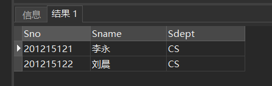
**［例41］找出每个学生超过他选修课程平均成绩的课程号。**

```sql
SELECT Sno, Cno
FROM  SC  x
WHERE Grade >=(SELECT AVG(Grade)  /*相关子查询*/ 
   	           FROM  SC y
              WHERE y.Sno=x.Sno
    );
```

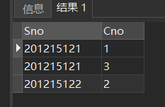

**`［例41］可能的执行过程：`**
1.从外层查询中取出SC的一个元组x，将元组x的Sno值（201215121）传送给内层查询。

```sql
SELECT AVG(Grade)
FROM SC y
WHERE y.Sno='201215121';
```

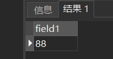

2.执行内层查询，得到值88（近似值），用该值代替内层查询，得到外层查询：

```sql
SELECT Sno, Cno
FROM  SC x
WHERE Grade >=88; 
```

3.执行这个查询，得到
（200215121，1）
（200215121，3）

4.外层查询取出下一个元组`重复做上述1至3步骤`，直到外层的SC元组全部处理完毕。结果为:


#### （6）带有ANY（SOME）或ALL谓词的子查询

**谓词语义：**

- `ANY：任意一个值`
- `ALL：所有值`

**需要配合使用比较运算符:**

|               |                                              |
| ------------- | -------------------------------------------- |
| > ANY         | 大于子查询结果中的某个值                     |
| > ALL         | 大于子查询结果中的所有值                     |
| < ANY         | 小于子查询结果中的某个值                     |
| < ALL         | 小于子查询结果中的所有值                     |
| >= ANY        | 大于等于子查询结果中的某个值                 |
| >= ALL        | 大于等于子查询结果中的所有值                 |
| <= ANY        | 小于等于子查询结果中的某个值                 |
| <= ALL        | 小于等于子查询结果中的所有值                 |
| = ANY         | 等于子查询结果中的某个值                     |
| =ALL          | 等于子查询结果中的所有值（通常没有实际意义） |
| !=（或<>）ANY | 不等于子查询结果中的某个值                   |
| !=（或<>）ALL | 不等于子查询结果中的任何一个值               |

**[例42] 查询其他系中比计算机科学某一学生年龄小的学生姓名和年龄**

```sql
SELECT Sname,Sage
FROM    Student
WHERE Sage < ANY (SELECT  Sage
                 FROM    Student
                  WHERE Sdept= 'CS')
   	 AND Sdept <> 'CS' ; /*父查询块中的条件 */
```

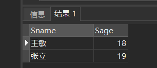
**执行过程：**

> 关系数据库管理系统（Relational Database Management System：RDBMS）

RDBMS执行此查询时，首先处理子查询，找出 CS系中所有学生的年龄，构成一个集合(20，19)

处理父查询，找所有不是CS系且年龄小于 20 或 19的学生

**用聚集函数实现[例42]**

```sql
SELECT Sname,Sage
FROM   Student
WHERE Sage < (SELECT MAX(Sage)
             FROM Student
             WHERE Sdept= 'CS')
          AND Sdept <> 'CS';
```

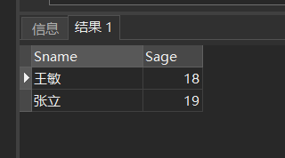

**[例43] 查询其他系中比计算机科学系所有学生年龄都小的学生姓名及年龄。**

- 方法一：用ALL谓词

```sql
SELECT Sname,Sage
FROM Student
WHERE Sage < ALL (SELECT Sage
                 FROM Student
                  WHERE Sdept= 'CS')
              AND Sdept <> 'CS';
```

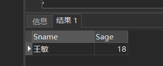

- 方法二：用聚集函数

```sql
SELECT Sname,Sage
FROM Student
WHERE Sage < (SELECT MIN(Sage)
               FROM Student
               WHERE Sdept= 'CS')
            AND Sdept <> 'CS';
```

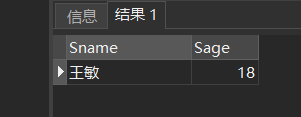

**ANY（或SOME），ALL谓词与聚集函数、IN谓词的等价转换关系**

|      | =    | <>或!= | <    | <=    | >    | >=    |
| ---- | ---- | ------ | ---- | ----- | ---- | ----- |
| ANY  | IN   | –      | <MAX | <=MAX | >MIN | >=MIN |
| ALL  | –    | NOT IN | <MIN | <=MIN | >MAX | >=MAX |

#### （7）带有EXISTS谓词的子查询

**EXISTS谓词**

- 存在量词 ∃
- 带有EXISTS谓词的子查询不返回任何数据，只产生逻辑真值“true”或逻辑假值“false”。
  - 若内层查询结果非空，则外层的WHERE子句返回真值
  - 若内层查询结果为空，则外层的WHERE子句返回假值
- 由EXISTS引出的子查询，其目标列表达式通常都用* ，因为带EXISTS的子查询只返回真值或假值，给出列名无实际意义

**NOT EXISTS谓词**

- 若内层查询结果非空，则外层的WHERE子句返回假值
- 若内层查询结果为空，则外层的WHERE子句返回真值

**[例44]查询所有选修了1号课程的学生姓名。**

**思路分析：**

- 本查询涉及Student和SC关系
- 在Student中依次取每个元组的Sno值，用此值去检查SC关系
- 若SC中存在这样的元组，其Sno值等于此Student.Sno值，并且其Cno=‘1’，则取此Student.Sname送入结果关系

**1.用嵌套查询**

```sql
SELECT Sname
FROM Student
WHERE EXISTS(SELECT *
             FROM SC
              WHERE Sno=Student.Sno 
   	AND Cno= '1');
```

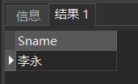

**2.用连接运算**

```sql
SELECT Sname
FROM Student, SC
WHERE Student.Sno=SC.Sno 
AND SC.Cno= '1';
```

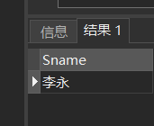

**[例45] 查询没有选修1号课程的学生姓名。**

```sql
SELECT Sname
FROM Student
WHERE NOT EXISTS(SELECT *
             FROM SC
              WHERE Sno=Student.Sno 
   	 AND Cno= '1');
```

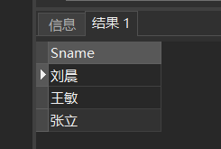

**不同形式的查询间的替换**

- 一些带EXISTS或NOT EXISTS谓词的子查询不能被其他形式的子查询等价替换
- 所有带IN谓词、比较运算符、ANY和ALL谓词的子查询都能用带EXISTS谓词的子查询等价替换
  用EXISTS/NOT EXISTS实现全称量词(难点)
  SQL语言中没有全称量词∀（For all）
  可以把带有全称量词的谓词转换为等价的带有存在量词的谓词：
  
  **例：[例39]查询与“刘晨”在同一个系学习的学生。**
  **可以用带EXISTS谓词的子查询替换：**

```sql
SELECT Sno,Sname,Sdept
FROM Student S1
WHERE EXISTS(SELECT *
           FROM Student S2
           WHERE S2.Sdept = S1.Sdept
      AND S2.Sname = '刘晨');
```

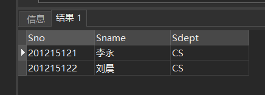

**[例46] 查询选修了全部课程的学生姓名。**

```sql
SELECT Sname
FROM Student
WHERE NOT EXISTS(SELECT *
                 FROM Course
                 WHERE NOT EXISTS(SELECT *
                                  FROM SC
                                  WHERE Sno= Student.Sno
                                   AND Cno= Course.Cno)
                 );
```


**用EXISTS/NOT EXISTS实现逻辑蕴函(难点)**

- SQL语言中没有蕴函(Implication)逻辑运算
- 可以利用谓词演算将逻辑蕴函谓词等价转换为：
  
  **[例47]查询至少选修了学生201215122选修的全部课程的学生号码。
  解题思路：**
- 用逻辑蕴函表达：查询学号为x的学生，对所有的课程y，只要201215122学生选修了课程y，则x也选修了y。
- 形式化表示：
  用P表示谓词 “学生201215122选修了课程y”
  用q表示谓词 “学生x选修了课程y”
  
  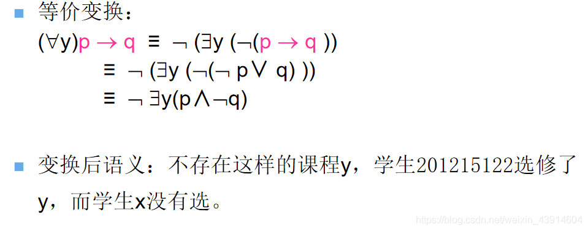
  **用NOT EXISTS谓词表示：**

```sql
SELECT DISTINCT Sno
FROM SC SCX
WHERE NOT EXISTS(SELECT *
                FROM SC SCY
                WHERE SCY.Sno = '201215122' 
   	    AND NOT EXISTS(SELECT *
                                FROM SC SCZ
                                WHERE SCZ.Sno=SCX.Sno 
   	        	AND SCZ.Cno=SCY.Cno
   	)
   );
```

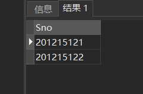

### 3.3.7 集合查询

#### （1） 集合操作的种类

- `并操作UNION`
- `交操作INTERSECT`
- `差操作EXCEPT`

**参加集合操作的各`查询结果`的`列数必须相同`；对应项的`数据类型也必须相同`**

#### （2）集合操作举例

**[例48] 查询计算机科学系的学生及年龄不大于19岁的学生。**
**方法一：**

```sql
SELECT *
FROM Student
WHERE Sdept= 'CS'
UNION SELECT *
       FROM Student
       WHERE Sage<=19;
```

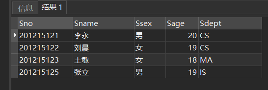

- `UNION`：将多个查询结果`合并`起来时，系统自动`去掉重复元组`。
- `UNION ALL`：将多个查询结果`合并`起来时，`保留重复元组`

**方法二：**

```sql
SELECT  DISTINCT  *
FROM Student
WHERE Sdept= 'CS'  
OR  Sage<=19;
```

**[例49] 查询选修了课程1`或者`选修了课程2的学生。**

```sql
SELECT Sno
FROM SC
WHERE Cno='1'
UNION
SELECT Sno
FROM SC
WHERE Cno= '2';
```

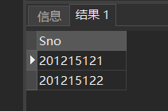

**[例50] 查询计算机科学系的学生与年龄不大于19岁的学生的`交集`**

```sql
SELECT *
FROM Student
WHERE Sdept='CS' 
INTERSECT
SELECT *
FROM Student
WHERE Sage<=19;
```

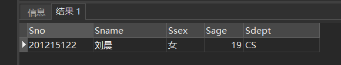

**[例50] 实际上就是查询计算机科学系中年龄不大于19岁的学生**

```sql
SELECT *
FROM Student
WHERE Sdept= 'CS' 
AND  Sage<=19;
```


**[例51] 查询选修课程1的学生集合与选修课程2的学生集合的`交集`**

```sql
SELECT Sno
FROM SC
WHERE Cno='1' 
INTERSECT
SELECT Sno
FROM SC
WHERE Cno='2';
```

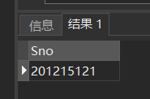

**[例51]实际上是查询既选修了课程1`又`选修了课程2 的学生**

```sql
SELECT Sno
FROM SC
WHERE Cno='1' AND Sno IN
(SELECT Sno
FROM SC
WHERE Cno='2');
```

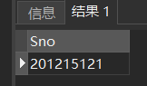

**[例52] 查询计算机科学系的学生与年龄不大于19岁的学生的`差集`。**

```sql
SELECT *
FROM Student
WHERE Sdept='CS'
EXCEPT
SELECT  *
FROM Student
WHERE Sage <=19;
```

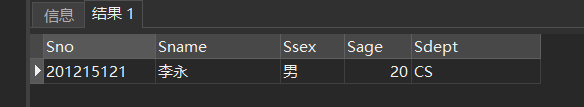

**[例52]实际上是查询计算机科学系中年龄大于19岁的学生**

```sql
SELECT *
FROM Student
WHERE Sdept= 'CS' 
AND  Sage>19;
```

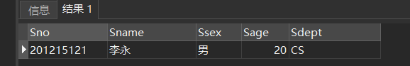

## 3.4. 数据更新

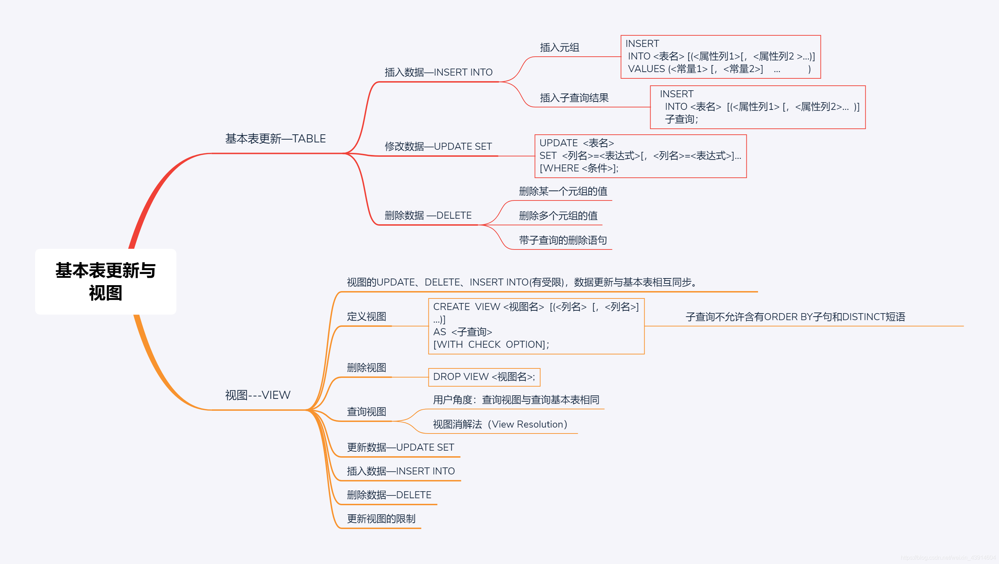

### 3.4.1 基本表更新—TABLE

#### 1) 插入数据

**两种插入数据方式**

1. 插入元组
2. 插入子查询结果

- 可以一次插入多个元组

##### ① 插入元组

**语句格式**

```sql
	INSERT
	INTO <表名> [(<属性列1>[，<属性列2 >…)]
	VALUES (<常量1> [，<常量2>]    …           )
```

功能:将新元组插入指定表中

**INTO子句**

- 属性列的顺序可与表定义中的顺序不一致
- 没有指定属性列
- 指定部分属性列

**VALUES子句**

- 提供的值必须与INTO子句匹配
- 值的个数
- 值的类型

**［例1］ 将一个新学生元组（学号：200215128；姓名：陈冬；性别：男；所在系：IS；年龄：18岁）插入到Student表中。**

```sql
    INSERT
    INTO  Student (Sno，Sname，Ssex，Sdept，Sage)
    VALUES ('200215128'，'陈冬'，'男'，'IS'，18)；
```

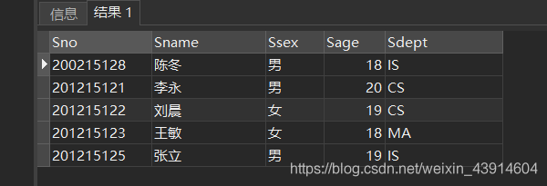
**［例2］ 将学生张成民的信息插入到Student表中。**

```sql
INSERT
INTO  Student
VALUES ('200215126', '张成民', '男',18,'CS'); 
```

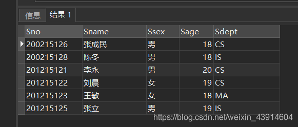

**［例3］ 插入一条选课记录( ‘200215128’，'1 ')。**

```sql
INSERT
INTO SC(Sno,Cno)//RDBMS将在新插入记录的Grade列上自动地赋空值
VALUES ('200215128','1');
//等价
INSERT
INTO SC
VALUES ('200215128','1',NULL);
```

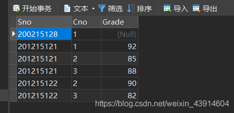

##### ② 插入子查询结果

**语句格式**

```sql
    INSERT 
    INTO <表名>  [(<属性列1> [，<属性列2>…  )]
    子查询；
```

**功能**
将子查询结果插入指定表中

**INTO子句(与插入元组类似)**

**子查询**

- SELECT子句目标列必须与INTO子句匹配
  值的个数
  值的类型

**[例4] 对每一个系，求学生的平均年龄，并把结果存入数据库。**

**第一步：建表**

```sql
CREATE  TABLE  Dept_age(
Sdept  CHAR(15),       /* 系名*/
Avg_age SMALLINT  /*学生平均年龄*/
);   	 
```

**第二步：插入数据**

```sql
INSERT INTO  Dept_age(Sdept,Avg_age)
SELECT  Sdept,AVG(Sage)
FROM  Student
GROUP BY Sdept;
```

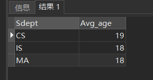

**RDBMS在执行插入语句时会检查所插元组是否破坏表上已定义的完整性规则**

- 实体完整性
- 参照完整性
- 用户定义的完整性
- NOT NULL约束
- UNIQUE约束
- 值域约束

#### 2) 修改数据

**语句格式**

```sql
UPDATE  <表名>
SET  <列名>=<表达式>[，<列名>=<表达式>]…
[WHERE <条件>];
```

**功能**
修改指定表中满足WHERE子句条件的元组

**SET子句**

- 指定修改方式
- 要修改的列
- 修改后取值

**WHERE子句**

- 指定要修改的元组
- `缺省表示要修改表中的所有元组`

**三种修改方式**

1. 修改某一个元组的值
2. 修改多个元组的值
3. 带子查询的修改语句

##### ① 修改某一个元组的值

**[例5] 将学生201215121的年龄改为22岁**

```sql
UPDATE  Student
SET Sage=22
WHERE  Sno='201215121'; 
```

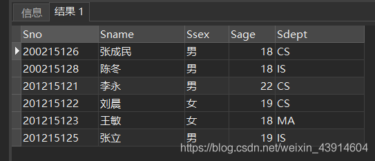

**[例6] 将所有学生的年龄增加1岁**

```sql
UPDATE Student
SET Sage= Sage+1;
```

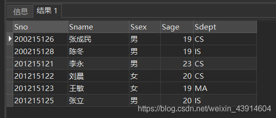
**[例7] 将计算机科学系全体学生的成绩置零。**

```sql
UPDATE SC
SET  Grade=0
WHERE  'CS'=( 
SELECT  Sdept
FROM  Student
WHERE  Student.Sno = SC.Sno
	);
```

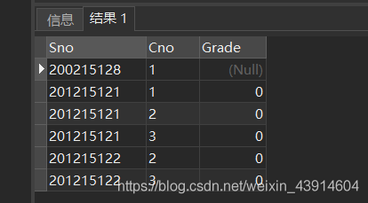

**RDBMS在执行修改语句时会检查修改操作是否破坏表上已定义的完整性规则**

- 实体完整性
- 主码不允许修改
- 用户定义的完整性
- NOT NULL约束
- UNIQUE约束
- 值域约束

#### 3) 删除数据

**三种删除方式**

1. 删除某一个元组的值
2. 删除多个元组的值
3. 带子查询的删除语句

##### ① 删除某一个元组的值

```sql
DELETE
FROM Student
WHERE Sno= '200215128';
```

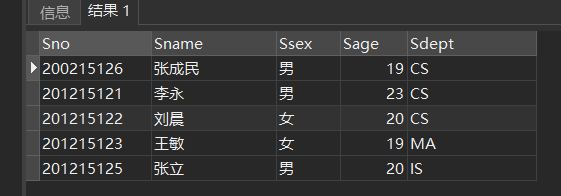

##### ② 删除多个元组的值

**[例9] 删除所有的学生选课记录。**

```sql
        DELETE
        FROM SC；//这个我就不截图了
```

##### ③ 带子查询的删除语句

[例10] 删除计算机科学系所有学生的选课记录。

```sql
DELETE
FROM SC
WHERE  'CS'=(
   SELECT Sdept
   FROM Student
   WHERE Student.Sno=SC.Sno
   	);
```

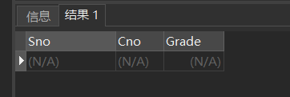

### 3.4.2 视图—VIEW

**视图的作用：**

1. 视图能够简化用户的操作
2. 视图使用户能以多种角度看待同一数据
3. 视图对重构数据库提供了一定程度的逻辑独立性
4. 视图能够对机密数据提供安全保护
5. 适当的利用视图可以更清晰的表达查询

**视图的特点**

- 虚表，是从一个或几个基本表（或视图）导出的表
- 只存放视图的定义，不存放视图对应的数据
- 基表中的数据发生变化，从视图中查询出的数据也随之改变

**基于视图的操作**

- 查询
- 删除
- 受限更新
- 定义基于该视图的新视图

> 视图的UPDATE、DELETE、INSERT INTO(有受限)，与基本表同步。

#### （1）定义视图

##### ① 建立视图

- **语句格式**

```sql
CREATE  VIEW <视图名>  [(<列名>  [，<列名>]…)]
AS  <子查询>
[WITH  CHECK  OPTION];
```

- 组成视图的属性列名：全部省略或全部指定
- `子查询不允许`含有`ORDER BY`子句和`DISTINCT`短语
- RDBMS执行CREATE VIEW语句时只是把视图定义存入`数据字典`，并不执行其中的SELECT语句。
- 在对视图查询时，按视图的定义从基本表中将数据查出。

**[例1] 建立信息系IS学生的视图。**

```sql
CREATE VIEW IS_Student
AS 
SELECT Sno,Sname,Sage
FROM    Student
WHERE  Sdept= 'IS';
```

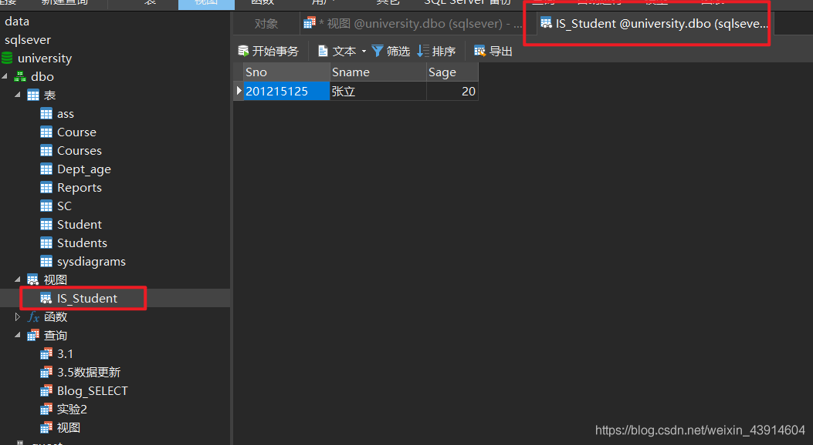
**[例2]建立信息系学生的视图，并要求进行修改和插入操作时仍需保证该视图只有信息系IS的学生 。**
**对IS_Student视图的更新操作：**

- 修改操作：自动加上Sdept= 'IS’的条件
- 删除操作：自动加上Sdept= 'IS’的条件
- 插入操作：自动检查Sdept属性值是否为’IS’
  - 如果不是，则拒绝该插入操作
  - 如果没有提供Sdept属性值，则自动定义Sdept为’IS’

```sql
CREATE VIEW IS_Student
AS 
SELECT Sno,Sname,Sage
FROM  Student
WHERE  Sdept= 'IS'
WITH CHECK OPTION;
```

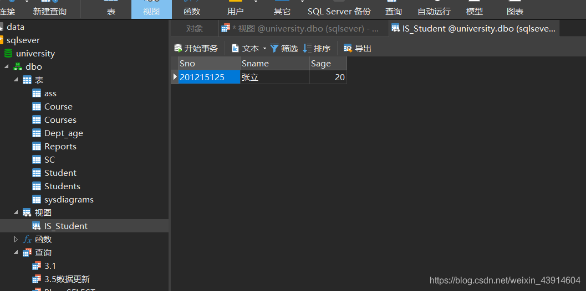
**基于多个基表的视图**

**[例3] 建立信息系选修了1号课程的学生视图。**

```sql
CREATE VIEW IS_S1(Sno,Sname,Grade)
AS 
SELECT Student.Sno,Sname,Grade
FROM  Student,SC
WHERE  Sdept= 'IS' 
AND Student.Sno=SC.Sno 
AND SC.Cno= '1';
```

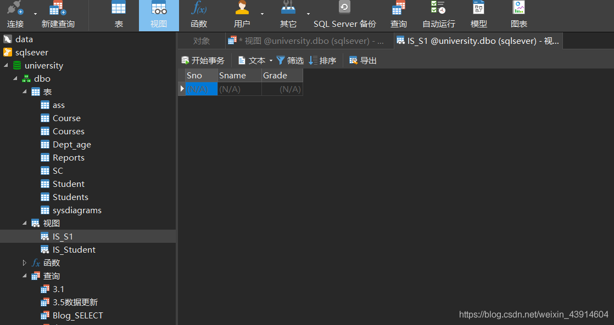
**基于视图的视图**

**[例4] 建立信息系选修了1号课程且成绩在90分以上的学生的视图。**

```sql
CREATE VIEW IS_S2
AS
SELECT Sno,Sname,Grade
FROM  IS_S1
WHERE  Grade>=90;
```

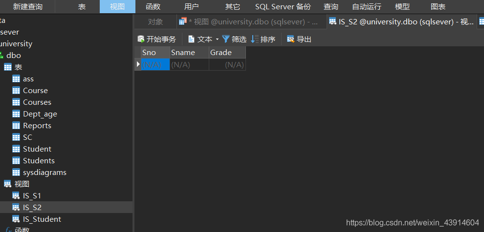

**带表达式的视图**

**[例5] 定义一个反映学生出生年份的视图。**

```sql
CREATE  VIEW BT_S(Sno,Sname,Sbirth)
AS 
SELECT Sno,Sname,2000-Sage
FROM  Student;
```

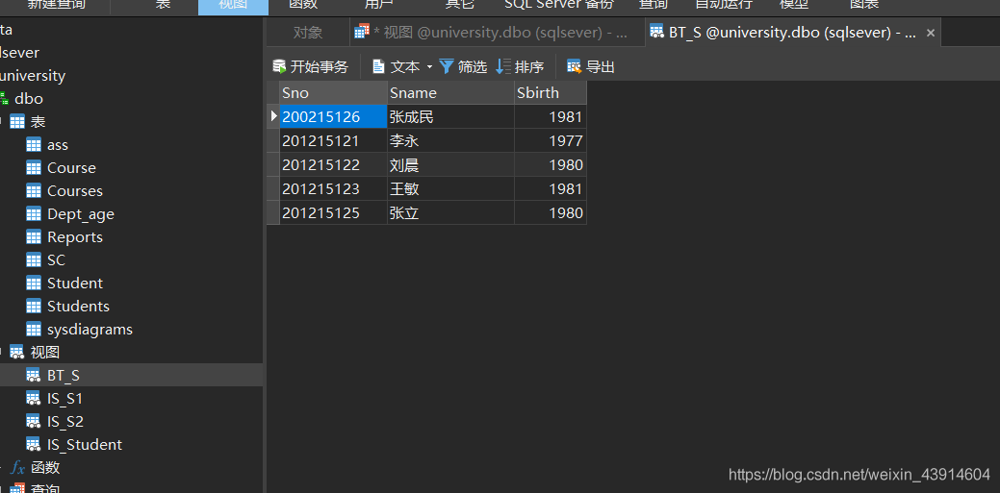

**分组视图**

**[例6] 将学生的学号及他的平均成绩定义为一个视图**

```sql
CREATE  VIEW S_G(Sno,Gavg)
AS  
SELECT Sno,AVG(Grade)
FROM  SC
GROUP BY Sno;
```

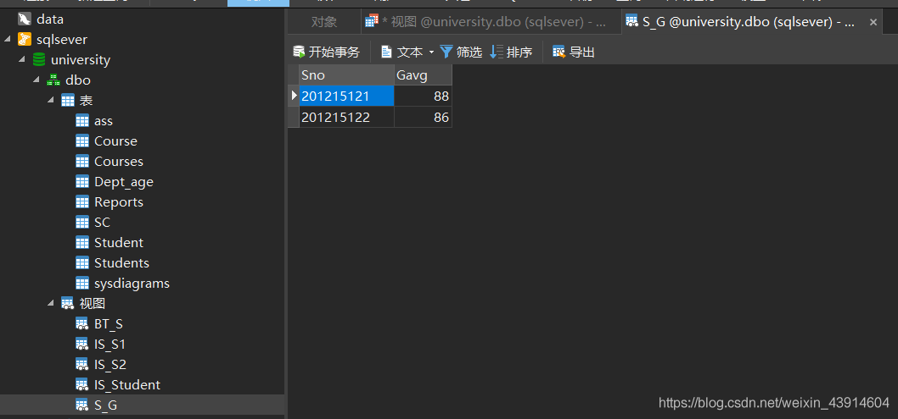
**不指定属性列**
**[例7]将Student表中所有女生记录定义为一个视图**

```sql
CREATE VIEW F_Student(F_Sno,name,sex,age,dept)
AS
SELECT *
FROM  Student
WHERE Ssex='女';
```

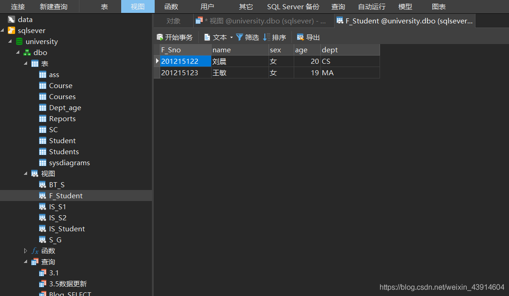
**缺点：**

- 修改基表Student的结构后，Student表与F_Student视图的映象关系被破坏，导致该视图不能正确工作。

##### ② 删除视图

**语句的格式:**

```sql
DROP VIEW <视图名>;
```

- 该语句从`数据字典`中删除指定的视图定义
- 如果该视图上还导出了其他视图，使用`CASCADE级联`删除语句，把该视图和由它导出的所有视图一起删除
- 删除基表时，由该基表导出的所有视图定义都必须显式地使用DROP VIEW语句删除

**［例8］ 删除视图IS_S1**

```sql
DROP VIEW IS_S1;
```

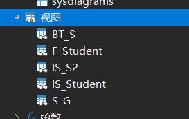

- 关于级联删除CASCADE，不知道为什么，删除模式、删除表、删除视图，有约束却删除不了，有待解决，先放这里。

#### （2）查询视图

**用户角度：`查询视图与查询基本表相同`**

**RDBMS实现视图查询的方法**

- 视图消解法（View Resolution）
  - 进行有效性检查
  - 转换成等价的对基本表的查询
  - 执行`修正`后的查询

关系数据库管理系统执行对视图的查询时，首先进行`有效性检查`，检查查询中涉及的表、视图等是否存在。如果存在，则从`数据字典`中取出视图的定义，把定义中的`子查询`和`用户的查询`结合起来，`转换成等价的对基本表的查询`，`然后再执行修正了的查询`。这一转换过程称为`视图消解`(view resolution)。

**[例9] 在信息系学生的视图中找出年龄小于等于20岁的学生。**

```sql
SELECT   Sno,Sage
FROM      IS_Student
WHERE   Sage<=20;
```

IS_Student视图的定义 (参见视图定义例1)
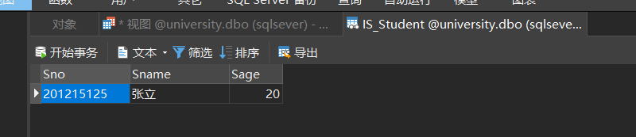
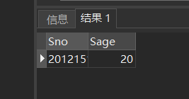
**视图消解转换后的查询语句为：**

```sql
 SELECT  Sno，Sage       
 FROM  Student
 WHERE  Sdept= 'IS'  AND  Sage<=20；
```

**[例10] 查询选修了1号课程的信息系学生**

```sql
SELECT  IS_Student.Sno,Sname
FROM     IS_Student,SC
WHERE  IS_Student.Sno =SC.Sno AND SC.Cno= '1';
```

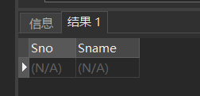

**视图消解法的局限**

- 有些情况下，视图消解法不能生成正确查询。

**[例11]在S_G视图中查询平均成绩在90分以上的学生学号和平均成绩**

```sql
SELECT *
FROM   S_G
WHERE  Gavg>=90;
```

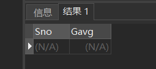

**S_G视图的子查询定义：**

```sql
CREATE VIEW S_G (Sno,Gavg)
AS 
SELECT  Sno,AVG(Grade)
FROM  SC
GROUP BY Sno;
```

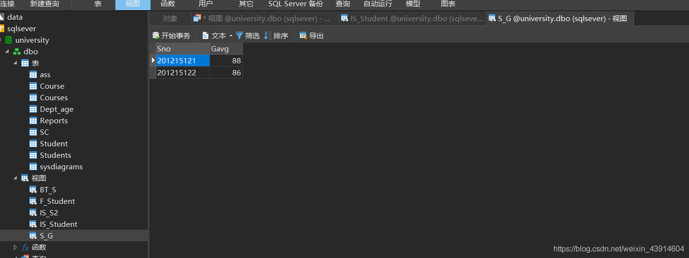

```sql
错误：
SELECT Sno,AVG(Grade)
FROM     SC
WHERE  AVG(Grade)>=90
GROUP BY Sno;

正确：
SELECT  Sno,AVG(Grade)
FROM  SC
GROUP BY Sno
HAVING AVG(Grade)>=90;
```

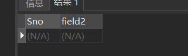

#### （3）更新视图

##### ① 更新数据—UPDATE SET

**[例12] 将信息系学生视图IS_Student中学号201215125的学生姓名改为“刘辰”。**
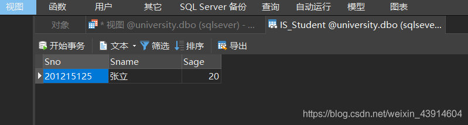

```sql
UPDATE  IS_Student
SET  Sname= '刘辰'
WHERE  Sno= '201215125';
转换后的语句：//基本表和视图表同步更新
UPDATE  Student
SET Sname= '刘辰'
WHERE Sno= '201215125' 
AND Sdept= 'IS'; 
```

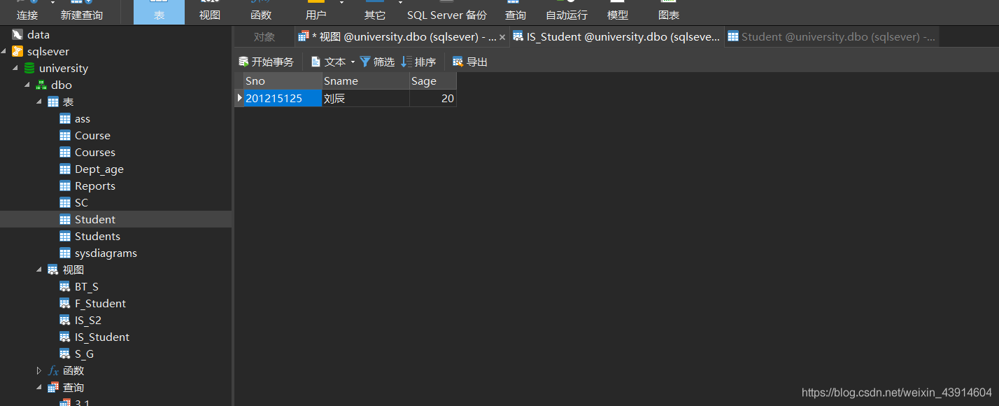
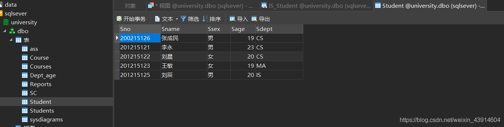

##### ② 插入数据—INSERT INTO

**[例13] 向信息系学生视图IS_Student中插入一个新的学生记录：200215111，赵新，20岁**

```sql
视图IS_Student的定义
CREATE VIEW IS_Student
AS 
SELECT Sno,Sname,Sage
FROM    Student
WHERE  Sdept= 'IS';
//如果加了WITH CHECK OPTION，则视图不能进行插入数据操作
CREATE VIEW IS_Student
AS 
SELECT Sno,Sname,Sage
FROM  Student
WHERE  Sdept= 'IS'
WITH CHECK OPTION;

//插入数据
INSERT
INTO IS_Student
VALUES('200215111','赵新',20);
//插入后基本表Student字段Sdept为空，视图表IS_Student无数据
转换为对基本表的更新：
INSERT
INTO   Student(Sno,Sname,Sage,Sdept)
VALUES('200215129','赵新2',20,'IS');
4567891011121314151617181920212223
```

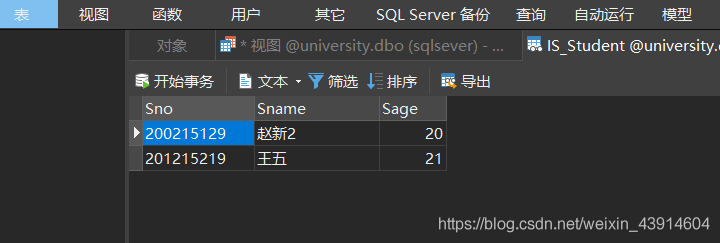
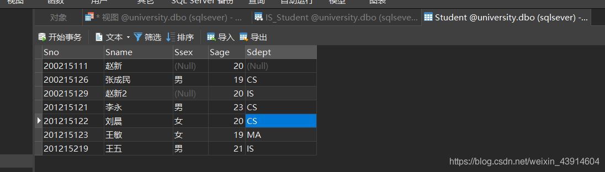

##### ③ 删除数据—DELETE

**[例14]删除信息系学生视图IS_Student中学号为200215129的记录**

```sql
DELETE
FROM IS_Student
WHERE Sno= '200215129';
转换为对基本表的更新：
DELETE
FROM Student
WHERE Sno= '200215129' AND Sdept= 'IS';
4567
```

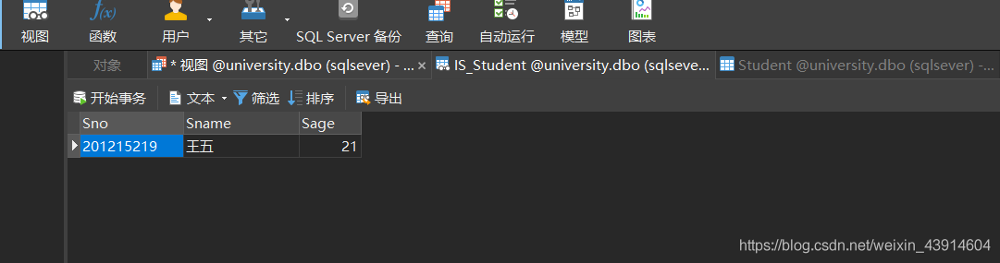
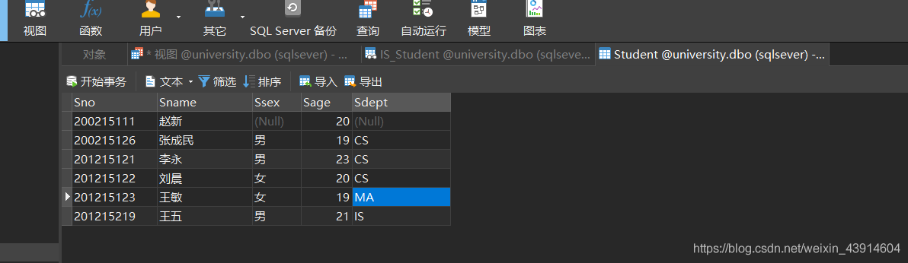

##### ④ 更新视图的限制

- `更新视图的限制：`一些视图是不可更新的，因为对这些视图的更新不能唯一地有意义地转换成对相应基本表的更新

**例：视图S_G为不可更新视图。**
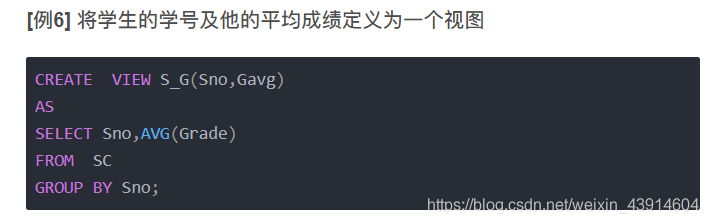

```sql
UPDATE  S_G
SET          Gavg=90
WHERE  Sno= '200215121';

```

这个对视图的更新无法转换成对基本表SC的更新

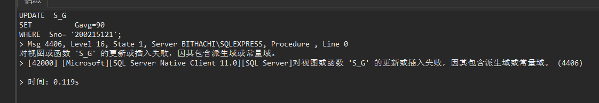

- 允许对行列子集视图进行更新
- 对其他类型视图的更新不同系统有不同限制


## 3.5. 空值处理

### 3.5.1. 空值的约束条件

not null，unique，码属性

## 3.6. 视图

### 3.6.1. 视图消解

执行视图查询时，先进行有效性检查。如果视图、表都存在，就取出视图定义，把定义中的子查询和用户查询结合起来，转换成等价的对基本表的查询。这一转换过程被称为**视图分解**。

### 3.6.2. 视图的作用

1. 视图能够简化用户的操作（简化操作）
2. 视图使用户能以多种角度看待同一数据（多角度）
3. 视图对重构数据库提供了一定程度的逻辑独立性（逻辑独立性）
4. 视图能对机密数据提供安全保护（安全保护）
5. 适当利用视图可以更清晰地表达查询（清晰表达）


在一个项目的实际开发过程中牵涉到复杂业务的时候，我们不可避免的需要使用中间表来进行数据连接，有的同学就说了，我可以采用Hibernate进行主外键进行关联啊？多对多，多对一，一对一，等，采用主外键关联在数据的操作过程中具有很强的耦合性，尤其对于需要经常删改数据表而言，我们是不建议采用主外键关联这种模式，那么，如果我们采用中间表的话，当数据过大在性能上又面临严峻考验，sql视图的出现，在解决中间表的业务逻辑上是不错的选择。ok，首先我们了解什么是视图？

1、视图是表？没错，但是是一张虚拟表，视图的字段是由我们自定义的，视图只供查询，数据不可更改，查询数据来源于我们建立的实体表。

2、使用视图的优势？视图可以将多个复杂关联表，提取出我们需要的信息，优化查询速度。

如何创建视图？

我们先建立三张表；如下:

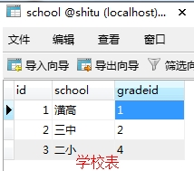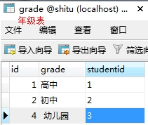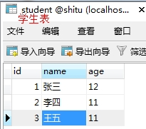

这个是典型的一对多和一对一的关系，那么，假如每张表的数据都在一万条数据以上，现在查询在潢高上学的学生姓名？

首先，我们分析一下，在潢高上学？首先是一个高中，那么我们会有一条Sql where school='潢高',

查询出一个List,得到gradeids，然后再到grade中根据gradeids查询这么多grades对应的studentids，在使用这些studentsid查询出students循环最后得到name？

是不是很累赘？查询是不是很影响性能？ 

观察得知，这三张表每两张表之间都是通过id进行关联的，如果我们通过id将三张表组成一张表，是不是很方便？ 

我们来关联学校表和年级表:这个年级ID我们不要，ok？ 

~~~sql
select s.id as schoolId,s.school as schoolName,s.gradeid as gradeid,g.grade as gradeName,g.studentid as studentid from school s,grade g  where s.gradeid=g.id; 
~~~


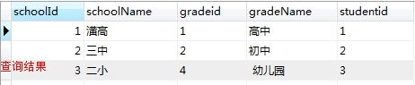

那么我们再关联上学生表，学生表的id等于年级表的studentid ok？

~~~sql
SELECT s.id as schoolId,s.school as schoolName,s.gradeid as gradeid,g.grade as gradeName,g.studentid as studentid ,t.`name` as studentName,t.age as studentAge
from school s,grade g,student t where s.gradeid=g.id and  g.studentid=t.id;
~~~


ok，到了这里？我们再看运行结果？ 

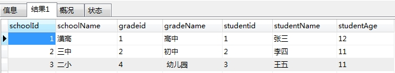

那么我们想查询在潢高上学的学生姓名，where schoolName='潢高',获取的list循环得到Object，通过Object.getStudentName,就可以了？

所以需要将查询到的结果，建立为一张虚拟表,这样才能操作，通过这个create view 视图名 as 命令建立:

意思就是将查询结果创建为名称为table_sgt的一张虚拟表:

~~~sql
create view table_sgt as(select s.id as schoolId,s.school as schoolName,s.gradeid as gradeid,g.grade as gradeName,g.studentid as studentid ,t.`name` as studentName,t.age as studentAge from school s,grade g,student t where s.gradeid=g.id and  g.studentid=t.id);
~~~


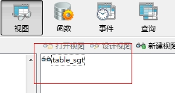

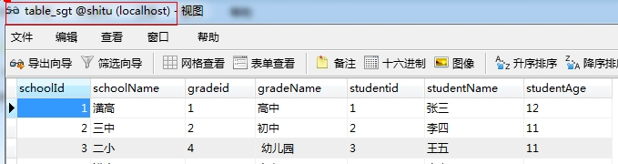

我们在使用视图的时候，需要把它看做为一张表，建立一张实体表需要做的步骤，视图也都需要(例如，实例化，配置映射文件，对象的属性get,set方法)

注意视图所查询出来的数据只能进行查看，不能增删改！


### 3.6.3. 视图的更新问题

视图是不实际存储数据的虚表，因此对视图的更新，最终要转换为对基本表的更新。**因为有些视图的更新不能惟一有意义地转换成对相应基本表的更新**，所以，并不是所有的视图都是可更新的.
基本表的行列子集视图一般是可更新的。若视图的属性来自集合函数、表达式，则该视图肯定是不可以更新的。


# 4. 数据库安全性

> 保护数据库以防止不合法使用所造成的的数据泄露、更改或破坏

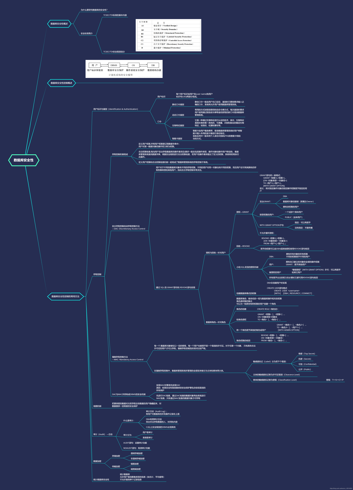


## 4.1 数据库安全性概述

### 4.1.1 为什么要研究数据库的安全性？

**问题的提出：**

- 数据库的一大特点是数据可以共享
- 数据共享必然带来数据库的安全性问题
- `数据库系统中的数据共享不能是无条件的共享`
- 例： 军事秘密、国家机密、新产品实验数据、
  市场需求分析、市场营销策略、销售计划、
  客户档案、医疗档案、银行储蓄数据

**非法使用数据库的情况：**

- 编写合法程序绕过DBMS及其授权机制（黑客等）
- 直接或编写应用程序执行非授权操作（黑客等）
- 通过多次合法查询数据库从中推导出一些保密数据（黑客等）

### 4.1.2 安全标准简介

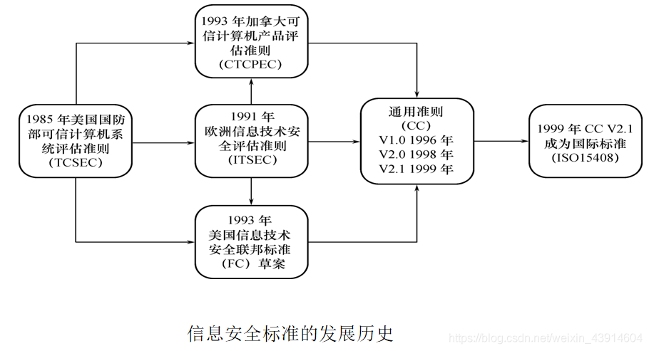

#### ① TCSEC/TDI标准的基本内容

- TCSEC/TDI，从四个方面来描述安全性级别划分的指标
  安全策略
  责任
  保证
  文档

#### ② TCSEC/TDI安全级别划分

- 按系统可靠或可信程度逐渐增高
- 各安全级别之间：偏序向下兼容
  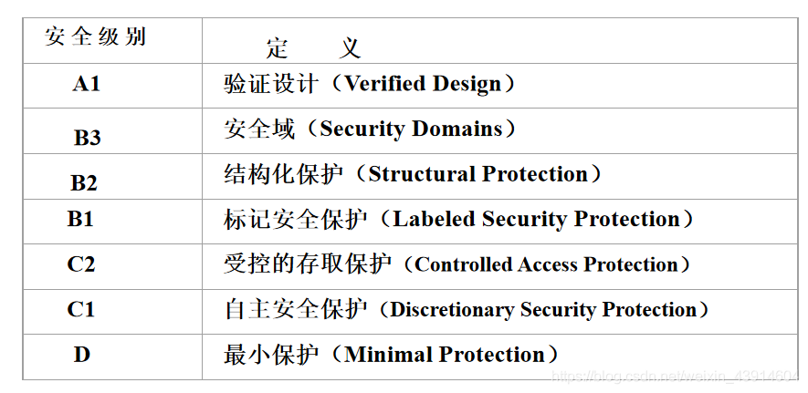

**B2以上的系统：**

- 还处于理论研究阶段
- 应用多限于一些特殊的部门，如军队等
- 美国正在大力发展安全产品，试图将目前仅限于少数领域应用的B2安全级别下放到商业应用中来，并逐步成为新的商业标准

## 4.2 数据库安全性控制概述

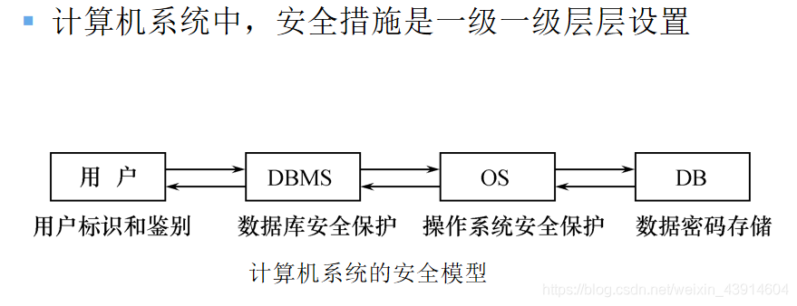

- 用户要求进入计算机系统时，系统首先根据输入的用户标识进行用户身份鉴定，只有合法的用户才准许进入计算机系统;对已进入系统的用户，数据库管理系统还要进行存取控制，只允许用户执行合法操作;操作系统也会有自己的保护措施;数据最后还可以以密码形式存储到数据库中（例如md5加密密码等信息）。

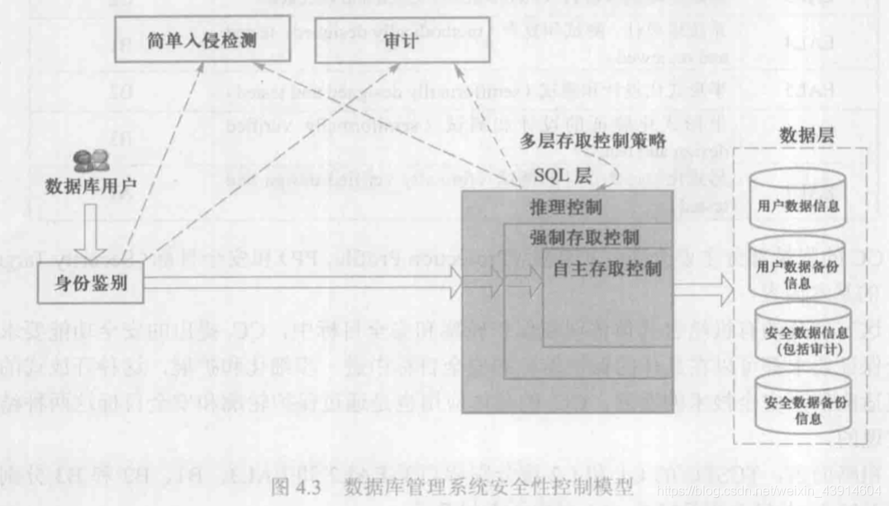

**数据库安全性控制的常用方法：**

- 用户标识和鉴定
- 存取控制
- 视图
- 审计
- 密码存储

## 4.3 数据库安全性控制

### 4.3.1 用户标识与鉴别

- `是系统提供的最外层安全保护措施`
- 用户标识
  每个用户标识由用户名(user name)和用户标识号(UID)两部分组成。
  UID在系统的整个生命周期内是唯–的。系统内部记录着所有合法用户的标识
- 口令
  系统核对口令以鉴别用户身份 （口令可理解为密码）
- 用户标识和口令易被窃取
  每个用户预先约定好一个计算过程或者函数

**常用的用户身份鉴别方法有以下几种：**

#### ① 静态口令鉴别

- 这种方式是当前常用的鉴别方法。
- `静态口令一般由用户自己设定，鉴别时只要按要求输入正确的口令，系统将允许用户使用数据库管理系统。`
- 这些口令是静态不变的，在实际应用中，用户常常用自己的生日、电话、简单易记的数字等内容作为口令，很容易被破解。而一旦被破解，非法用户就可以冒充该用户使用数据库。
- 这种方式虽然简单，但容易被攻击，安全性较低。

#### ② 动态口令鉴别

- 它是目前较为安全的鉴别方式。
- 这种方式的口令是动态变化的，每次鉴别时均需使用动态产生的新口令登录数据库管理系统，即采用一次一密的方法。
- `常用的方式如短信密码和动态令牌方式，每次鉴别时要求用户使用通过短信或令牌等途径获取的新口令登录数据库管理系统。`
- 与静态口令鉴别相比，这种认证方式增加了口令被窃取或破解的难度，安全性相对高一些。

#### ③ 生物特征鉴别

- 它是一种通过生物特征进行认证的技术，其中，生物特征是指生物体唯一具有的，可测量、识别和验证的稳定生物特征，如`指纹、虹膜和掌纹等`。
- 这种方式通过采用图像处理和模式识别等技术实现了基于生物特征的认证，- 与传统的口令鉴别相比，无疑产生了质的飞跃，安全性较高。

#### ④ 智能卡鉴别

- 智能卡是一种不可复制的硬件，内置集成电路的芯片，具有硬件加密功能。
- `智能卡由用户随身携带，登录数据库管理系统时用户将智能卡插入专用的读卡器进行身份验证。`
- 由于每次从智能卡中读取的数据是静态的，通过内存扫描或网络监听等技术还是可能截取到用户的身份验证信息，存在安全隐患。
- 因此，实际应用中一般采用`个人身份识别码(PIN)和智能卡`相结合的方式。这样，即使PIN或智能卡中有一种被窃取，用户身份仍不会被冒充。

### 4.3.2 存取控制

- 数据库安全最重要的一点就是确保只授权给有资格的用户访问数据库的权限，同时令所有未被授权的人员无法接近数据，这`主要通过数据库系统的存取控制机制实现。`

#### ① 存取控制机制组成:

- `定义用户权限`,并将用户权限登记到数据字典中；
  用户对某一数据对象的操作权力称为权限。
- `合法权限检查`,每当用户发出存取数据库的操作请求后(请求一般应包括操作类型、操作对象和操作用户等信息)，`数据库管理系统查找数据字典，根据安全规则进行合法权限检查`，若用户的操作请求超出了定义的权限，系统将拒绝执行此操作。

**`定义用户权限`和`合法权限检查机制`一起组成了`数据库管理系统的存取控制子系统`。**

- `C2级`的数据库管理系统支持`自主存取控制`( Discretionary Access Control, DAC),
- `B1级`的数据库管理系统支持`强制存取控制`( Mandatory Access Control, MAC)。

**这两类方法的简单定义是:**

- (1)在`自主存取控制`方法中，用户对于不同的数据库对象有不同的存取权限，不同的用户对同一对象也有不同的权限，而且用户还可将其拥有的存取权限转授给其他用户。因此自主存取控制非常灵活。
- (2)在`强制存取控制`方法中，每一个 数据库对象被标以一定的密级，每一个用户也被授予某一个级别的许可证。对于任意一个对象， 只有具有合法许可证的用户才可以存取。强制存取控制因此相对比较严格。

### 4.3.3 自动存取控制方法—DAC

- 通过 SQL 的 `GRANT`语句和 `REVOKE`语句实现
- **用户权限组成**
  `数据对象`
  `操作类型`
- 定义用户存取权限：定义用户可以在哪些数据库对象上进行哪些类型的操作
- `定义存取权限称为授权`

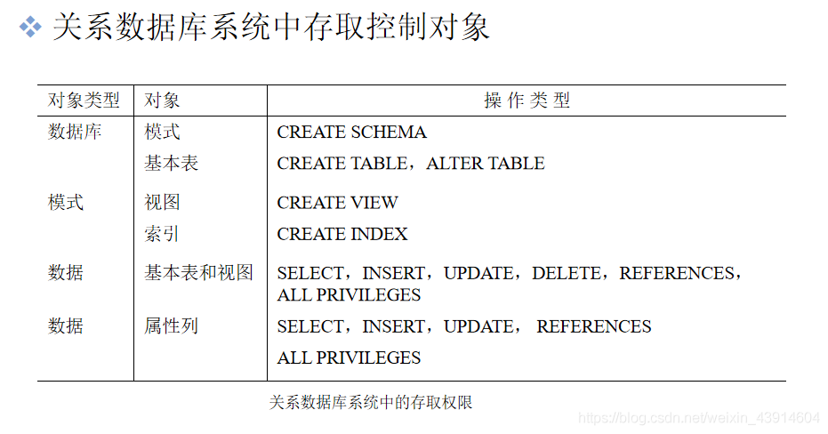

#### ① 授权与回收—针对用户

##### 1️⃣ 授权—GRANT

```sql
GRANT语句的一般格式：
       GRANT <权限>[,<权限>]... 
       [ON <对象类型> <对象名>]
       TO <用户>[,<用户>]...
       [WITH GRANT OPTION];
语义：将对指定操作对象的指定操作权限授予指定的用户 
```

**发出GRANT：**

- DBA
- 数据库对象创建者（即属主Owner）
- 拥有该权限的用户

**按受权限的用户:**

- 一个或多个具体用户
- PUBLIC（全体用户）

**WITH GRANT OPTION子句:**

- 指定：可以再授予
- 没有指定：不能传播

**不允许循环授权：**

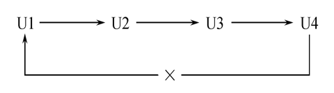

**[例1] 把查询Student表权限授给用户U1**

```sql
GRANT   SELECT 
ON   TABLE   Student 
TO   U1;
```

> 举个例子而已，不同数据库请参考相关文档，先打基础。有个印象，知道有这么个东西，其实很多数据库管理系统已经将这些封装好了，简洁漂亮的UI，灵活的操作，基本不会用到语句来写。话不多说，直接上图：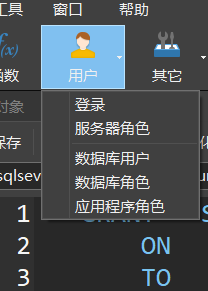

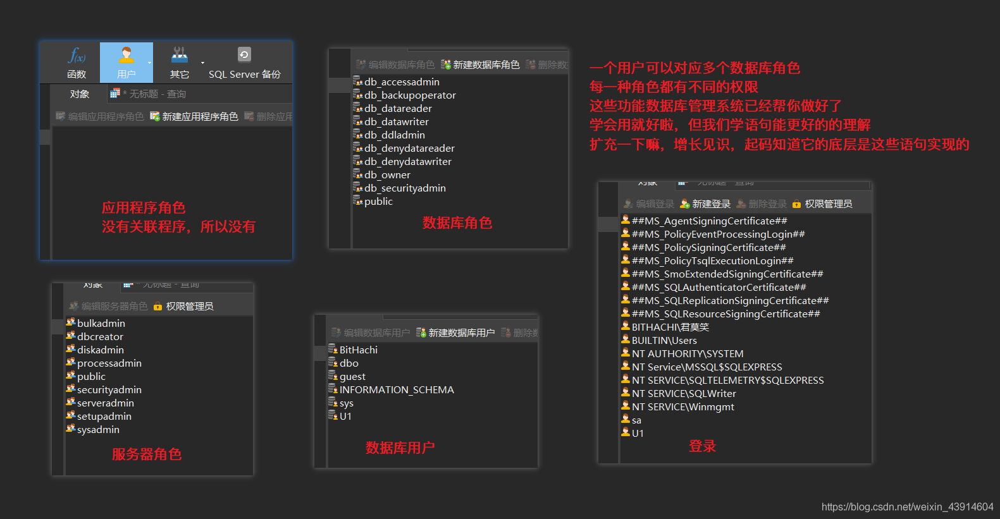

**[例2] 把对Student表和Course表的全部权限授予用户U2和U3**

```sql
GRANT ALL PRIVILIGES 
ON TABLE Student, Course 
TO U2, U3;
```

**[例3] 把对表SC的查询权限授予所有用户**

```sql
GRANT SELECT 
ON TABLE SC 
TO PUBLIC;
```

**[例4] 把查询Student表和修改学生学号的权限授给用户U4**

```sql
对属性列的授权时必须明确指出相应属性列名 
	  	GRANT UPDATE(Sno), SELECT 
ON TABLE Student 
TO U4;
4
```

**[例5] 把对表SC的INSERT权限授予U5用户，并允许他再将此权限授予其他用户**

```sql
   GRANT INSERT 
   ON TABLE SC 
   TO U5
   WITH GRANT OPTION;
4
```

**执行例5后，U5不仅拥有了对表SC的INSERT权限，
还可以传播此权限：**
[例6]

```sql
GRANT INSERT ON TABLE SC TO U6
        WITH GRANT OPTION;
12
```

同样，U6还可以将此权限授予U7：

[例7]
`GRANT INSERT ON TABLE SC TO U7;`
但U7不能再传播此权限,因为没有写这条语句`WITH GRANT OPTION`。

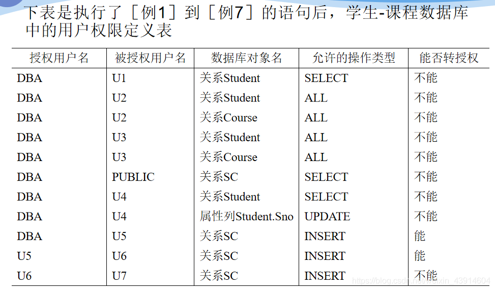

##### 2️⃣ 回收—REVOKE

**授予的权限可以由DBA或其他授权者用REVOKE语句收回**
REVOKE语句的一般格式为：

```sql
      REVOKE <权限>[,<权限>]... 
      [ON <对象类型> <对象名>]
      FROM <用户>[,<用户>]...;

```

**[例8] 把用户U4修改学生学号的权限收回**

```sql
REVOKE UPDATE(Sno)
ON TABLE Student 
FROM U4;

```

**[例9] 收回所有用户对表SC的查询权限**

```sql
REVOKE SELECT 
ON TABLE SC 
FROM PUBLIC;

```

**[例10] 把用户U5对SC表的INSERT权限收回**

```sql
REVOKE INSERT 
ON TABLE SC 
FROM U5 CASCADE ;

将用户U5的INSERT权限收回的时候必须级联（CASCADE）收回 系统只收回直接或间接从U5处获得的权限
```

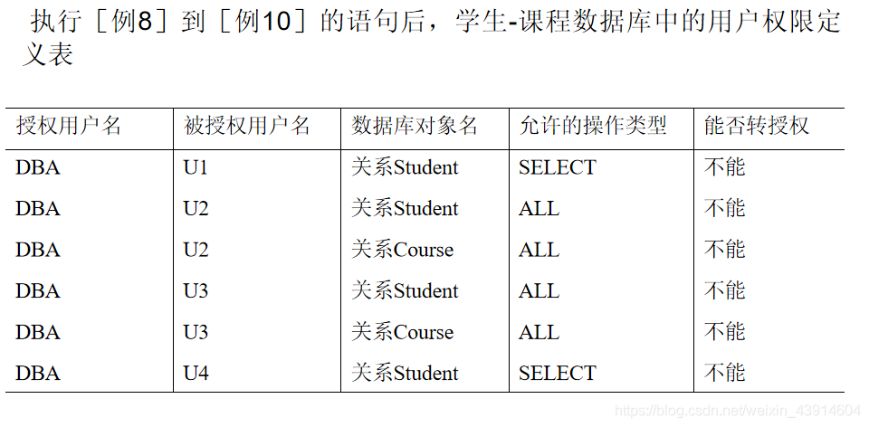

##### 3️⃣ 小结:SQL灵活的授权机制

- DBA：
  拥有所有对象的所有权限
  不同的权限授予不同的用户
- 用户：拥有自己建立的对象的全部的操作权限
  GRANT：授予其他用户
- 被授权的用户
  “继续授权”（WITH GRANT OPTION）许可：可以再授予给其它用户
- 所有授予出去的权力在必要时又都可用REVOKE语句收回

##### 4️⃣ 创建数据库模式的权限

**DBA在创建用户时实现**

```sql
CREATE USER语句格式
              CREATE  USER  <username> 
            ［WITH］［DBA | RESOURCE | CONNECT］

```

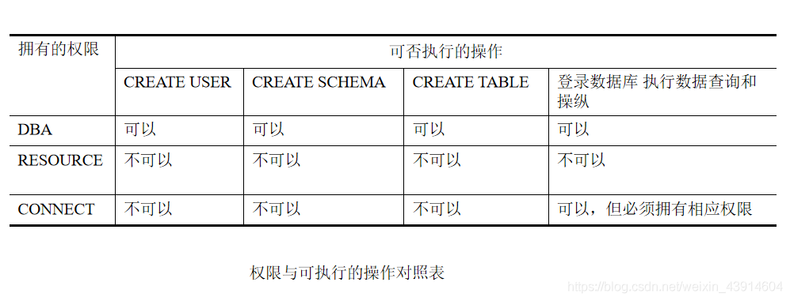

#### ② 数据库角色—针对角色

**数据库角色：被命名的一组与数据库操作相关的权限**

- 角色是权限的集合 ，`结合我刚刚上面截得黑色背景图片了解`
- 可以为一组具有相同权限的用户创建一个角色
- 简化授权的过程

##### 1️⃣ 角色的创建

```
CREATE ROLE <角色名>
```

##### 2️⃣ 给角色授权

```sql
 GRANT  <权限>［，<权限>］… 
 ON <对象类型>对象名  
 TO <角色>［，<角色>］…

```

##### 3️⃣ 将一个角色授予其他的角色或用户

```sql
GRANT  <角色1>［，<角色2>］…
TO  <角色3>［，<用户1>］… 
［WITH ADMIN OPTION］ 

```

##### 4️⃣ 角色权限的收回

```sql
REVOKE <权限>［，<权限>］…
ON <对象类型> <对象名>
FROM <角色>［，<角色>］…

```

**[例11]　通过角色来实现将一组权限授予一个用户。**
`步骤如下：`

1. 首先创建一个角色 R1
   `CREATE ROLE R1；`
2. 然后使用GRANT语句，使角色R1拥有Student表的SELECT、UPDATE、INSERT权限

```sql
    GRANT SELECT，UPDATE，INSERT 
    ON TABLE Student 
    TO R1；

```

1. 将这个角色授予王平，张明，赵玲。使他们具有角色R1所包含的全部权限

```sql
   GRANT  R1 
   TO 王平，张明，赵玲；
12
```

1. 可以一次性通过R1来回收王平的这3个权限

```sql
     REVOKE  R1 
     FROM 王平；
12
```

**[例12]　角色的权限修改**

```sql
      GRANT DELETE 
      ON TABLE Student
      TO R1

```

[例13]　角色权限的收回

```sql
    REVOKE SELECT 
    ON TABLE Student
    FROM  R1；

```

### 4.3.4 强制存取控制方法—MAC

**自主存取控制缺点:**

- 可能存在数据的“无意泄露”
- 原因：这种机制仅仅通过对数据的存取权限来进行安全控制，而数据本身并无安全性标记
- 解决：对系统控制下的所有主客体实施强制存取控制策略

------

**强制存取控制（MAC):**

- 保证更高程度的安全性

- 用户能不能直接感知或进行控制,因为对数据进行了加密

- 适用于对数据有严格而固定密级分类的部门

  *军事部门

  *政府部门

  ------

**在强制存取控制中，数据库管理系统所管理的全部实体被分为主体和客体两大类。**

- `主体`是系统中的活动实体
  DBMS所管理的实际用户
  代表用户的各进程
- `客体`是系统中的被动实体，是受主体操纵的
  文件
  基表
  索引
  视图

------

**对于主体和客体，数据库管理系统为它们每个实例(值)指派一个敏感度标记(label)。**
**敏感度标记（Label）分为若干个级别：**

- 绝密（Top Secret）
- 机密（Secret）
- 可信（Confidential）
- 公开（Public）
- `主体的敏感度标记称为许可证级别`（Clearance Level）
- `客体的敏感度标记称为密级`（Classification Level）
- 密级：T>=S>=C>=P

------

**强制存取控制规则：**

- (1)仅当主体的许可证级别`大于或等于客体`的密级时，该主体才能`读取`相应的客体
- (2)仅当主体的许可证级别`等于`客体的密级时，该主体才能`写`相应的客体
- 修正规则
  `主体的许可证级别 <=客体的密级→ 主体能写客体`

**规则的共同点:**

- `禁止`了拥有高许可证级别的主体`更新`低密级的数据对象

### 4.3.5 DAC与MAC共同构成DBMS的安全机制

- 实现MAC时要首先实现DAC
  原因：较高安全性级别提供的安全保护要包含较低级别的所有保护
- 先进行DAC检查，通过DAC检查的数据对象再由系统进行MAC检查，只有通过MAC检查的数据对象方可存取。
  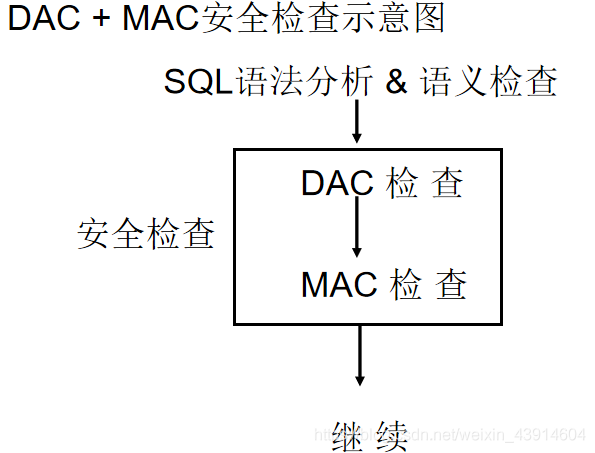

## 4.4 视图机制

**把要保密的数据对无权存取这些数据的用户隐藏起来，对数据提供一定程度的安全保护**

- 主要功能是提供数据独立性，无法完全满足要求
- 间接实现了支持存取谓词的用户权限定义

------

**[例14]建立计算机系学生的视图，`把对该视图的SELECT权限授于王平，把该视图上的所有操作权限授于张明`**

```sql
先建立计算机系学生的视图CS_Student
 CREATE VIEW CS_Student AS 
    SELECT  *
    FROM   Student
    WHERE  Sdept='CS'；
```

**在视图上进一步定义存取权限：**

```sql
     GRANT  SELECT
     ON  CS_Student  
     TO 王平;
     
     GRANT ALL PRIVILIGES
     ON  CS_Student  
     TO  张明;
```

## 4.5 审计（Audit） —日志

**什么是审计：**

- `审计日志（Audit Log）`;
  将用户对数据库的所有操作记录在上面
- DBA利用审计日志
  找出非法存取数据的人、时间和内容
- C2以上安全级别的DBMS必须具有

------

**审计分为:**

- `用户级审计`
  针对自己创建的数据库表或视图进行审计 ;
  记录所有用户对这些表或视图的一切成功和（或）不成功的访问要求以及各种类型的SQL操作 ;
- `系统级审计`
  DBA设置 ;
  监测成功或失败的登录要求 ;
  监测GRANT和REVOKE操作以及其他数据库级权限下的操作;

------

```
AUDIT语句：设置审计功能
NOAUDIT语句：取消审计功能
```

------

**［例15］对修改SC表结构或修改SC表数据的操作进行审计**

```sql
AUDIT ALTER,UPDATE  
ON  SC;
```

**［例16］取消对SC表的一切审计**

```sql
           NOAUDIT  ALTER,UPDATE  
           ON  SC;
```

## 4.6 数据加密

- 数据加密
  防止数据库中数据在`存储`和`传输`中失密的有效手段
- 数据加密分为`存储加密`和`传输加密`

------

### 4.6.1 存储加密

- 对于存储加密，一般提供`透明和非透明`两种存储加密方式。
  `透明`存储加密是`内核级加密保护`方式，`对用户完全透明`
  `非透明`存储加密则是通过`多个加密函数`实现的。
- `透明存储加密`是数据在写到磁盘时对数据进行加密，授权用户读取数据时再对其进行解密。由于数据加密对用户透明，数据库的应用程序不需要做任何修改，只需在创建表语句中说明需加密的字段即可。当对加密数据进行增、删、改、查询操作时，数据库管理系统将自动对数据进行加、解密工作。基于数据库内核的数据存储加密、解密方法性能较好，安全完备性较高。

### 4.6.2 传输加密

- 在客户/服务器结构中，数据库用户与服务器之间若采用明文方式传输数据，容易被网络恶意用户截获或篡改，存在安全隐患。因此，为保证二者之间的安全数据交换，数据库管理系统提供了传输加密功能。
- 常用的传输加密方式如`链路加密和端到端加密`。

#### ① 链路加密

- 链路加密对传输数据在链路层进行加密，它的传输信息由报头和报文两部分组成，前者是路由选择信息，而后者是传送的数据信息。这种方式对报文和报头均加密。

#### ② 端到端加密

- 端到端加密对传输数据在发送端加密，接收端解密。它只加密报文，不加密报头。与链路加密相比，它只在发送端和接收端需要密码设备，而中间节点不需要密码设备，因此它所需密码设备数量相对较少。但这种方式不加密报头，从而容易被非法监听者发现并从中获取敏感信息。

## 4.7 统计数据库安全性

- `统计数据库`
  允许用户查询聚集类型的信息（如合计、平均值等）
  不允许查询单个记录信息

------

- `统计数据库中特殊的安全性问题:`
  隐蔽的信息通道
  能从合法的查询中推导出不合法的信息

------

**统计数据库安全性规则：**

- 规则1：任何查询至少要涉及N(N足够大)个以上的记录
- 规则2：任意两个查询的相交数据项不能超过M个
- 规则3：任一用户的查询次数不能超过1+(N-2)/M

> 数据库安全机制的设计目标：
> 试图破坏安全的人所花费的代价 >> 得到的利益


# 5. 数据库完整性


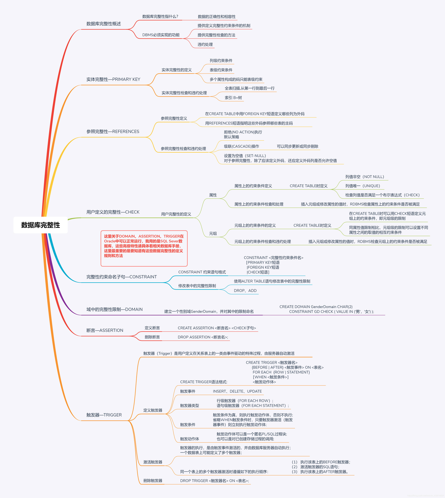

## 5.1 数据库完整性概述

**简单介绍：**

- 首先先概述一下数据库完整性指的是什么，`数据库完整性`指的是数据的`正确性`和`相容性`。
- 数据的`正确性`是指数据是符合现实世界语义、反映当前实际状况的;比如说人类的性别，只能是男和女。
- 数据的`相容性`是指数据库同一对象在不同关系表中的数据是符合逻辑的。比如说年龄一般都在1-100岁，当然也有超过一百岁的，反正没有两百岁，三百岁成仙的人类。

**既然我们学的是数据库，那么数据库管理系统就应该为数据完整性实现如下的功能：**

1.提供定义完整性约束条件的机制

- 完整约束条件也称`完整性规则`，是数据库中数据必须满足的语义条件规则
- 为保证数据的正确、有效和相容性的一些规则
- 数据的主码、外码、一些约束规则

2.提供完整性检查的方法

- 数据库管理系统中检查数据是否满足完整性规则的机制称为`完整性检查`
- 一般在执行INSERT、UPDATE、DELETE时检查

3.违约处理

- 数据库管理系统若发现用户的操作违背了完整性约束条件将采取一定的动作，如拒绝(NO ACTION)执行该操作或级联(CASCADE)执行其他操作，进行违约处理以保证数据的完整性。

**此前写的一篇文章提到了关系完整性约束的基本概念 [关系完整性的基本概念](https://blog.csdn.net/weixin_43914604/article/details/105104581)，而本篇文章讲的是利用SQL如何去实现这些约束机制，如何实现完整性规则**

## 5.2 实体完整性—PRIMARY KEY

### （1）实体完整性的定义

**关系模型的实体完整性**

- CREATE TABLE中用PRIMARY KEY定义

**单属性构成的码有两种说明方法**

- 定义为列级约束条件
- 定义为表级约束条件

**对多个属性构成的码只有一种说明方法**

- 定义为表级约束条件

```sql
举几个例子
将Student表中的Sno属性定义为码

(1)在列级定义主码
CREATE TABLE Student
(Sno  CHAR(9)  PRIMARY KEY，
Sname  CHAR(20) NOT NULL，     
Ssex  CHAR(2) ，
Sage  SMALLINT，
Sdept  CHAR(20));

(2)在表级定义主码
CREATE TABLE Student
(Sno  CHAR(9)，  
Sname  CHAR(20) NOT NULL，
Ssex  CHAR(2) ，
Sage  SMALLINT，
Sdept  CHAR(20)，
PRIMARY KEY (Sno)
); 

将SC表中的Sno，Cno属性组定义为码
CREATE TABLE SC
(Sno   CHAR(9)  NOT NULL， 
Cno  CHAR(4)  NOT NULL，  
Grade    SMALLINT，
PRIMARY KEY (Sno，Cno)     /*只能在表级定义主码*/
); 
```

### （2）实体完整性检查和违约处理

**插入或对主码列进行更新操作时，RDBMS按照实体完整性规则自动进行检查。包括：**

1. 检查主码值是否唯一，如果不唯一则拒绝插入或修改
2. 检查主码的各个属性是否为空，只要有一个为空就拒绝插入或修改

**检查记录中主码值是否唯一的一种方法是进行全表扫描**
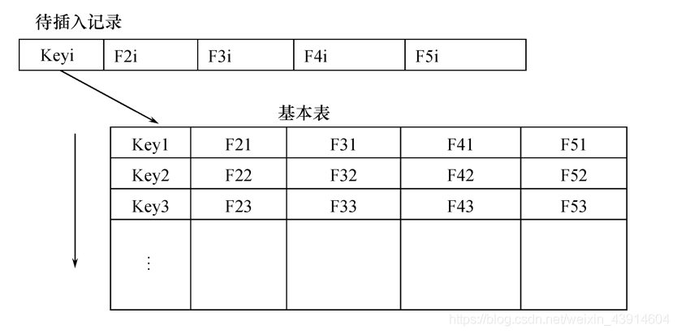

- 全表扫描是十分耗时的。为了避免对基本表进行全表扫描，关系数据库管理系统一般 都在主码上`自动建立一个索引`，如图5.2的B+树索引，通过索引查找基本表中是否已经存在新的主码值将大大提高效率。
- 例如，如果新插入记录的主码值是25，通过主码索引，从B+树的根结点开始查找，只要读取三个结点就可以知道该主码值已经存在，所以不能插入这条记录。这三个结点是根结点(51)、中间结点(1230)和叶结点(15 20 25)。

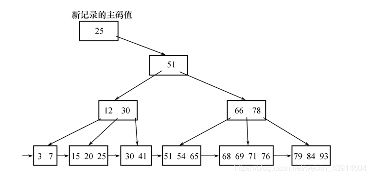

## 5.3 参照完整性—REFERENCES

### （1）参照完整性定义

**关系模型的参照完整性定义**

- 在CREATE TABLE中用`FOREIGN KEY`短语定义哪些列为外码
- 用`REFERENCES`短语指明这些外码参照哪些表的主码

**举个例子**

```sql
例如，关系SC中一个元组表示一个学生选修的某门课程的成绩，
（Sno，Cno）是主码。
Sno，Cno分别参照引用Student表的主码和Course表的主码 

定义SC中的参照完整性
CREATE TABLE SC
(Sno    CHAR(9)  NOT NULL， 
Cno     CHAR(4)  NOT NULL，  
Grade    SMALLINT，
PRIMARY KEY (Sno， Cno)，   /*在表级定义实体完整性*/
FOREIGN KEY (Sno) REFERENCES Student(Sno)，  
/*在表级定义参照完整性*/
FOREIGN KEY (Cno) REFERENCES Course(Cno)    
/*在表级定义参照完整性*/
);
```

### （2）参照完整性检查和违约处理

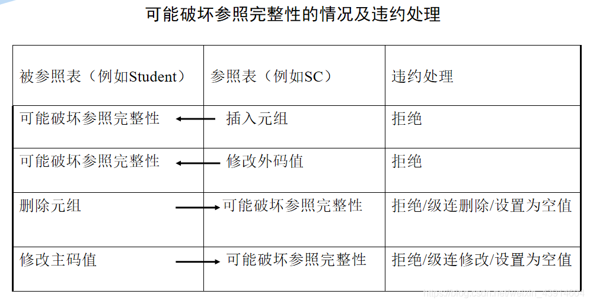

**参照完整性违约处理**

1. 拒绝(NO ACTION)执行
   默认策略
2. 级联(CASCADE)操作
3. 设置为空值（SET-NULL）
   对于参照完整性，除了应该定义外码，还应定义`外码列是否允许空值`

```sql
［例4］  显式说明参照完整性的违约处理示例
CREATE TABLE SC
(Sno   CHAR(9)  NOT NULL，
Cno   CHAR(4)  NOT NULL，
Grade  SMALLINT，
PRIMARY KEY（Sno，Cno）， 				
FOREIGN KEY (Sno) REFERENCES Student(Sno) 
ON DELETE CASCADE     /*级联删除SC表中相应的元组*/
ON UPDATE CASCADE， /*级联更新SC表中相应的元组*/
FOREIGN KEY (Cno) REFERENCES Course(Cno) 	                    
ON DELETE NO ACTION 	
/*当删除course 表中的元组造成了与SC表不一致时拒绝删除*/
ON UPDATE CASCADE   
/*当更新course表中的cno时，级联更新SC表中相应的元组*/
);
```

- 经过测试，当UPDATE更新Student和Course表数据时，SC也自动更新
- 当删除Student的数据时，SC同步删除相应数据
- 当删除Course的数据时，拒绝删除，因为SC中有相应的外码数据，并设置了NO ACTION
- 当删除SC的数据时，对Student和Course无影响

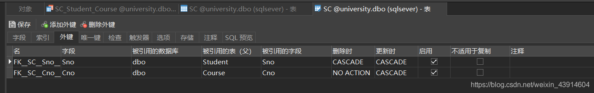


## 5.4 用户定义的完整性—CHECK

- 用户定义的完整性就是针对`某一具体应用的数据`必须满足的语义要求
- RDBMS提供，而不必由应用程序承担

### （1）属性上的约束条件定义

**CREATE TABLE时定义**

- 列值非空（NOT NULL）
- 列值唯一（UNIQUE）
- 检查列值是否满足一个布尔表达式（CHECK）

```sql
1.不允许取空值 

［例5］  在定义SC表时，说明Sno、Cno、Grade属性不允许取空值。

CREATE TABLE SC
(Sno  CHAR(9)  NOT NULL，	
Cno  CHAR(4)  NOT NULL，	
Grade  SMALLINT NOT NULL，	
PRIMARY KEY (Sno， Cno)，  
/* 如果在表级定义实体完整性，隐含了Sno，Cno不允许取空值，
则在列级不允许取空值的定义就不必写了 */
）;

2.列值唯一 

［例6］建立部门表DEPT，要求部门名称Dname列取值唯一，
部门编号Deptno列为主码

CREATE TABLE DEPT
(Deptno  NUMERIC(2)，
Dname  CHAR(9)  UNIQUE，/*要求Dname列值唯一*/
Location  CHAR(10)，
PRIMARY KEY (Deptno)
)；

3. 用CHECK短语指定列值应该满足的条件

［例7］Student表的Ssex只允许取“男”或“女”。

    CREATE TABLE Student
        (Sno  CHAR(9) PRIMARY KEY，
          Sname CHAR(8) NOT NULL，                     
          Ssex  CHAR(2)  CHECK (Ssex IN (‘男’，‘女’) ) ，                
              /*性别属性Ssex只允许取'男'或'女' */
          Sage  SMALLINT，
          Sdept  CHAR(20)
        );
```

### （2）属性上的约束条件检查和处理

- 插入元组或修改属性的值时，RDBMS检查属性上的约束条件是否被满足
- 如果不满足则操作被拒绝执行

### （3）元组上的约束条件的定义

- 在CREATE TABLE时可以用`CHECK`短语定义元组上的约束条件，即`元组级的限制`
- 同属性值限制相比，元组级的限制可以设置不同属性之间的取值的相互约束条件

```sql
［例9］  当学生的性别是男时，其名字不能以Ms.打头。
    CREATE TABLE Student
         (Sno    CHAR(9)， 
          Sname  CHAR(8) NOT NULL，
          Ssex    CHAR(2)，
          Sage   SMALLINT，
          Sdept  CHAR(20)，
          PRIMARY KEY (Sno)，
          CHECK (Ssex='女' OR Sname NOT LIKE 'Ms.%')
          /*定义了元组中Sname和 Ssex两个属性值之间的约束条件*/
        )；
性别是女性的元组都能通过该项检查，因为Ssex=‘女’成立；
当性别是男性时，要通过检查则名字一定不能以Ms.打头
```

### （4）元组上的约束条件检查和违约处理

- 插入元组或修改属性的值时，RDBMS检查元组上的约束条件是否被满足
- 如果不满足则操作被拒绝执行

## 5.5 完整性约束命名子句—CONSTRAINT

### 1) 约束种类

- 非空约束(not null)
- 唯一性约束(unique)
- 主键约束(primary key) PK
- 外键约束(foreign key) FK
- 检查约束(目前MySQL不支持、Oracle支持)


**CONSTRAINT 约束语句格式：**

```sql
CONSTRAINT <完整性约束条件名>
［PRIMARY KEY短语
   |FOREIGN KEY短语
   |CHECK短语］
```

举个例子：

```sql
［例10］  建立学生登记表Student，要求学号在90000~99999之间，
姓名不能取空值，年龄小于30，性别只能是“男”或“女”。
 CREATE TABLE Student
      (Sno  NUMERIC(6)
        CONSTRAINT C1 CHECK (Sno BETWEEN 90000 AND 99999),
        Sname  CHAR(20)  
        CONSTRAINT C2 check( NOT NULL),
        Sage  NUMERIC(3)
        CONSTRAINT C3 CHECK (Sage < 30),
        Ssex  CHAR(2)
        CONSTRAINT C4 CHECK (Ssex IN ( '男','女')),
        CONSTRAINT StudentKey PRIMARY KEY(Sno)
      );
在Student表上建立了5个约束条件，包括主码约束（命名为StudentKey）
以及C1、C2、C3、C4四个列级约束。
```

- 这个没有C2应该是为主键就忽略没显示叭
  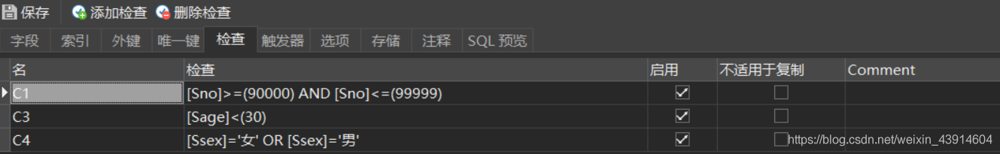

**修改表中的完整性限制**

- 使用ALTER TABLE语句修改表中的完整性限制

```sql
［例13］  修改表Student中的约束条件，要求学号改为在900000~999999之间，
年龄由小于30改为小于40
可以先删除原来的约束条件，再增加新的约束条件
ALTER TABLE Student
DROP CONSTRAINT C1;
        
 ALTER TABLE Student
ADD CONSTRAINT C1 CHECK (Sno BETWEEN 900000 AND 999999);
        
ALTER TABLE Student
DROP CONSTRAINT C3;
        
ALTER TABLE Student
ADD CONSTRAINT C3 CHECK (Sage < 40);
```

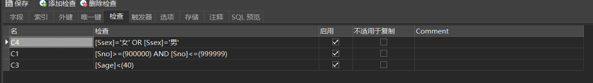


## 5.6 域中的完整性限制—DOMAIN

> 关于域的定义有些数据库可能不同，或者定义失败，得观看相关的手册深入学习，但是SQL中是有定义DOMAIN，初学先了解一下叭。

**SQL支持域的概念，并可以用`CREATE DOMAIN`语句建立一个域以及该域应该满足的完整性约束条件。**

```sql
［例14］建立一个性别域，并声明性别域的取值范围
           CREATE DOMAIN GenderDomain CHAR(2)
           CHECK (VALUE IN ('男'，'女') );
这样［例10］中对Ssex的说明可以改写为Ssex GenderDomain

［例15］建立一个性别域GenderDomain，并对其中的限制命名
           CREATE DOMAIN GenderDomain CHAR(2)
           CONSTRAINT GD CHECK ( VALUE IN ('男'，'女') );
           
［例16］删除域GenderDomain的限制条件GD。
           ALTER  DOMAIN  GenderDomain  
           DROP CONSTRAINT GD;
           
［例17］在域GenderDomain上增加限制条件GDD。
          ALTER  DOMAIN  GenderDomain  
         ADD CONSTRAINT GDD CHECK (VALUE IN ( '1'，'0') ); 
         
通过［例16］和［例17］，就把性别的取值范围由('男'，'女')改为 ( '1'，'0') 
123456789101112131415161718
```

## 5.7 断言—ASSERTION

> 关于断言还是和域一样，不同的数据库可能实现方式不同，初学先了解，后期再深入

- 在SQL中可以使用数据定义语言中的`CREATE ASSERTION`语句，通过声明性断言(declarative assertions)来指定更具一般性的约束。
- 可以定义涉及多个表或聚集操作的比较复杂的完整性约束。
- 断言创建以后，任何对断言中所涉及关系的操作都会触发关系数据库管理系统对断言的检查，任何使断言不为真值的操作都会被拒绝执行。

### （1）定义断言

标准语句格式：

```sql
CREATE ASSERTION <断言名> <CHECK子句>
```

- 每个断言都被赋予一个名字，<CHECK子句>中的约束条件与WHERE子句的条件表达式类似。

```sql
[例5.18]限制数据库课程最多 60名学生选修。
CREATE ASSERTION ASSE_SC_DB_ NUM
CHECK(60>=(SELECT count(*)/*此断言的谓词涉及聚集操作count的SQL语句*/
FROM Course,SC
WHERE SC.Cno=Course.Cno AND Course.Cname=数据库)
);

每当学生选修课程时，将在SC表中插入一条元组(Sno, Cno, NULL), 
ASSE_SC_DB_NUM断言被触发检查。如果选修数据库课程的人数已经超过60人，
CHECK子句返回值为“假”，对SC表的插入操作被拒绝。

[例5.19]限制每一 门课程最多60名学生选修。 
CREATE ASSERTION ASSE_SC_CNUMI
CHECK( 60>=ALL( SELECT count (*)/*此断言的谓词，涉及聚集操作count */
FROM SC							/*和分组函数group by的SQL语句*/
GROUP by cno );

[例5.20 限制每个学期每一门课程最多60名学生选修]
首先修改SC表的模式，增加一个“学期(TERM)”的属性。
ALTER TABLE SC ADD TERM DATE;
/*先修改SC表，增加TERM属性，它的类型是DATE*/

然后定义断言:
CREATE ASSERTION ASSE_SC_CNUM2
CHECK (60>=ALL ( select count (*) from SC group by Cno,TERM )); 
```

### （2）删除断言

```sql
DROP ASSERTION <断言名>;
```

- 如果断言很复杂，则系统在检测和维护断言上的开销较高，这是在使用断言时应该注意的。

## 5.8 触发器—TRIGGER

- 触发器（Trigger）是用户定义在关系表上的一类由`事件驱动`的特殊过程
  由服务器自动激活
- 可以进行更为复杂的检查和操作，具有更精细和更强大的数据控制能力

### （1）定义触发器

**CREATE TRIGGER语法格式:**

```sql
CREATE TRIGGER <触发器名>  
       {BEFORE | AFTER} <触发事件> ON <表名>
        FOR EACH  {ROW | STATEMENT}
      ［WHEN <触发条件>］
        <触发动作体>
```

**定义触发器的语法说明:**

1. 创建者：表的拥有者
2. 触发器名
3. 表名：触发器的目标表,不能建立在视图上
4. 触发事件：INSERT、DELETE、UPDATE
5. 触发器类型
   行级触发器（FOR EACH ROW）;
   语句级触发器（FOR EACH STATEMENT）;

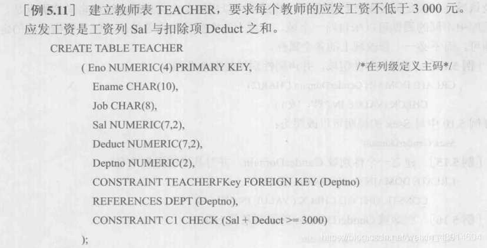

- 例如,假设在［例11］的TEACHER表上创建了一个AFTER UPDATE触发器。如果表TEACHER有1000行，执行如下语句：
  `UPDATE TEACHER SET Deptno=5;`
- 如果该触发器为`语句`级触发器，那么执行完该语句后，触发动作只发生一次
- 如果是`行级`触发器，触发动作将执行1000次

1. 触发条件
   触发条件为真，则执行触发动作体，否则不执行;
   省略WHEN触发条件时，只要触发器激活（触发器事件）则立刻执行触发动作体;
2. 触发动作体
   触发动作体可以是一个匿名PL/SQL过程块;
   也可以是对已创建存储过程的调用;

```sql
［例18］  定义一个BEFORE行级触发器，
为教师表Teacher定义完整性规则“教授的工资不得低于4000元，
如果低于4000元，自动改为4000元”。
    CREATE TRIGGER Insert_Or_Update_Sal 
         BEFORE INSERT OR UPDATE ON Teacher  
        /*触发事件是插入或更新操作*/
         FOR EACH ROW                      /*行级触发器*/
        AS BEGIN                /*定义触发动作体，是PL/SQL过程块*/
              IF (new.Job='教授') AND (new.Sal < 4000) THEN   
              new.Sal :=4000;                
              END IF;
        END;       


［例19］定义AFTER行级触发器，当教师表Teacher的工资发生变化后
就自动在工资变化表Sal_log中增加一条相应记录

   首先建立工资变化表Sal_log
    CREATE TABLE Sal_log
        (Eno    NUMERIC(4)  references teacher(eno)，
          Sal     NUMERIC(7，2)，
          Username  char(10)，
          Date   TIMESTAMP
         )；
              
 [例19]（续）
CREATE TRIGGER Insert_Sal               	
    AFTER INSERT ON Teacher      	/*触发事件是INSERT*/
    FOR EACH ROW
    AS BEGIN
        INSERT INTO Sal_log VALUES(
           new.Eno，new.Sal，CURRENT_USER，CURRENT_TIMESTAMP);
    END;

[例19]（续）
CREATE TRIGGER Update_Sal            	
   AFTER UPDATE ON Teacher    	/*触发事件是UPDATE */
   FOR EACH ROW
   AS BEGIN 
     IF (new.Sal <> old.Sal) THEN INSERT INTO Sal_log VALUES(
          new.Eno，new.Sal，CURRENT_USER，CURRENT_TIMESTAMP);
     END IF;
  END;
```

> 这个可以在Oracle数据库里运行，但是因为我用的是SQL Sever数据库，所以运行不了，不同的数据库，触发器的实现略有不同，详情请查看相关数据库手册。

### （2）激活触发器

- 触发器的执行，是由`触发事件激活`的，并由数据库服务器自动执行
  一个数据表上可能定义了`多个触发器`
- 同一个表上的多个触发器激活时遵循如下的执行顺序：
  （1） 执行该表上的BEFORE触发器；
  （2） 激活触发器的SQL语句；
  （3） 执行该表上的AFTER触发器。

```sql
［例20］执行修改某个教师工资的SQL语句，激活上述定义的触发器。
     UPDATE Teacher SET Sal=800 WHERE Ename='王五';
执行顺序是：
执行触发器Insert_Or_Update_Sal
执行SQL语句“UPDATE Teacher SET Sal=800 WHERE Ename='王五';”
执行触发器Insert_Sal;
执行触发器Update_Sal 
```

### （3）删除触发器

**删除触发器的SQL语法：**
`DROP TRIGGER <触发器名> ON <表名>;`

触发器必须是一个已经创建的触发器，并且只能由具有相应权限的用户删除。

**［例21］ 删除教师表Teacher上的触发器Insert_Sal**

```sql
DROP TRIGGER Insert_Sal ON Teacher;
```


# 6. 关系数据库理论


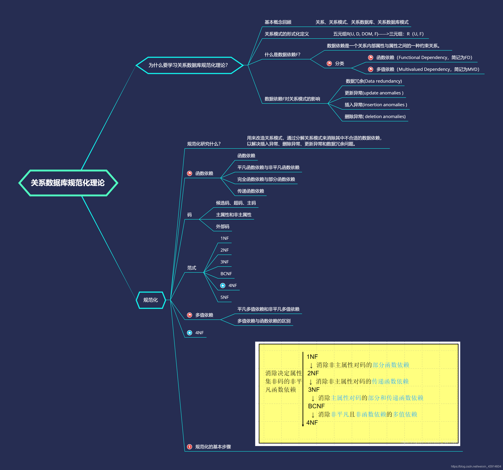

## 6.1 为什么要学习关系数据库规范化理论？

**感性认识：**

- 当我们面对一个实际问题时，我们应该如何去建数据库，建表，库的结构，表的结构我们该如何组织，才能更好的解决问题。
- 如何省内存，提高查询修改删除更新的效率？
- 如何避免可能出现的隐患，如修改删除更新插入等异常？
- 以上就是关系`数据库规范化理论`研究解决的问题,说白了就是告诉你如何才能设计出合适的库和表

**下面我们回顾几个概念和问题，以便更好地学习后面的关系数据库规范化理论**

### （1）基本概念回顾

- 关系：可简单的理解为二维表
- `关系模式：即二维表的逻辑结构`
- 关系数据库：指采用了关系模型来组织数据的数据库，其以行和列的形式存储数据，`关系型数据库这一系列的行和列被称为表，一组表组成了数据库`。
- 关系数据库的模式：即关系数据库的逻辑结构

### （2）关系模式的形式化定义

- 这里我们回顾一下《数据库系统概论》中对二维表结构的定义

> 关系模式由五部分组成，即它是一个五元组：
> R(U, D, DOM, F)
> R： 关系名,即表名
> U： `组成该关系的属性名集合`
> D： 属性组U中属性所来自的域。数据的取值范围和类型
> DOM： 属性向域的映象集合
> F： `属性组U上的一组数据依赖。`

**关系数据库规范化理论研究的就是R、F、U，之间的关系。
因为D和DOM对研究表的设计关系不大，所以在学习关系数据库规范化理论时可以将五元组简化成三元组**

> 三元组：`R（U, F）`
> 当且仅当U上的一个关系`r`满足`F`时，`r`称为`关系模式 R（U, F）的一个关系`

### （3）什么是数据依赖F？

**这里我们对`F`中的`数据依赖`进行简单解释，后面会详细叙述`函数依赖`和`多值依赖`。**

> `数据依赖`是`一个关系内部属性与属性之间的一种约束关系。`
> 这种约束关系是通过`属性间值的相等与否体现出来的数据间相关联系`。
> 它是现实世界属性间相互联系的抽象，是数据内在的性质，是语义的体现。

**数据依赖分类：**

- 函数依赖（Functional Dependency，简记为FD）

> 函数依赖极为普遍地存在于现实生活中。比如描述一个学生的关系，可以有学号(Sno)、姓名(Sname)、 系名(Sdept) 等几个属性。由于一个学号只对应一个学生，一个学生只在一一个系学习。因而当“学号”值确定之后，学生的姓名及所在系的值也就被唯一地确定了。`属性间的这种依赖关系类似于数学中的函数y=f(x)，自变量x确定之后，相应的函数值y也就唯一地确定 了。`

- 多值依赖（Multivalued Dependency，简记为MVD）
- 其他

### （4）数据依赖F对关系模式的影响

- 因为`关系数据库规范化理论`主要研究的是`三元组R(U,F)`，U我们都好理解，最重要的是F，这里我们简单的了解一下F对关系模式，即表的逻辑结构的影响，让我们理性的认识为什么学习`关系数据库规范化理论`

**举个例子：**

> [例1]建立一个描述学校教务的数据库,数据库涉及的对象有：
> 学生的学号（Sno）、所在系（Sdept）、系主任姓名（Mname）、课程名（Cname）、成绩（Grade）

这里我们用单一的关系模式Student来表示这些对象：
`Student <U、F>`
该关系的属性集合：
`U ＝｛ Sno, Sdept, Mname, Cname, Grade ｝`

**这里说明一下现实世界的事实语义，关于这些对象之间的联系：**
①一个系有若干学生，但一个学生只属于一个系。
②一个系只有一名(正职)负责人。
③一个学生可以选修多门课程，每门课程有若干学生选修。
④每个学生学习每一一门课程有一个成绩。

于是得到`属性组U上的一组函数依赖F`
F={Sno- > Sdept, Sdept- >Mname, (Sno, Cno)- >Grade}
(如图所示)

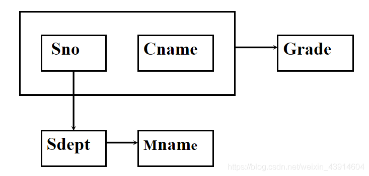

- 如果只考虑函数依赖这一种数据依赖， 可以得到一个描述学生的关系模式Student <U,F>。表6.1是某一时刻关系模式Student的一个实例，即数据表。
  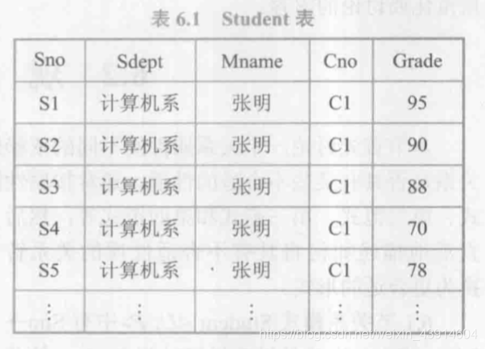

**这个关系模式设计的并不好,存在以下问题:**

#### 1️⃣ 数据冗余(Data redundancy)

- 比如，每一个系的系主任姓名重复出现，重复次数与该系所有学生的所有课程成绩出现次数相同，如表6.1所示。这将浪费大量的存储空间。

#### 2️⃣ 更新异常(update anomalies )

- 由于数据冗余，当更新数据库中的数据时，系统要付出很大的代价来维护数据库的完整性，否则会面临数据不一致的危险。 比如，某系更换系主任后，必须修改与该系学生有关的每一个元组。

#### 3️⃣ 插入异常(insertion anomalies )

- 如果一个系刚成立，尚无学生，则无法把这个系及其系主任的信息存入数据库。

#### 4️⃣ 删除异常( deletion anomalies)

- 如果某个系的学生全部毕业了，则在删除该系学生信息的同时，这个系及其系主任的信息也丢掉了。

**鉴于存在以上种种问题，可以得出这样的结论:**

- `Student关系模式不是一个好的模式`。
- `“好”的模式：`
  不会发生插入异常、删除异常、更新异常，数据冗余应尽可能少
- 原因：由存在于模式中的`某些数据依赖`引起的
- 解决方法：通过`分解关系模式`来`消除其中不合适 的数据依赖`

可以把这个单一模式分成3个关系模式：

- `S（Sno，Sdept，Sno → Sdept）;`
- `SC（Sno，Cno，Grade，（Sno，Cno） → Grade）;`
- `DEPT（Sdept，Mname，Sdept→ Mname）`

这三个模式都不会发生插入异常、删除异常的问题，数据的冗余也得到了控制。
`一个模式的数据依赖会有哪些不好的性质，如何改造一个不好的模式`，这就是接下来`2.规范化`要讨论的内容。

## 6.2 规范化—改造关系模式，解决插入异常、删除异常、更新异常和数据冗余问题。

### 6.2.1 规范化研究什么？

- 规范化讨论如何`根据属性间依赖情况来判定关系是否具有某些不合适的性质`
- 通常`按属性间依赖情况来区分关系规范化程度`为`第一范式、第二范式、第三范式和第四范式等`
- 用来改造关系模式，`通过分解关系模式来消除其中不合适的数据依赖，以解决插入异常、删除异常、更新异常和数据冗余问题。`

------

**接下来我们依次学习以下内容，来更好的掌握规范化理论，来更好的设计表的结构，设计关系模式。**

- 函数依赖
- 码
- 范式
- 2NF
- 3NF
- BCNF
- 多值依赖
- 4NF

**`其中函数依赖、码是为了学习范式、1NF,2NF,3NF……打基础`**

### 6.2.2 函数依赖

**这里我们讨论数据依赖F中的函数依赖，分为以下几种类型：**

- 函数依赖
- 平凡函数依赖与非平凡函数依赖
- 完全函数依赖与部分函数依赖
- 传递函数依赖

#### ① 函数依赖

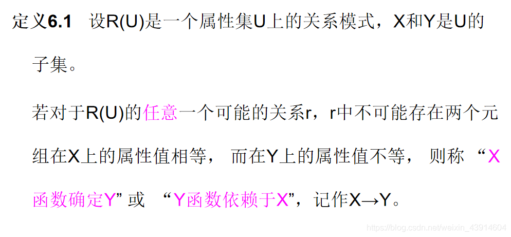

`注意:`函数依赖不是指关系模式R的某个或某些关系满足的约束条件，而是指R的一切关系均要满足的约束条件。

**以下是一个错误的例子：**
`sno->sdept，sno应该唯一决定sdept`
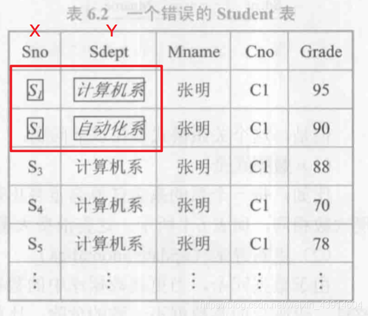

> 函数依赖和别的数据依赖样是语义范畴的概念，只能根据语义来确定一个函数依赖。
> 例如，姓名→年龄这个函数依赖只有在该部门没有同名人的条件下成立。如果允许有同名人，则年龄就不再函数依赖于姓名了。

#### ② 平凡函数依赖与非平凡函数依赖

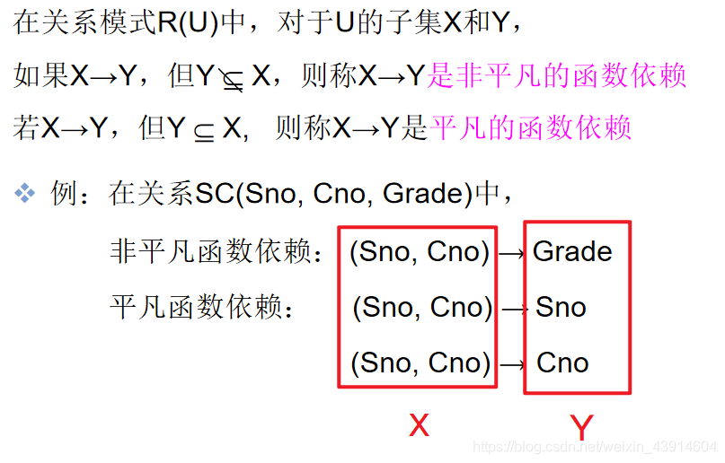
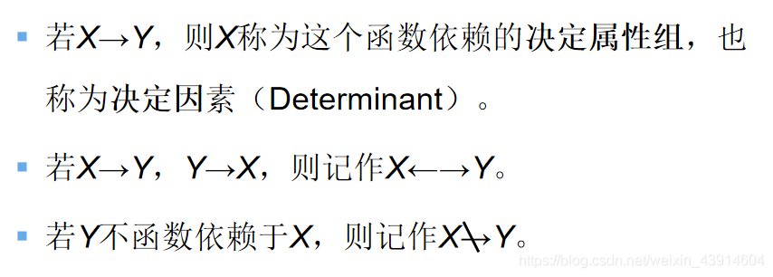

#### ③ 完全函数依赖与部分函数依赖

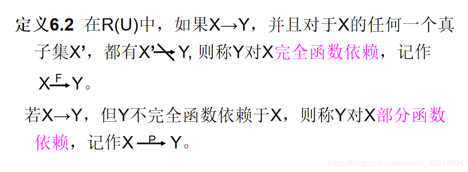
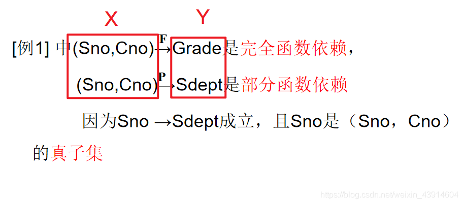

#### ④ 传递函数依赖

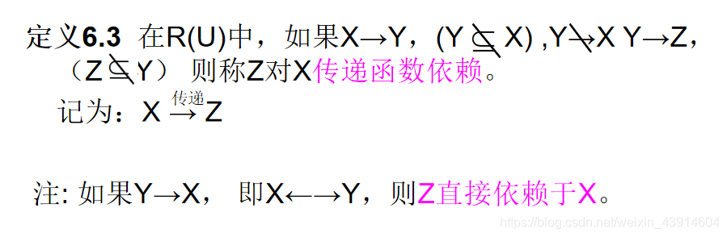
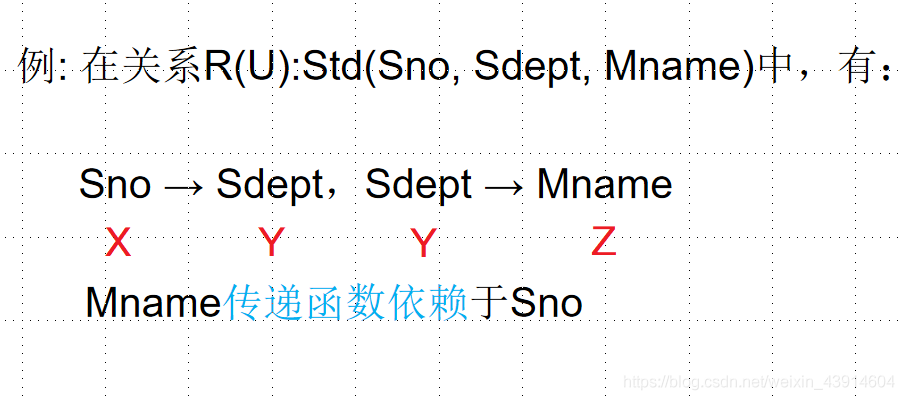
**直接依赖这里我们举个例子：**
`BH(sno,idCard,address)`

> X：sno 学号
> Y：idCard 身份证号
> Z：address 住址
> X->Y，Y->X，X<->Y，Y->Z
> 所以我们说Z直接依赖于X

### 6.2.3 码

- 码是关系模式中的一个重要概念。在 [码的定义](https://blog.csdn.net/weixin_43914604/article/details/105101908)中有关码的若干定义， 这里用函数依赖的概念来定义码。
- 码唯一决定一个实体集

#### ① 候选码、超码、主码

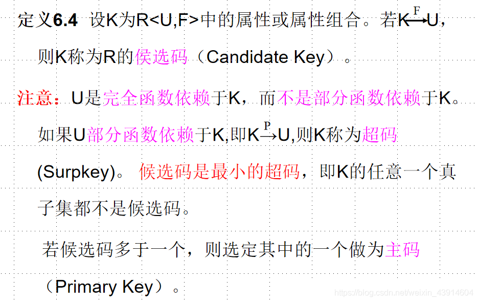

#### ② 主属性和非主属性

**主属性与非主属性**

- 包含在任何一个候选码中的属性 ，称为`主属性（Prime attribute）`
- 不包含在任何码中的属性称为`非主属性（Nonprime attribute）`或`非码属性（Non-key attribute）`

**举几个例子：**

**[例2]**
关系模式S(Sno,Sdept,Sage)，单个属性Sno是`码`，
SC（Sno，Cno，Grade）中，（Sno，Cno）是`码`

**[例3]**
关系模式R（P，W，A）
P：演奏者 W：作品 A：听众
一个演奏者可以演奏多个作品
某一作品可被多个演奏者演奏
听众可以欣赏不同演奏者的不同作品
`码为(P，W，A)，即All-Key`

#### ③ 外部码

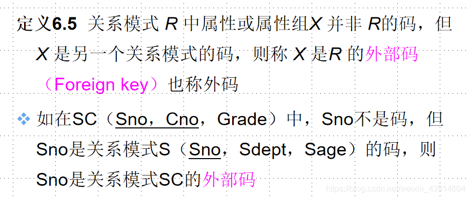

### 6.2.4 范式

- 范式是符合某一种级别的关系模式的集合
- 关系数据库中的关系必须满足一定的要求。满足不同程度要求的为不同的范式。
- 级别越高，表设计的越合理

**范式的种类：**

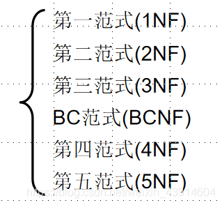
**各种范式之间存在联系：**

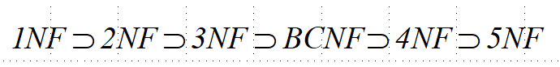

- 某一关系模式`R为第n范式`，可简记为`R∈nNF。`
  一个低一级范式的关系模式，通过`模式分解`可以转换为若干个高一级范式的关系模式的集合，这种过程就叫`规范化`

------

#### ① 1NF

**1NF的定义:**

- 如果一个关系模式R的所有属性都是`不可分的基本数据项`，则`R∈1NF`
- 第一范式是对关系模式的最起码的要求。不满足第一范式的数据库模式不能称为关系数据库
- 但是满足第一范式的关系模式并不一定是一个好的关系模式

**以下是一个满足1NF，但不是好的关系模式的例子：**

> 关系模式 S-L-C(Sno, Sdept, Sloc, Cno, Grade)
> Sloc为学生住处，假设每个系的学生住在同一个地方

- 这个例子中存在函数依赖，不是一个好的关系模式

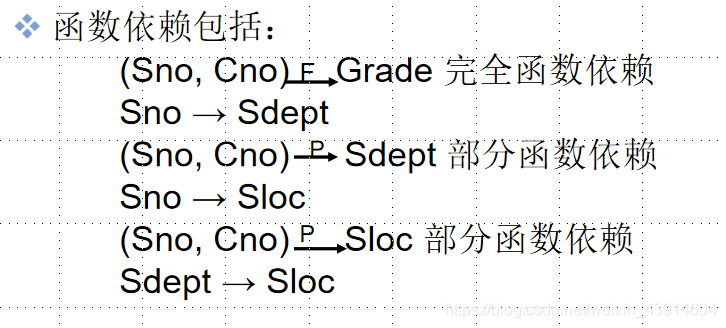
**图形化表示：**
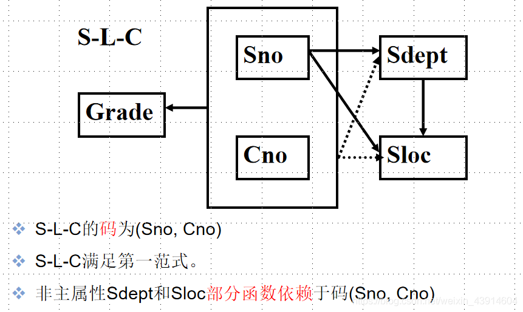
**S-L-C不是一个好的关系模式，一个关系模式 R不属于2NF,就会产生以下几个问题:**

- (1)`插入异常`。假若要插入一个学生Sno=S7， Sdept =PHY， Sloc =BLD2， 但该生还未选课，即这个学生`无Cno`,这样的元组就插不进S-L-C中。因为`插入元组时必须给定码值，而这时码值的一部分 为空，因而学生的固有信息无法插入。`
- (2)`删除异常`。假定某个学生只选一门课，如S4就选了一门课C3，现在C3这门课他也不选了，那么C3这个数据项就要删除。而`C3是主属性，删除了C3，整个元组就必须一起删除，使得S4的其他信息也被删除了`，从而造成删除异常，即不应删除的信息也删除了。
- (3)`修改复杂`。某个学生从数学系(MA)转到计算机科学系(CS)，这本来只需修改此学生元组中的Sdept分量即可，但因为关系模式S-L-C中还含有系的住处Sloc属性，学生转系将同时改变住处，因而还必须修改元组中的Sloc分量。另外，如果这个学生选修了k门课，Sdept、 Sloc重复存储了k次，不仅`存储冗余度大`，而且必须无遗漏地修改k个元组中全部Sdept、Sloc 信息，造成`修改的复杂化`。

**为什么会有这些问题呢？**

- 原因：
  Sdept、 Sloc`部分函数依赖于码`。
- 解决方法(也就是2NF的处理方法)
  S-L-C`分解为两个关系模式`，以`消除这些部分函数依赖`
  SC（Sno， Cno， Grade）
  S-L（Sno， Sdept， Sloc）
  

#### ② 2NF

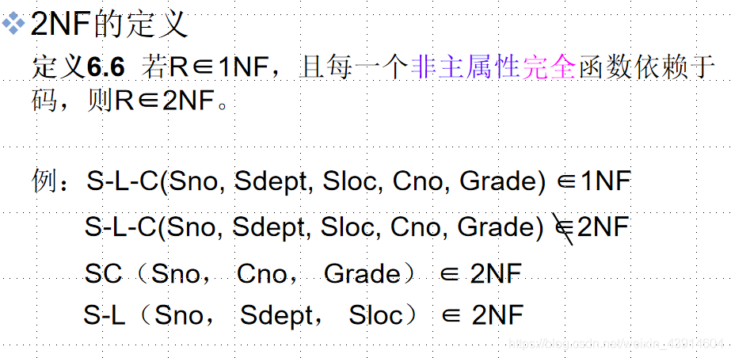

- 采用投影分解法将一个1NF的关系分解为多个2NF的关系，可以在一定程度上减轻原1NF关系中存在的插入异常、删除异常、数据冗余度大、修改复杂等问题。
- 将一个1NF关系分解为多个2NF的关系，并不能完全消除关系模式中的各种异常情况和数据冗余。所以又引入了3NF。

#### ③ 3NF


**这里我们对上面的2NF例子再次进行剖析：**
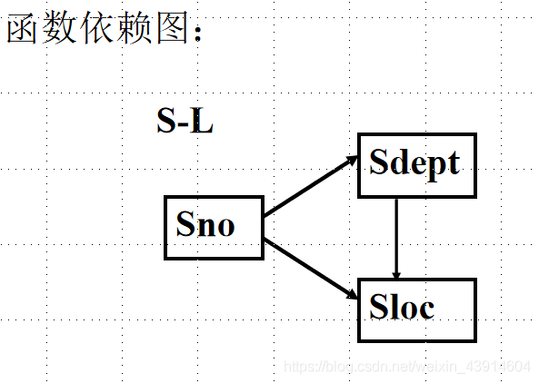

**解决方法：**

- 采用投影分解法，把S-L`分解`为两个关系模式，以`消除传递函数依赖`：
  S-D（Sno， Sdept）
  D-L（Sdept，Sloc）
- S-D的码为Sno， D-L的码为Sdept。
- `分解后的关系模式S-D与D-L中不再存在传递依赖`

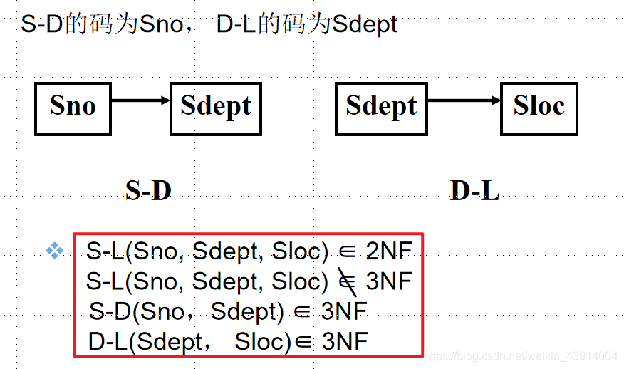

- 采用投影分解法将一个2NF的关系分解为多个3NF的关系，可以`在一定程度上解决原2NF关系中存在的插入异常、删除异常、数据冗余度大、修改复杂等问题。`
- 将一个2NF关系分解为多个`3NF`的关系后，`仍然不能完全消除关系模式中的各种异常情况和数据冗余。`

#### ④ BCNF

> BCNF ( Boyce Codd Normal Form)是由Boyce与Codd提出的，比上述的3NF又进了一步，`通常认为BCNF是修正的第三范式，有时也称为扩充的第三范式。`

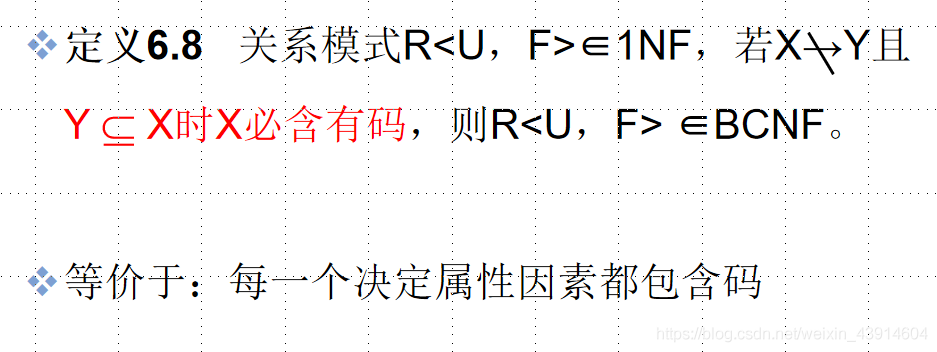

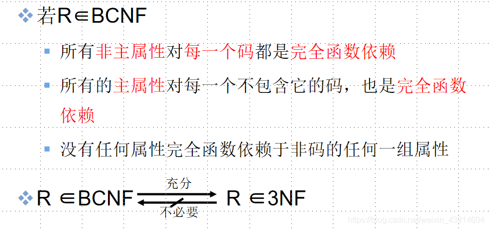
**下面用几个例子说明属于3NF的关系模式有的属于BCNF，但有的不属于BCNF。**

**[例5] 关系模式C（Cno，Cname，Pcno）**
C∈3NF
C∈BCNF

> 关系模式C(Cno, Cname, Peno)， 它`只有一个码Cno, 这里没有任何属性对Cno部分依赖或传递依赖，所以C∈3NF。`同时C中`Cno`是`唯一的决定因素`， 所以C ∈BCNF。

**[例6]关系模式S(Sno, Sname, Sdept, Sage)**
假定S有两个码Sno，Sname
S∈3NF。
S ∈ BCNF

> `假定Sname也具有唯一性， 那么S就有两个码，这两个码都由单个属性组成，彼此不相交。其他属性不存在对码的传递依赖与部分依赖，所以S∈3NF。`
> 同时S中除Sno、Sname外没有其他`决定因素`，所以S也属于BCNF。

**［例7］关系模式SJP（S，J，P）**
SJP∈3NF，
SJP∈BCNF

> [例6.7]关系模式SJP(S, J, P)中，S是学生，J表示课程，P表示名次。
> 每一个学生选修每门课程的成绩有一定的名次，
> 每门课程中每一名次只有一个 学生(即没有并列名次)。
> 由语义可得到下面的`函数依赖:`
> `(S,J)→P; (J,P)→S`
> 所以(S,J) 与(J,P)都可以作为`候选码`。
> `这两个码各由两个属性组成，而且它们是相交的。`
> `这个关系模式中显然没有属性对码传递依赖或部分依赖。`
> 所以SJP∈3NF，而且除(S,J)与(J,P)以外没有其他决定因素，所以SJP∈BCNF。

**[例8] 关系模式STJ(S, T, J)中，S表示学生，T表示教师，J表示课程。**

> 每一教师只教一门课，
> 每门课有若干教师，
> 某一学生选定某门课， 就对应一个固定的教师。
> 由语义可得到如下的函数依赖。
> `(S,J)→T，(S,T)-J, T→J`
> `函数依赖`关系可以用如图表示
> 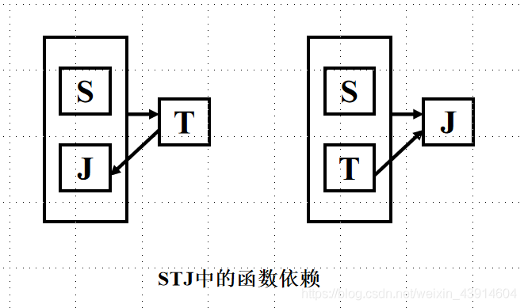
> 这里(S,J)、 (S,T)都是`候选码`。
> STJ是3NF,因为`没有任何非主属性对码传递依赖或部分依赖`，
> 但`STJ不是BCNF关系`，`因为T是决定因素，而T不包含码。`

**如何解决才能让STJ是BCNF关系呢？**
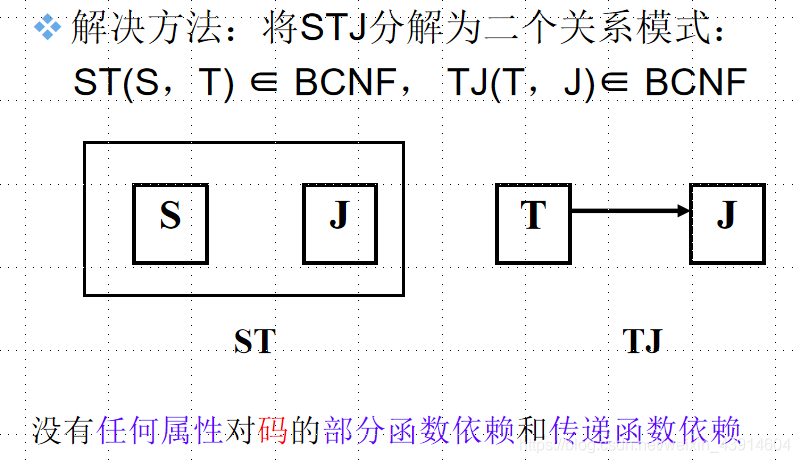

#### ⑤ 3NF与BCNF的关系

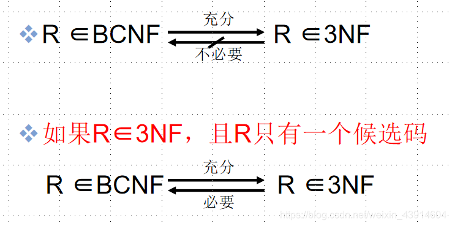

- 3NF和BCNF是在函数依赖的条件下对模式分解所能达到的分离程度的测度。
- 一个模式中的关系模式如果都属于`BCNF`,那么在函数依赖范畴内它已实现了彻底的分离，`已消除了插入和删除的异常。`
- `3NF的“不彻底”性`表现在`可能存在主属性对码`的`部分依赖`和`传递依赖`。

### 6.2.5 多值依赖

- 前面我们讲了数据依赖分为函数依赖和多值依赖，函数依赖在上面已经叙述了，这里我们再讨论多值依赖。

**用一个例子引入多值依赖：**

**[例9] 学校中某一门课程由多个教师讲授，他们使用相同的一套参考书。每个教员可以讲授多门课程，每种参考书可以供多门课程使用。**

可以用一个非规范化的关系来表示教师T、课程C和参考书B之间的关系
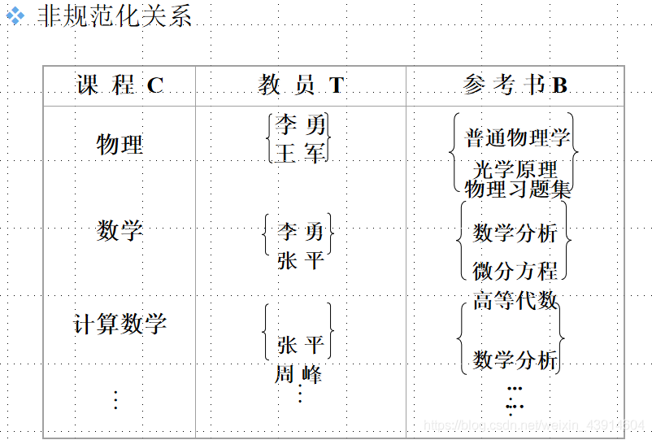
把这张表变成一张规范化的二维表：
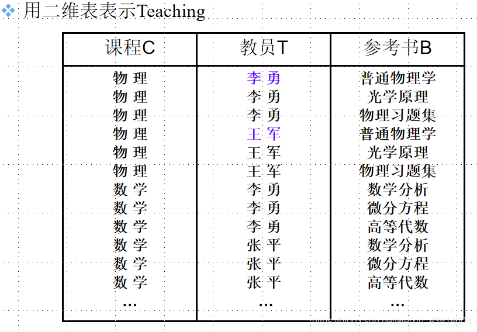

- 关系模型Teaching (C, T,B)的`码是(C, T, B)`，即`all-key`,因而`Teaching∈BCNF。`
- 但是当`某一课程(如物理)增加一名讲课教师(如周英)时`，必须插入多个(这里是三个)元组:
  (物理，周英，`普通物理学`)，(物理，周英，`光学原理`)，(物理，周英，`物理习题集`)。
- 同样，`某一门课(如数学)要去掉一本参考书(如微分方程)`，则必须删除多个(这里是两个)元组:
  (数学，`李勇`，`微分方程`)，(数学，`张平`，`微分方程`)。
- 可以看出对数据的增删改很不方便，数据的冗余也十分明显。
- 仔细考察这类关系模式，发现它具有一种称之为`多值依赖`(Multi-Valued Dependency, MVD)的数据依赖。

#### ① 多值依赖的定义

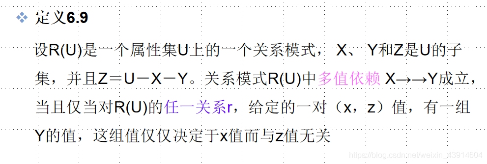

> 例如，在关系模式Teaching中，对于一个(物理，光学原理)有一组T值{李勇，王军}，这组值仅仅决定于课程C上的值(物理)。
> 也就是说对于另一个(物理，普通物理学)，它对应的一组T值仍是{李勇，王军}，尽管这时参考书B的值已经改变了。
> 因此`T多值依赖于C，即C→→T`。

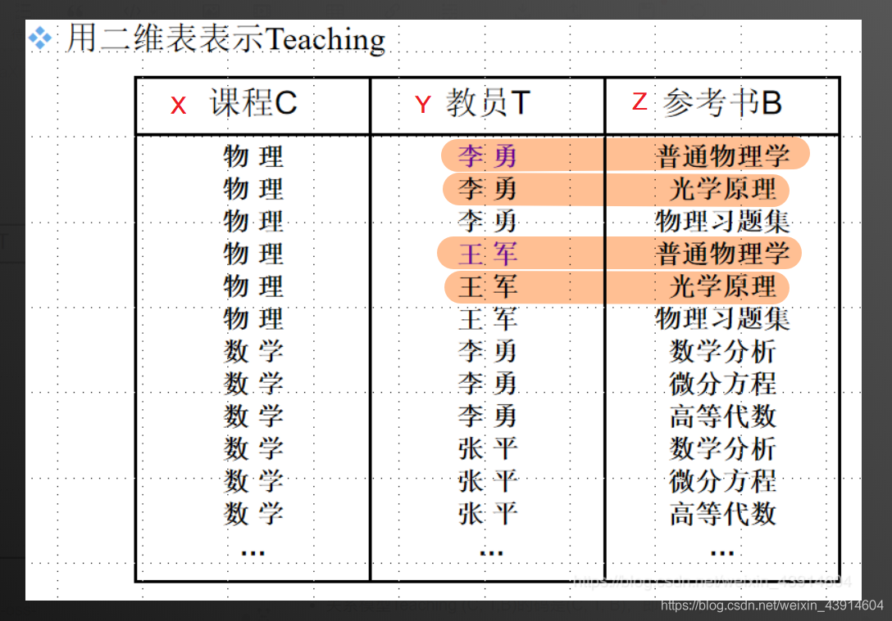

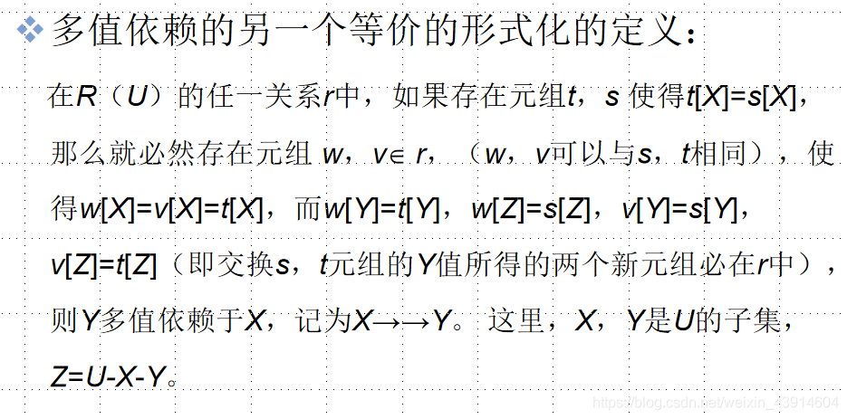

#### ② 平凡多值依赖和非平凡多值依赖

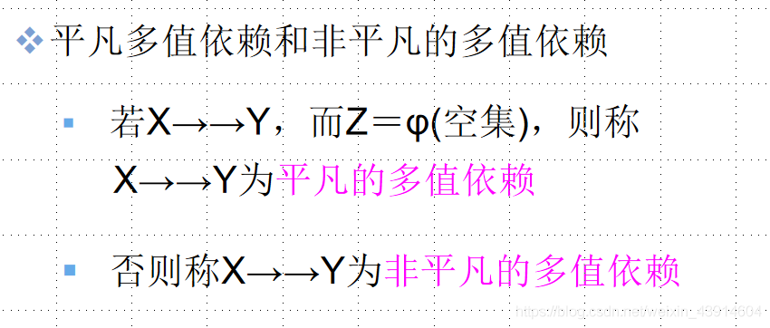
**下面再举一个具有多值依赖的关系模式的例子。**
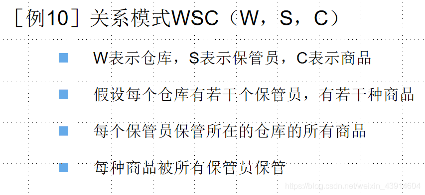

- 对于W的每一个值Wi, S有一个完整的集合与之对应而不问C取何值。所以W→→S(多值依赖)。
  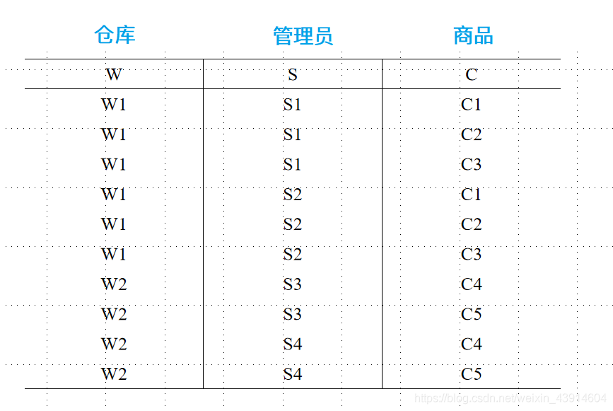

**如果用图下图来表示这种对应**
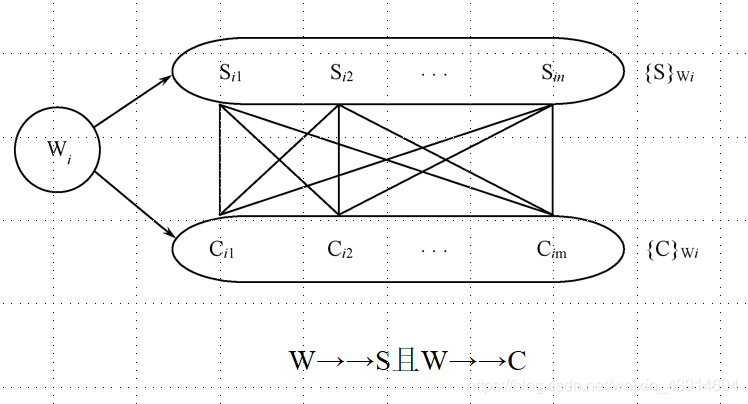

- 则对应W的某一个值Wi的全部S值记作{S}wi (表示此仓库工作的全部保管员)
- 全部C值记作{C}wi (表示在此仓库中存放的所有商品)。
- 应当有{S}wi中的每一个值和{C}wi中的每一个C值对应。
- 于是{S}wi与{C}wi之间正好形成一个完全二分图，因而`W→→S`。
- 由于C与S的完全对称性，必然有`W→→C`成立。

**多值依赖具有以下性质:**

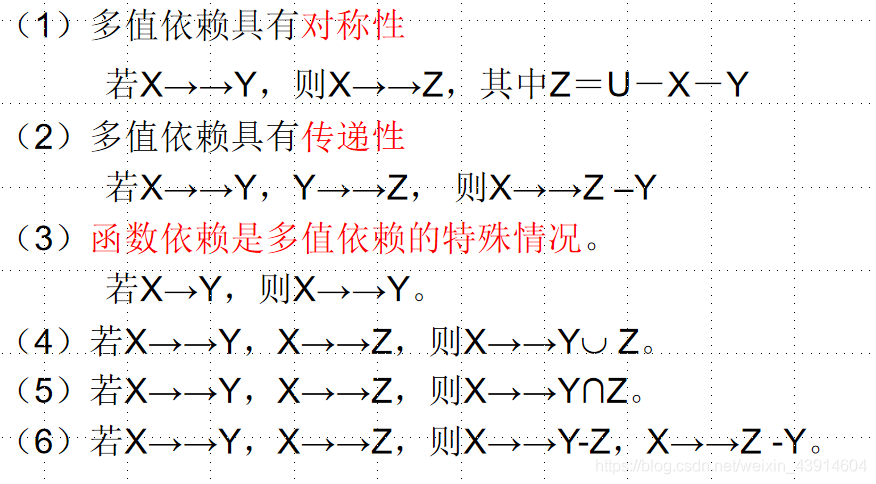

#### ③ 多值依赖与函数依赖的区别

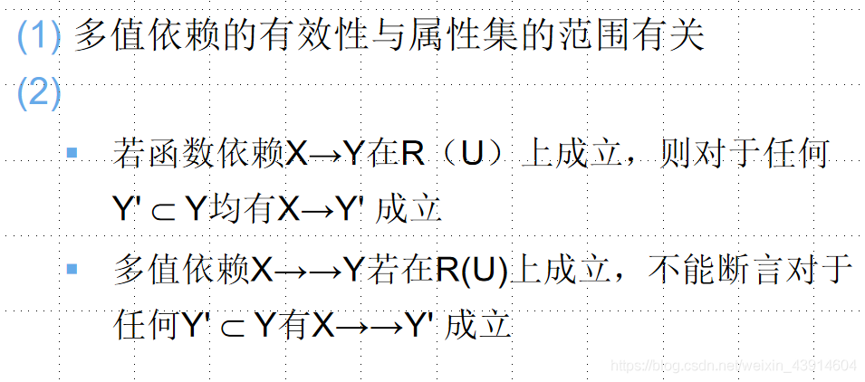

### 6.2.6 NF

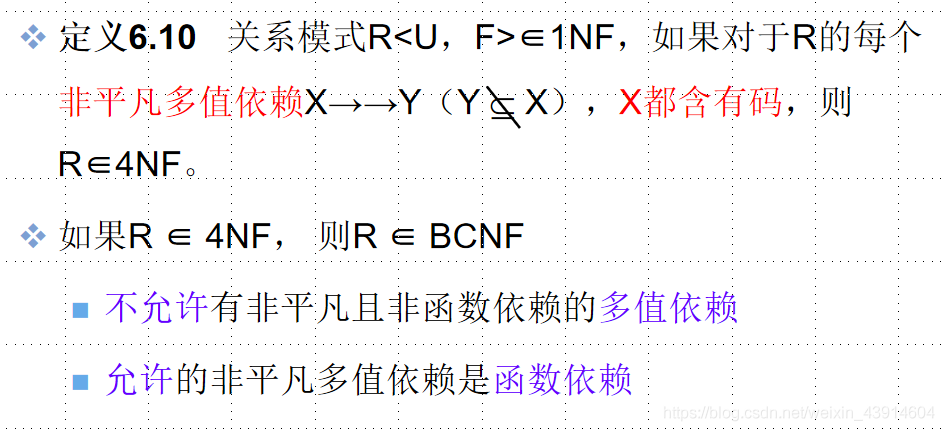

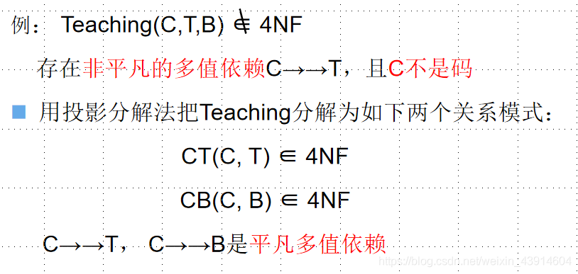

### 6.2.7 规范化小结—重点归纳步骤

- 关系数据库的规范化理论是数据库逻辑设计的工具
- 目的：尽量消除插入、删除异常，修改复杂，数据冗余
- 基本思想：逐步消除数据依赖中不合适的部分
  实质：`·概念的单一化·`

**关系模式规范化的基本步骤:**

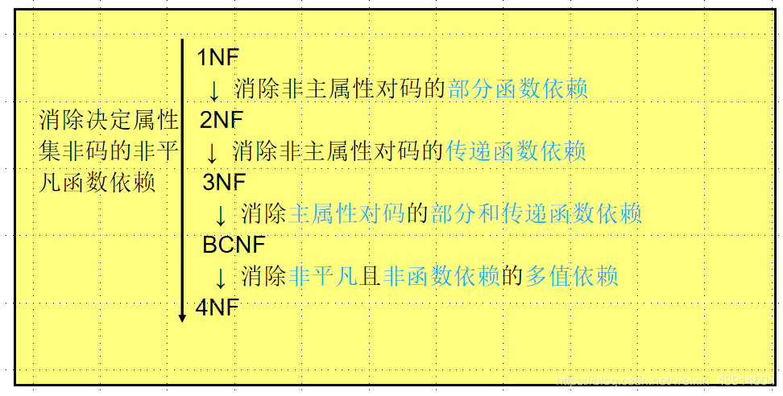


## 6.3 数据依赖的公理系统

### Armstrong公理的推论

- **合并规则**：若X→Y，X→Z同时在R上成立，则X→YZ在R上也成立。
- **分解规则**：若X→W在R上成立，且属性集Z包含于W，则X→Z在R上也成立。
- **伪传递规则**：若X→Y在R上成立，且WY→Z，则XW→Z。

### 函数依赖的公理系统

**一、Armstrong公理系统设关系模式R<U,F>，其中U为属性集，F是U上的一组函数依赖，那么有如下推理规则：**

1. **A1自反律**：若Y⊆X⊆U，则X→Y为F所蕴含；
2. **A2增广律**：若X→Y为F所蕴含，且Z⊆U，则XZ→YZ为F所蕴含；
3. **A3传递律**：若X→Y，Y→Z为F所蕴含，则X→Z为F所蕴含。

根据上面三条推理规则，又可推出下面三条推理规则：

1. **合并规则**：若X→Y，X→Z，则X→YZ为F所蕴含；
2. **伪传递规则**：若X→Y，WY→Z，则XW→Z为F所蕴含；
3. **分解规则**：若X→Y，Z⊆Y，则X→Z为F所蕴含。

**引理**：X→A1A2…Ak成立的充分必要条件是X→Ai成立(i=1,2,…,k)。

**二、Armstrong公理系统的证明**

1. **A1自反律**：若Y X U，则X→Y为F所蕴含
   证明1
   设Y⊆X⊆U。
   对R<U,F>的任一关系r中的任意两个元组t,s：
   若t[X]=s[X]，由于Y X，则有t[Y]=s[Y]，所以X→Y成立，自反律得证。
2. **A2增广律**：若X→Y为F所蕴含，且Z U，则XZ→YZ为F所蕴含
   证明2
   设X→Y为F所蕴含，且Z⊆U。
   对R<U,F>的任一关系r中的任意两个元组t,s：
   若t[XZ]=s[XZ]，由于X ⊆XZ，Z⊆ XZ，根据自反律，则有t[X]=s[X]和t[Z]=s[Z]；
   由于X→Y，于是t[Y]=s[Y]，所以t[YZ]=s[YZ]；所以XZ→YZ成立，增广律得证。
3. **A3传递律**：若X→Y，Y→Z为F所蕴含，则X→Z为F所蕴含
   证明3
   设X→Y及Y→Z为F所蕴含。
   对R<U,F>的任一关系r中的任意两个元组t,s：
   若t[X]=s[X]，由于X→Y，有t[Y]=s[Y]；
   再由于Y→Z，有t[Z]=s[Z]，所以X→Z为F所蕴含，传递律得证。
4. **合并规则**：若X→Y，X→Z，则X→YZ为F所蕴含
   证明4
   因X→Y ，所以X→XY （增广律 XX→XY即X→XY）
   因X→Z ，所以XY→YZ （增广律）
   因X→XY，XY→YZ
   故X→YZ （传递律）
5. **伪传递规则**：若X→Y，WY→Z，则XW→Z为F所蕴含
   证明5
   因X→Y ，所以WX→WY （增广律）
   因WY→Z ，所以XW→Z （传递律）
6. **分解规则**：若X→Y，Z∈Y，则X→Z为F所蕴含
   证明6
   因Z∈Y 　所以Y→Z （自反律）
   因X→Y 所以X→Z （传递律）

### 闭包及其计算

- **定义1**：设F是关系模型R的一个函数依赖集，X,Y是R的属性子集，如果从F中的函数依赖能够推出X→Y，则称F[1]X→Y。
- **定义2**：被F逻辑蕴涵的函数依赖的全体构成的集合，称为F的闭包，记作F+。
- **定义3**：设F是属性集U上的一组函数依赖，则属性集X关于F的闭包X+F定义为X+F={A|A∈U且X→A可由F经Armstrong公理导出}，即X+F={A|X→A∈F+}。
- **定理1**：设关系模型R(U)，F为其函数依赖集，X，Y为U的真子集，则从F推出X→Y的充要条件是Y是X+F的真子集。

 


# 7. 数据库设计

## 7.1. 数据库设计概述

> 数据库设计是指对于一个给定的应用环境，构造（设计）优化的数据库逻辑模式和物理结构，并据此建立数据库及其应用系统，使之能够有效的存储和管理书籍，满足各种用户的应用需求，包括信息管理要求和数据操作要求。

### 7.1.1. 数据库设计特点

1. 三分技术，七分管理，十二分基础数据
2. 结构设计和行为设计

### 7.1.2. 设计步骤

1. 需求分析
2. 概念结构设计
3. 逻辑结构设计
4. 物理结构设计
5. 数据库实施阶段
6. 数据库运行和维护阶段

## 7.2. 需求分析

### 7.2.1. 数据字典

> 它是关于数据库中数据的描述，即元数据，而不是数据本身。数据字典是在需求分析阶段监理，在数据库设计过程中不断修改、充实、完善的。

通常包括：数据项、数据结构、数据流、数据存储和处理。

## 7.3. 概念结构设计

> 应用需求抽象为信息世界的结构

### 7.3.1. 概念模型主要特点

1. 能真实、充分地反映现实世界
2. 易于理解
3. 易于更改
4. 易于向关系、网状、层次等各种数据模型转换

## 7.4. 逻辑结构设计

> 把概念结构设计阶段设计好的E-R图转换为与选用数据库管理系统产品所支持的数据模型相符合的逻辑结构

## 7.5. 物理结构设计

> 为一个给定的逻辑数据模型选取一个最适合应用要求的物理结构的过程

步骤：

1. 确定数据库的物理结构
2. 对物理结构进行评价

内容包括：关系模式选择存取方法，以及设计关系、索引等数据库文件的物理存储结构

# 8. 数据库编程

## 8.1. 标准SQL缺点和SQL编程技术优点

标准SQL是非过程化的查询语言，缺少流程控制能力，难以实现应用业务的逻辑控制
SQL编程技术可以有效克服SQL语言实现复杂应用方面的不足，提高应用系统和数据库管理系统间的互操作性。

## 8.2. 存储过程

> 存储过程是由过程化SQL语句书写的过程，这个过程经编译和优化后存储在数据库服务器中

优点：

1. 运行效率高，因为是被编译后保存在数据库中的
2. 降低了客户机和服务器的通信量
3. 方便实施企业规则

## 8.3. ODBC编程

> 是为解决异构数据库间的数据共享而产生的，它建立了一组规范，并提供了一组访问数据库的应用程序编程接口（API）。ODBC具有两重约束力：一方面规范应用开发，另一方面规范关系数据库管理系统应用接口

组成：

1. 用户应用程序
2. ODBC驱动程序管理器
3. 数据库驱动程序
4. 数据源


# 9. 关系查询处理和查询优化

## 9.1. 查询处理

分为4个阶段：查询分析、查询检查、查询优化和查询执行

1. 查询分析：对SQL语句进行语法分析和词法分析
2. 查询检查：对合法的查询语句进行语义检查
3. 查询优化：选择一个高效执行的查询处理策略；按照优化的层次一般可分为代数优化和物理优化
4. 查询执行：依据优化器得到的执行策略生成查询执行计划，由代码生成器生成执行这个查询计划的代码。然后执行并回送查询结果

## 9.2. 查询优化在数据库系统中的重要性和可能性

### 9.2.1. 重要性

1. 减轻了用户选择存取路径的负担，用户只要提出“干什么”，而不需“怎么干”
2. 查询优化的优点不仅在于用户不必考虑如何最好地表达查询以获得较高的效率，而且在于系统可以比用户程序做的更好

### 9.2.2. 可能性

1. 优化器可以从数据字典中获取许多统计信息，而用户程序则难以获得这些信息
2. 如果数据库的物理统计信息变了，系统可以自动对查询进行重新优化而不必重写程序
3. 优化器可以考虑数百种不同的执行方案，而程序员一般只能考虑有限的几种
4. 优化器中实现包含了很多复杂的优化技术，这些技术的实现降低了编写人员的门槛

## 9.3. 查询优化的一般准则

1. 选择运算应尽可能先做
2. 把投影运算和选择运算同时进行
3. 把投影同其前或后的双目运算结合起来
4. 把某些选择同它前面要执行的笛卡尔积结合起来成为一个连接运算
5. 找出公共子表达式
6. 选取合适的连接算法

## 9.4. 查询优化的一般步骤

1. 将查询转为内部形式，语法树
2. 代数优化，利用优化算法，将语法树转为更优化的形式
3. 物理优化，选择存取路径
4. 生成优化查询计划

## 9.5. 物理优化

> 物理优化的目的是为了选择高效合理的操作算法或存取路径，方法有

1. 基于规则的启发式优化
2. 基于代价估算的优化
3. 二者结合的优化方法

# 10. 数据恢复技术

## 10.1. 事务的概念及事务的4个特性及恢复技术能保证事务的哪些特性

ACID

1. 原子性，事务是数据库中的逻辑工作单元，里面的操作要么全做，要么不做
2. 一致性，事务执行结果必须是一个事务从一个一致性状态转到另一个一致性状态
3. 隔离性，一个事务的执行不能受其他事务的影响
4. 持久性，一旦一个事务完成提交了，那么对数据库的改变是永久的，

保证了事务的原子性和隔离性

## 10.2. 故障种类

1. 事务内部的故障
2. 系统故障
3. 介质故障
4. 计算机病毒

## 10.3. 恢复技术

恢复机制两个关键问题：如何建立冗余数据，以及如何利用这些冗余数据实施数据库恢复。建立数据库冗余数据最常用的技术是数据转储和登记日志文件

## 10.4. 为什么事务的非正常结束会影响数据库数据的正确性？请举例说明

如果数据库运行过程中出现故障导致事务非正常结束，有些事务尚未完成就被中断，那么就破坏了事务的原子性，这些事务的一部分操作已经写入了数据库，这时数据库处于不一致的状态

例如银行转账

## 10.5. 登记日志文件时为什么必须先写日志文件，后写数据库？

因为这是两个不同的操作，如果中间发送故障，两个只能完成一个。如果先写了数据库操作，而在日志中没有这个记录，那么就无法恢复这个修改了。如果先写了日志，但没有写入数据库。那么恢复时只要多执行一次UNDO操作，并不会影响数据库操作。

## 10.6. 针对不同的故障，给出恢复的策略和方法

### 10.6.1. 事务内部故障

1. 反向扫描文件日志，查找到该事务的更新操作
2. 对该事务的更新操作执行逆操作，直到读到改事务的开始标记

### 10.6.2. 系统故障

1. 正向扫描日志文件，找出在故障前已经提交的事务队列和未完成队列
2. 对未完成队列执行中各个事务执行UNDO操作
3. 对已经提交的各个事务执行REDO操作

### 10.6.3. 介质故障

1. 装入最新的数据库后备副本，使数据库恢复到最近一次转储时的一致性状态
2. 装入转储结束时刻的日志文件副本
3. 启动系统恢复命令，由DBMS完成恢复功能

## 10.7. 什么是检查点记录，包括什么内容

检查点记录是一类新的日志记录。它的内容包括：

1. 建立检查点时刻所有正在执行的事务清单
2. 这些事务的最近一个日志记录的地址

## 10.8. 具有检查点恢复技术有什么优点？

1. 节约时间，利用日志技术进行数据库恢复时，恢复子系统必须搜索整个日志，这将耗费大量时间
2. 需要REDO的操作实际上已经将它们的更新操作结果写到数据库了，恢复子系统又重新执行了这些操作，浪费了大量时间

## 10.9. 使用检查点方法进行恢复的步骤

1. 找到最后一个检查点记录在日志文件的地址，由该地址在日志文件中找到最后一个检查点记录
2. 由该检查点记录得到检查点建立时刻所有正在执行的事务清单，建立两个事务队列UNDO和REDO
3. 从检查点开始正向扫描日志文件，根据提交与否选择重做还是撤销
4. 对队列执行事务操作

## 10.10. 什么是数据库镜像？它有什么用途

自动将整个数据库或者关键数据复制到另一个磁盘上。每当主数据库更新时，把更新后的数据复制过去，即自动保证镜像数据和主数据的一致性。
用途

1. 数据恢复
2. 提升数据库利用率。例如被加了排他锁，可以在镜像数据库上读。

## 10.11. 为什么UNDO是反向扫描日志，REDO是正向扫描日志

UNDO是恢复到第一个失败的事务就OK了，正向做不到。REDO是恢复到最后一个成功的事务之后。

## 10.12. 恢复系统是否可以保证事务的原子性和持续性

UNDO保证原子性，REDO保证持续性

# 11. 并发控制

## 11.1. 数据库中为什么要并发控制？并发控制技术能保证事务的哪些特性？

数据库时共享资源，通常有多个事务同时执行。当多个事务同时并发地存取时就会产生同时读/写同一个数据。若对并发操作不加以控制就可能导致存取不正确的数据，破坏事务的一致性。
并发控制保证了事务的一致性和隔离性

## 11.2. 并发操作会产生哪几类数据的不一致？用什么方法可以避免

1. 丢失修改，两个事务对同一个数据同时进行修改，那么就会有一个事务的操作被另一个事务的修改覆盖掉。
2. 不可重复读，一个事务读了某一数据以后，另一个事务对其进行了更新操作，那么再次读的时候就会得到与上次不一样的数据。
3. 读取脏数据，一个事务修改了某一数据并把其写回磁盘，另一个事务读取了这个数据以后，之前那个事务因为某种原因撤销了。

避免不一致性的方法就是并发控制，常用的并发控制有封锁法、时间戳法、乐观控制法、多版本并发控制法等

## 11.3. 什么是封锁？封锁类型有哪几种？

封锁就是事务T对某一数据进行操作前，先向系统发送请求，对其加锁，加锁以后事务就对这个数据有了一定的控制前，在事务T释放锁之前，其他事务不能对该数据进行更新或者读取
封锁类型有：排它锁、共享锁

## 11.4. 三级协议分别能解决哪些问题

1. 加X锁，直到事务结束再释放。解决了丢失修改问题。
2. 在1基础上加S锁，读完后可以释放，解决了读取脏数据的问题。
3. 在1基础上加S锁，直到事务结束再释放，解决了不可重复读问题

## 11.5. 什么是活锁，产生原因和解决办法

当一系列封锁操作无法按照其正确顺序执行时，就可能导致事务无限等待某个封锁。
避免活锁的方法就是使用FCFS

## 11.6. 什么是死锁，解决死锁的办法

举例说明什么是死锁。
防止死锁的方法有两种：预防死锁、死锁诊断与解除
预防死锁有两种办法：一次封锁法、顺序封锁法
死锁诊断与解决：超时法、事务等待图法
解除法：选择处理死锁代价最小的事务，将其解除

## 11.7. 什么样的并发调度是正确的调度

可串行化的并发调度是正确的调度。可串行化调度定义：多个事务并发执行是正确的，当且仅当其结果与按某一次序执行的串行执行的结果相同。

## 11.8. 如何保证并发调度的正确性

冲突可串行化，使用两段锁协议